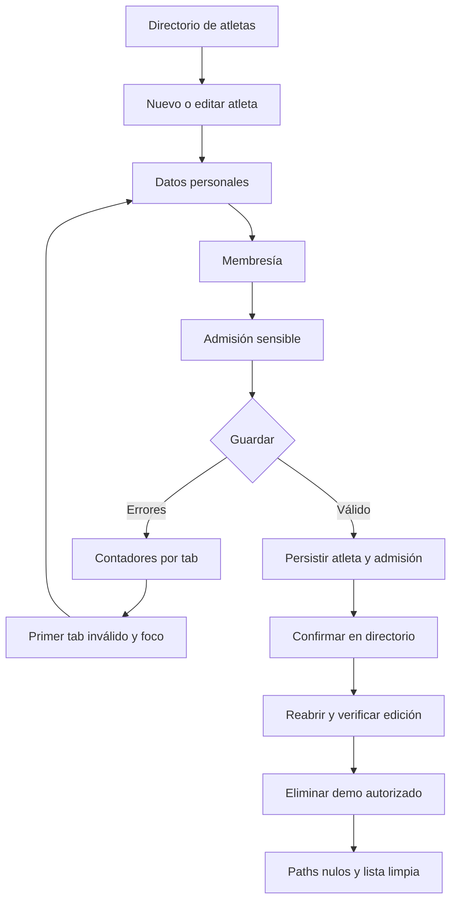

# Implementation Report: Fase B — formulario de atleta por pestañas

## Estado

- Spec: ✅ implementada y validada
- Tests: ✅
- Typecheck: ✅
- Build: ✅
- Chrome QA: ✅
- Flujo completo afectado en Chrome: ✅
- Playwright responsive: ✅ público; protegido preparado y omitido por autorización de dispositivo
- Login manual requerido: Sí; se reutilizó exclusivamente la sesión autorizada del usuario en Chrome
- Despliegue: ✅ `https://kronos-training-fd5e5.web.app/atletas`

## Árbol de archivos modificados

```text
kronos-training-app/
├── AGENTS.md
├── app/
│   ├── .gitignore
│   ├── README.md
│   ├── package.json
│   ├── package-lock.json
│   ├── playwright.config.ts
│   ├── e2e/
│   │   ├── auth.setup.ts
│   │   └── responsive/
│   │       ├── athlete-form-responsive.spec.ts
│   │       └── public-responsive.spec.ts
│   ├── src/
│   │   ├── components/kronos/AthleteIntakeFields.vue
│   │   ├── pages/atletas.vue
│   │   └── utils/athlete-intake.ts
│   └── tests/athlete-intake.test.ts
├── Docs/
│   ├── decisions/ADR-001-playwright-responsive-complement.md
│   └── implementation-reports/
│       ├── 2026-08-26-athlete-form-tabs.md
│       ├── 2026-08-26-sdd-qa-gates-phase-b-spec.md
│       └── README.md
├── specs/
│   ├── SPEC-athlete-form-tabs.md
│   └── SPEC-quality-gates.md
└── tasks/todo.md
```

## Flujos afectados

- Alta de atleta: el diálogo se divide en `Datos personales`, `Membresía` y `Admisión`.
- Edición de atleta: conserva la misma distribución y carga los datos sensibles con los permisos existentes.
- Validación: cuenta errores por pestaña, activa la primera inválida y enfoca el primer campo con error.
- Responsive: los tres tabs permanecen visibles y utilizables desde 320 px; los contadores no desplazan tabs fuera del viewport.
- QA global: Playwright queda integrado como complemento y Chrome como gate obligatorio del flujo completo.

## Recorrido completo validado

- Entrada del flujo: directorio `Atletas` → `Nuevo atleta`.
- Navegación: Personal → Membresía → Admisión → Personal, conservando valores.
- Error: guardado incompleto → `Datos personales, 2 errores` → foco en nombre; `Admisión, 12 errores` permanece anunciado.
- Alta: creación autorizada de `QA Tabs Demo 20260826` con perfil, membresía y admisión ficticia.
- Persistencia: el registro apareció una sola vez y al reabrirse conservó todos los campos capturados.
- Edición: horario actualizado de `07:00 AM` a `08:00 AM` y parentesco de `Prueba` a `QA actualizado`.
- Limpieza: eliminación exacta de `v1/athletes/-P-zkpOHrn29s5cTFvVw` y `v1/athleteIntake/-P-zkpOHrn29s5cTFvVw`; ambos paths devolvieron `null` y Chrome dejó de mostrar el demo.

## Flujos no afectados

- Esquema, reglas y permisos de Firebase.
- Autenticación y autorización por dispositivo.
- Pagos, recibos, quiosco, visitas, tienda, cierres y reportes financieros.
- Payloads existentes de atleta y admisión; sólo cambió la presentación y navegación del formulario.

## Diagrama



## Evidencia

- `npx eslint` sobre los archivos modificados: pasa.
- `npm run test:athlete-intake`: 6/6.
- `npm run test:finance`: 2/2.
- `npm run test:iconify`: 1/1.
- `npm run typecheck`: pasa.
- `npm run build`: 1108 módulos, pasa.
- `npm run test:e2e:responsive`: 4/4 pruebas públicas pasan; 4 protegidas se omiten deliberadamente sin `storageState` autorizado.
- Chrome conectado al perfil existente: 320×720, 768×900, 1024×900 y 1440×1000; sin overflow de página, diálogo o tablist.
- Chrome: alta, validación, navegación, persistencia, edición y eliminación completas; cero errores o warnings nuevos en consola.
- Las capturas de Chrome se inspeccionaron durante QA; no contienen ni versionan credenciales o material de autenticación.

## Riesgos y pendientes

- El perfil Chromium independiente de Playwright no está autorizado como dispositivo. No se debilitó el control: el proyecto protegido queda listo para un futuro dispositivo QA dedicado y la matriz autenticada se ejecutó mediante la API Playwright adjunta al Chrome ya autorizado.
- No se generaron baselines visuales protegidos versionados por la misma restricción; el smoke público y la revisión visual real de Chrome sí pasaron.
- `atletas.vue` sigue concentrando varias responsabilidades históricas; una extracción futura puede reducir tamaño, pero no es necesaria para el comportamiento de Fase B.
