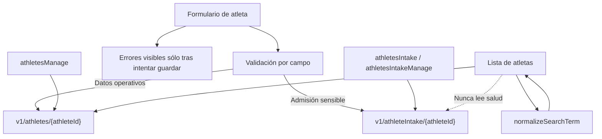

# Implementation Report: cuestionario de admisión de atletas

## Estado

- Spec: ✅ `specs/SPEC-athletes-payments.md` aprobada y actualizada.
- Tests: ⚠️ La prueba enfocada pasa compilada con esbuild y Node (4/4), y la prueba de búsqueda pasa (2/2). Los comandos `npm run test:athlete-intake` y `npm run test:rules` quedan bloqueados por limitaciones del entorno: `uv_os_get_passwd returned ENOMEM` y Java 8, respectivamente; Firebase CLI requiere Java 21+ para el emulador de reglas.
- Typecheck: ✅ `npm run typecheck`.
- Lint: ✅ ESLint dirigido a los archivos afectados.
- Build: ✅ `npm run build` (1107 módulos transformados).
- Realtime Database: ✅ Reglas publicadas y sintácticamente válidas.
- Hosting: ✅ Publicado en `https://kronos-training-fd5e5.web.app/` con el commit `ea60636`.
- Chrome QA: ✅ Validado en producción con sesión iniciada manualmente por el usuario y URL cache-busting. El formulario no muestra errores al abrirse; los muestra después de intentar guardar incompleto. La búsqueda recupera el listado al limpiarse y no genera errores.
- E2E demo: ✅ Se creó un atleta ficticio, se editó la admisión con campos condicionales, se confirmó la persistencia y se eliminaron tanto el registro operativo como su admisión sensible. No quedaron datos demo.
- Login manual requerido: ✅ Completado por el usuario; no se inspeccionaron credenciales, cookies, tokens ni material de autenticación.

## Árbol de archivos modificados

```text
app/
├── database.rules.json
├── package.json
├── src/
│   ├── components/kronos/AthleteIntakeFields.vue
│   ├── pages/atletas.vue
│   ├── services/athlete-intake.service.ts
│   ├── stores/athlete-intake.ts
│   ├── types/access.ts
│   ├── types/domain.ts
│   └── utils/
│       ├── athlete-intake.ts
│       └── kronos.ts
└── tests/
    ├── athlete-intake.test.ts
    ├── database.rules.test.mjs
    └── kronos.test.ts
specs/SPEC-athletes-payments.md
tasks/plan.md
tasks/todo.md
Docs/implementation-reports/2026-08-26-athlete-intake.md
```

## Flujos afectados

- Alta de atletas: captura estado civil, contacto de emergencia y cuestionario de salud.
- Edición de atletas: carga sólo la admisión del atleta seleccionado y permite modo lectura o edición según permisos.
- Validación de alta: los errores por campo aparecen después del primer intento de guardado, no al abrir el formulario.
- Búsqueda de atletas: limpiar el campo restablece el listado sin intentar normalizar un valor nulo.
- Administración de usuarios: aparecen las acciones `athletesIntake` y `athletesIntakeManage` desde el catálogo de permisos existente.
- Persistencia: los datos sensibles se guardan en `v1/athleteIntake/{athleteId}` y el registro operativo continúa en `v1/athletes/{athleteId}`.

## Flujos no afectados

- Tabla, filtros, paginación, estados y códigos de kiosco de atletas.
- Pagos, visitas, tienda, programación y reportes financieros.
- No se ejecutaron migraciones ni escrituras sobre datos reales.

## Diagrama



## Evidencia

- Comandos ejecutados: `npm run typecheck`, ESLint dirigido, `npm run build`, `npm run test:athlete-intake`, `npm run test:rules` y pruebas enfocadas compiladas con esbuild/Node.
- Pruebas enfocadas alternativas: admisión 4/4 y normalización de búsqueda 2/2.
- Resultado de reglas: no ejecutable hasta disponer de Java 21+; las reglas sí fueron desplegadas y aceptadas por Firebase.
- Chrome producción: carga de `/atletas`, apertura del formulario, comprobación de campos de admisión, validación vacía, limpieza de búsqueda y revisión de consola; todas las comprobaciones pasaron.
- E2E demo: alta, edición, lectura posterior y eliminación exacta del atleta ficticio; verificación posterior sin registro operativo ni admisión asociada.
- Viewport revisado: predeterminado de Chrome. La API disponible no permitió cambiar de viewport, por lo que los breakpoints 320/768/1024/1440 quedan pendientes de una sesión responsive dedicada.
- Errores o warnings observados: el entorno local conserva el problema previo de App Check/reCAPTCHA en `localhost:5173`; no se observaron errores o warnings nuevos en la validación de producción.

## Riesgos y pendientes

- Ejecutar `npm run test:rules` con JDK 21+.
- Configurar App Check para el origen local de QA (`localhost`) mediante un dominio permitido o un debug token registrado; después repetir alta, edición, validación, reintento, responsive y consola/network en Chrome.
- Mantener un dataset de QA aislado para futuras pruebas repetibles; el demo usado en esta validación ya fue eliminado.
- Definir retención, consentimiento y exportación/eliminación de la información de salud.
- Revisar las vulnerabilidades transitorias reportadas por `npm audit` antes de actualizar dependencias de desarrollo/build; no se aplicó un `audit fix --force`.
- Los permisos de admisión quedan desactivados por defecto; un Admin debe concederlos explícitamente.
