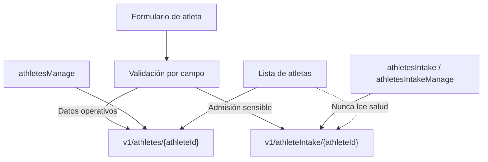

# Implementation Report: cuestionario de admisión de atletas

## Estado

- Spec: ✅ `specs/SPEC-athletes-payments.md` aprobada y actualizada.
- Tests: ⚠️ La prueba enfocada pasa compilada con esbuild y Node (4/4). El comando `npm run test:athlete-intake` queda bloqueado por `uv_os_get_passwd returned ENOMEM`. Las reglas no pudieron ejecutarse porque el entorno sólo tiene Java 8 y Firebase CLI requiere Java 21+.
- Typecheck: ✅ `npm run typecheck`.
- Build: ✅ `npm run build` (1107 módulos transformados).
- Chrome QA: ⚠️ Bloqueado: Chrome está ejecutándose, pero el perfil de pruebas seleccionado (`Profile 3`) no tiene la extensión de control instalada/habilitada y falta el registro del host nativo.
- Login manual requerido: Sí.

## Árbol de archivos modificados

```text
app/
├── database.rules.json
├── package.json
├── src/
│   ├── components/kronos/AthleteIntakeFields.vue
│   ├── pages/atletas.vue
│   ├── services/athlete-intake.service.ts
│   ├── stores/athlete-intake.ts
│   ├── types/access.ts
│   ├── types/domain.ts
│   └── utils/athlete-intake.ts
└── tests/
    ├── athlete-intake.test.ts
    └── database.rules.test.mjs
specs/SPEC-athletes-payments.md
tasks/plan.md
tasks/todo.md
Docs/implementation-reports/2026-08-26-athlete-intake.md
```

## Flujos afectados

- Alta de atletas: captura estado civil, contacto de emergencia y cuestionario de salud.
- Edición de atletas: carga sólo la admisión del atleta seleccionado y permite modo lectura o edición según permisos.
- Administración de usuarios: aparecen las acciones `athletesIntake` y `athletesIntakeManage` desde el catálogo de permisos existente.
- Persistencia: los datos sensibles se guardan en `v1/athleteIntake/{athleteId}` y el registro operativo continúa en `v1/athletes/{athleteId}`.

## Flujos no afectados

- Tabla, búsqueda, filtros, paginación, estados y códigos de kiosco de atletas.
- Pagos, visitas, tienda, programación y reportes financieros.
- No se ejecutaron migraciones ni escrituras sobre datos reales.

## Diagrama



## Evidencia

- Comandos ejecutados: `npm run typecheck`, lint dirigido a los archivos afectados, `npm run build`, `npm run test:athlete-intake`, `npm run test:rules`.
- Prueba enfocada alternativa: esbuild del test a un archivo temporal y `node`; 4 pruebas pasaron.
- Resultado de reglas: no ejecutable hasta disponer de Java 21+.
- Viewports revisados: ninguno todavía; Chrome QA requiere una conexión funcional con el perfil autenticado.
- Errores o warnings observados: no hay errores de lint ni typecheck en los archivos afectados; los bloqueos de `tsx`, Firebase CLI y la conexión Chrome son del entorno.

## Riesgos y pendientes

- Ejecutar `npm run test:rules` con JDK 21+.
- Iniciar sesión manualmente en el perfil de Chrome de pruebas y validar alta, edición, validación, reintento, responsive y consola/network.
- Confirmar la extensión ChatGPT/Codex instalada y habilitada en el mismo perfil de Chrome; si el host nativo continúa ausente, reinstalar el Browser plugin desde la interfaz de plugins de ChatGPT.
- Definir retención, consentimiento y exportación/eliminación de la información de salud.
- Los permisos de admisión quedan desactivados por defecto; un Admin debe concederlos explícitamente.
