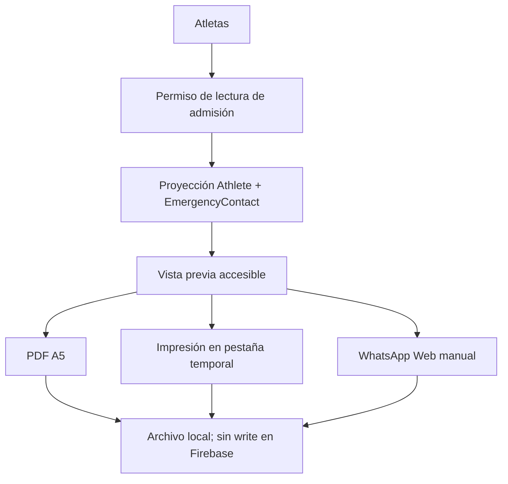

# Implementation Report: Fase C — Ficha de inscripción

## Estado

- Spec: ✅
- Tests: ✅
- Typecheck: ✅
- Build: ✅
- Chrome QA: ✅
- Flujo completo afectado en Chrome: ✅
- Playwright responsive: ✅ mediante la API Playwright de Chrome contra Hosting
- Login manual requerido: Sí

## Árbol de archivos modificados

```text
app/
├── components.d.ts
├── e2e/responsive/enrollment-sheet-responsive.spec.ts
├── package.json
├── playwright.config.ts
├── scripts/node-userinfo-preload.cjs
├── src/
│   ├── components/kronos/EnrollmentSheetDialog.vue
│   ├── pages/atletas.vue
│   └── utils/
│       ├── enrollment-sheet-pdf.ts
│       ├── enrollment-sheet.ts
│       ├── kronos-pdf.ts
│       └── receipts.ts
└── tests/enrollment-sheet.test.ts
specs/SPEC-enrollment-sheet.md
tasks/plan.md
tasks/todo.md
Docs/implementation-reports/2026-08-26-enrollment-sheet.md
```

## Flujos afectados

- `Atletas` añade una acción de lectura para abrir la ficha cuando la sesión puede consultar admisión.
- La ficha proyecta únicamente atleta, fechas, día recurrente y contacto de emergencia.
- Descarga e impresión generan el mismo PDF A5; WhatsApp Web abre un mensaje neutral y deja el adjunto/envío manual.
- El renderer de recibos consume un encabezado/logo compartido sin cambiar su API pública.

## Recorrido completo validado

- Entrada del flujo: sesión manual activa en `https://kronos-training-fd5e5.web.app/atletas`.
- Resultado final: ficha revisada, PDF descargado e inspeccionado, impresión abierta en pestaña `blob:`, WhatsApp Web abierto sin enviar y directorio conservado.
- Segmento modificado y pasos de integración comprobados: publicación de Hosting → creación de `QA Fase C 20260826` → búsqueda → vista previa → responsive → PDF → impresión → WhatsApp → cierre → eliminación de `/v1/athleteIntake/-P000JgUXncNyDG_PF1R` y `/v1/athletes/-P000JgUXncNyDG_PF1R` → ambos paths verificados como `null`.

## Flujos no afectados

- No se modificaron reglas, permisos, autenticación, esquema, índices ni dependencias.
- No se consultó historial de pagos ni se escribieron pagos, saldos, planes o importes desde la ficha.
- No se modificaron datos de atletas reales; los únicos writes fueron el atleta QA autorizado y su eliminación.
- Mensualidades, tienda, visitas y avisos de cobranza conservan el contrato existente de recibos.

## Diagrama



## Evidencia

- Comandos ejecutados: `npm run test:enrollment-sheet`, prueba de `athlete-intake` con preload, `npm run typecheck`, ESLint enfocado, `npm run build`, `firebase deploy --only hosting`, `pdfinfo` y `pdftoppm`.
- Resultado de pruebas: 8/8 de ficha y PDF; 6/6 de admisión; typecheck, lint y build exitosos.
- Viewports revisados: `320`, `768`, `1024` y `1440` px, sin overflow horizontal y con cuatro acciones visibles.
- Errores o warnings observados: ninguno nuevo en consola. Poppler informó fuentes fallback `Symbol`/`ArialUnicode`, sin glifos rotos en el render final.
- Evidencia Playwright/Chrome: nombre accesible del diálogo, frase exacta `Tu fecha de pago será el 26 de cada mes.`, contacto completo, ausencia de salud, estados y acciones visibles.
- Evidencia PDF: A5 vertical de una página (`419.53 × 595.28 pt`), encabezado Kronos, folio, contacto y pie legibles. El primer QA detectó una segunda página innecesaria; se añadió regresión, se corrigió, reconstruyó, republicó y volvió a renderizar.
- Limpieza: los dos nodos QA se eliminaron y devolvieron `null`; la búsqueda quedó en estado `Sin atletas` y sin errores de consola.

## Riesgos y pendientes

- El PDF contiene fecha de nacimiento y contacto de emergencia; el operador debe confirmar el destinatario y controlar el archivo descargado.
- WhatsApp Web no adjunta ni envía automáticamente; el usuario conserva la decisión final.
- El runner Playwright separado no usó un `storageState`, porque el dispositivo autorizado sólo estaba disponible en Chrome; la misma matriz se ejecutó con selectores/evaluación Playwright dentro de la sesión Chrome autorizada.
- La integración con WhatsApp Business Cloud API permanece fuera de alcance.
