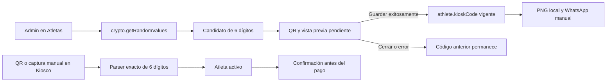

# Implementation Report: credencial QR de Kiosco

## Estado

- Spec: ✅ aprobada; implementación y QA D1–D4 completados.
- Tests: ✅ pruebas enfocadas, regresiones y QA runtime.
- Typecheck: ✅.
- Build: ✅, 1121 módulos transformados.
- Chrome QA: ✅ en `https://kronos-training-fd5e5.web.app/`.
- Flujo completo afectado en Chrome: ✅ sin confirmar venta.
- Playwright responsive: ⚠️ cobertura creada y descubierta; 4 casos omitidos para no crear otro dispositivo autenticado. La misma matriz pasó en la sesión Chrome autorizada.
- Login manual requerido: Sí.

## Árbol de archivos modificados

```text
app/
├── components.d.ts
├── package.json
├── playwright.config.ts
├── e2e/responsive/kiosk-credential-responsive.spec.ts
├── src/components/kronos/
│   ├── BarcodeScanner.vue
│   ├── KioskCredentialCard.vue
│   └── KioskCredentialDialog.vue
├── src/pages/
│   ├── atletas.vue
│   └── kiosco.vue
├── src/utils/kiosk-code.ts
└── tests/kiosk-code.test.ts
specs/
├── CAPABILITY-MAP.md
└── SPEC-kiosk-code.md
tasks/
├── plan.md
└── todo.md
Docs/implementation-reports/2026-08-26-kiosk-credential.md
```

## Flujos afectados

- Atletas / Admin: generación criptográfica de candidatos, confirmación de regeneración, vista previa, persistencia y acciones de la credencial vigente.
- Entrega: descarga local PNG, copia de mensaje y apertura de WhatsApp Web para adjuntar manualmente la imagen.
- Kiosco: identificación por lector QR-only o captura manual exacta de seis dígitos antes de mostrar al atleta seleccionado.
- Escáner compartido: conserva el lector multiformato para productos y añade un modo QR separado para credenciales.

## Recorrido completo validado

- Entrada del flujo: acción `Credencial QR` de un atleta, disponible sólo para Admin.
- Segmento automatizado: candidato aleatorio → matriz QR con payload exacto → tarjeta accesible → guardado explícito; lector QR/manual → parser estricto → búsqueda de atleta activo.
- Resultado final automatizado: build de producción correcto, reglas Firebase 26/26 y sin cambios de esquema o dependencias.
- Resultado runtime: se creó y conservó `QA Credencial QR Kronos`, se descargó la credencial, se regeneró varias veces, el código anterior fue rechazado y el QR vigente identificó al atleta antes del pago. El producto QA se retiró del carrito y no se registró venta.

## Flujos no afectados

- No se modificaron reglas Firebase, esquema, autenticación, permisos ni configuración de Hosting.
- No se modificaron productos, inventario, pagos, cierres ni la escritura de ventas.
- No se añadieron dependencias ni servicios externos; generación y lectura reutilizan ZXing.
- No se tocó la aplicación HTML histórica de `AppKronos/`.

## Diagrama



## Evidencia

- `npm run test:kiosk-code`: 8/8; incluye ceros iniciales, colisiones, sesgo, payload estricto, decodificación QR, escape de nombre y WhatsApp manual.
- `npm run test:rules` con Temurin 21: 26/26.
- `npm run test:enrollment-sheet`: 8/8.
- `npm run test:athlete-intake`: 6/6.
- `npm run test:finance`: 2/2.
- `npm run test:iconify`: 1/1.
- `npm run typecheck`: exitoso.
- Lint enfocado sobre todos los archivos de Fase D: sin hallazgos.
- Lint global sin corrección: conserva 53 errores y 368 warnings preexistentes en archivos ajenos a la fase; no se modificaron para evitar ampliar alcance.
- `npm run build`: exitoso, 1121 módulos transformados.
- Playwright: los casos `320`, `768`, `1024` y `1440` se descubren correctamente; quedaron omitidos por no existir `.playwright/auth/user.json` local.
- Deploy: `firebase deploy --only hosting --project kronos-training-fd5e5`, 93 archivos y release completado; no se desplegaron reglas.
- PNG real: `1080 × 1920`, PNG ARGB, diseño oscuro/naranja, QR negro sobre blanco, nombre, código y URL visibles. La credencial final quedó en Descargas.
- Regeneración: tres candidatos iniciales distintos; cerrar descartó el candidato. Con credencial vigente se confirmó el reemplazo, se generaron dos candidatos adicionales y sólo el último se activó al guardar.
- Revocación: el código anterior fue rechazado por Kiosco y el lector QR vigente llegó a la confirmación del atleta.
- Cámara: el lector QR-only mostró video `1280 × 720`; al cerrar, el elemento de video pasó de uno a cero después de la transición.
- Responsive Chrome: Atletas y Kiosco pasaron `320`, `768`, `1024` y `1440` sin overflow horizontal y con contenido dentro del viewport.
- Accesibilidad/DOM: estados `Pendiente de guardar` y `Credencial vigente`, alt descriptivo, acciones con nombre accesible y captura manual siempre disponible.
- Consola: cero warnings o errores nuevos en Atletas y Kiosco.
- WhatsApp: no se abrió ni envió información; se validó el texto copiado y la instrucción de adjuntar manualmente.
- Datos QA: el atleta sintético permanece para futuras pruebas. El carrito terminó vacío y no se confirmó pago ni venta.

## Riesgos y pendientes

- El código de seis dígitos es un identificador operativo revocable, no autenticación fuerte; puede copiarse o adivinarse.
- La unicidad se valida contra los atletas cargados y nuevamente antes de escribir; una carrera entre dos clientes sigue siendo un riesgo residual mientras el esquema/reglas no impongan unicidad global.
- La suite Playwright protegida permanece omitida porque no se creó un segundo dispositivo/estado de autenticación; Chrome cubrió la matriz equivalente en la única sesión permitida.
- Quedaron dos archivos PNG QA en Descargas: el primero contiene el código revocado y el sufijo `(1)` corresponde a la credencial vigente. No se eliminaron sin una instrucción explícita.
- El lint global mantiene deuda previa fuera de esta fase; el conjunto modificado está limpio.
