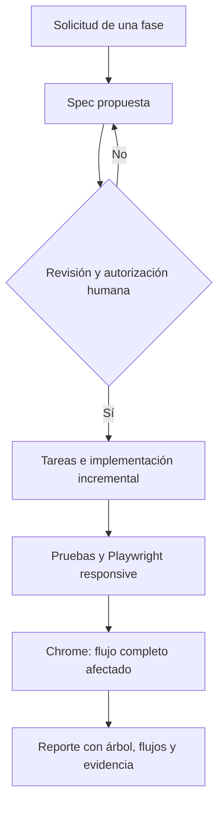

# Implementation Report: Gate SDD/QA y specs de Fase B

## Estado

- Spec: ✅ propuestas disponibles para revisión humana
- Tests: No aplica; sólo se modificó documentación de proceso
- Typecheck: No aplica
- Build: No aplica
- Chrome QA: No aplica; todavía no se modificó la aplicación web
- Flujo completo afectado en Chrome: Pendiente de autorización e implementación de Fase B
- Playwright responsive: Pendiente de autorización e instalación
- Login manual requerido: Pendiente para el gate de Chrome de Fase B

## Árbol de archivos modificados

```text
AGENTS.md
specs/
├── CAPABILITY-MAP.md
├── SPEC-athlete-form-tabs.md
├── SPEC-athletes-payments.md
└── SPEC-quality-gates.md
Docs/decisions/
└── ADR-001-playwright-responsive-complement.md
tasks/
├── plan.md
└── todo.md
Docs/implementation-reports/
├── README.md
└── 2026-08-26-sdd-qa-gates-phase-b-spec.md
```

## Flujos afectados

- Flujo de trabajo de futuras fases: spec propuesta → revisión/autorización → tareas → implementación incremental → pruebas → Chrome con flujo completo afectado → reporte.
- Futuro flujo de alta/edición de atleta: la spec propone tres pestañas y un indicador/navegación de errores.
- Futuro QA responsive: la spec propone Playwright Test en `320/768/1024/1440` px contra localhost o QA aislado.

## Flujos no afectados

- La aplicación Vue, Firebase, autenticación, permisos, datos y reglas no cambiaron.
- No se ejecutó ni modificó el flujo de pagos, kiosco, inventario, WhatsApp o push.
- No se instaló `@playwright/test` ni se descargó Chromium porque ambas acciones quedan sujetas a autorización.

## Recorrido completo validado

- Entrada del flujo: no aplica en esta entrega documental.
- Resultado final: specs y reglas globales listas para revisión; Fase B permanece bloqueada hasta autorización.
- Segmento modificado y pasos de integración comprobados: actualización de documentación y checklist; no hubo segmento runtime.

## Diagrama



## Evidencia

- Archivos revisados: `AGENTS.md`, capability map, specs, ADR, tareas y configuración de testing del repositorio.
- Comprobación documental: `git diff --check` se ejecutará antes del commit de esta entrega.
- Viewports definidos: `320`, `768`, `1024` y `1440` px para la futura prueba Playwright y la revisión responsive en Chrome.
- Errores o warnings observados: ninguno generado por cambios runtime; no hubo build ni navegador porque no se modificó la aplicación.

## Riesgos y pendientes

- El usuario debe autorizar `specs/SPEC-athlete-form-tabs.md`.
- El usuario debe autorizar `specs/SPEC-quality-gates.md`, `@playwright/test` y la descarga de Chromium.
- Hace falta confirmar un entorno/dataset aislado para pruebas Playwright autenticadas; no se debe usar producción por defecto.
- Antes del QA de Fase B, el usuario deberá iniciar sesión manualmente en el perfil Chrome de pruebas y autorizar la validación visible.
