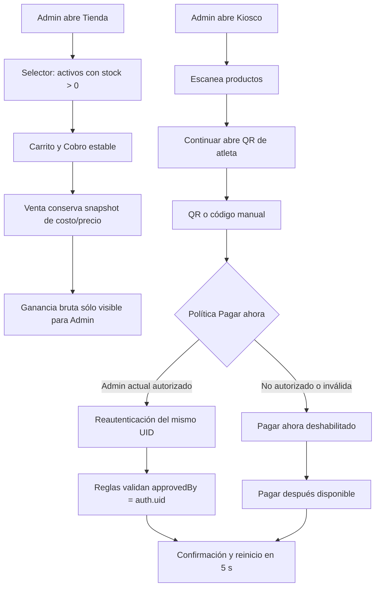

# Implementation Report: Mejoras de Punto de Venta y Kiosco

## Estado

- Spec: ✅ aprobada para implementación local
- Tests: ✅
- Typecheck: ✅
- Build: ✅
- Chrome QA: ⚠️ pendiente de desplegar la versión implementada
- Flujo completo afectado en Chrome: ⚠️ pendiente de autorización de despliegue
- Playwright responsive: ⚠️ 8 casos descubiertos; ejecución autenticada pendiente
- Login manual requerido: Sí

## Árbol de archivos modificados

```text
app/
├── database.rules.json
├── e2e/responsive/store-kiosk-improvements-responsive.spec.ts
├── package.json
├── playwright.config.ts
├── src/
│   ├── pages/
│   │   ├── kiosco.vue
│   │   ├── tienda.vue
│   │   └── usuarios.vue
│   ├── services/kiosk-settings.service.ts
│   ├── stores/kiosk-settings.ts
│   ├── types/
│   │   ├── access.ts
│   │   └── domain.ts
│   └── utils/store-kiosk.ts
└── tests/
    ├── database.rules.test.mjs
    └── store-kiosk-improvements.test.ts
Docs/implementation-reports/2026-08-27-store-kiosk-improvements.md
specs/SPEC-store-kiosk-improvements.md
tasks/plan.md
tasks/todo.md
```

## Flujos afectados

- Punto de Venta: oferta de productos con stock, armado/vaciado del carrito, estado de `Cobro` y tarjeta administrativa de ganancia bruta.
- Usuarios y permisos: creación/edición del perfil Coach y configuración de `Pagar ahora` para todos o determinados Admin habilitados.
- Kiosco: identificación QR como opción primaria, captura manual de respaldo, autorización de pago inmediato y reinicio posterior a una venta.
- Realtime Database: validación del rol Coach, configuración `v1/settings/kiosk` y ventas pagadas de Kiosco.

## Recorrido completo validado

- Entrada del flujo local: contratos puros y componentes de Tienda, Usuarios y Kiosco.
- Resultado final local: 7 pruebas unitarias y 29 pruebas de reglas aprobadas; typecheck, lint enfocado y build aprobados.
- Segmentos de integración comprobados: Coach sin permisos implícitos; configuración fail-closed; allowlist de Admin; `approvedBy === auth.uid`; catálogo con `stock > 0`; margen histórico; carrito idempotente; temporizador exacto de 5 segundos.
- Chrome publicado: se reprodujo la versión anterior para confirmar el error `customerKey = null` y la presencia de productos agotados. La versión corregida todavía no se recorrió porque no se ha autorizado su despliegue.

## Flujos no afectados

- No se cambió el formato persistido de ventas ni la operación de `Pagar después`.
- No se modificaron pagos de membresía, visitas, cierres, recibos, inventario fuera de la venta ni credenciales QR de atletas.
- No se creó ningún usuario, venta o configuración de prueba en la instancia publicada.

## Diagrama



## Evidencia

- `npm run test:store-kiosk`: 7/7 aprobadas.
- `npm run test:rules`: 29/29 aprobadas con Firebase Database Emulator y JDK 21 temporal verificado.
- `npm run typecheck`: aprobado.
- `npx eslint` sobre los archivos modificados: aprobado.
- `npm run build`: aprobado; 1124 módulos transformados.
- `npx playwright test ... --list --reporter=line`: 8 casos descubiertos para 320, 768, 1024 y 1440 px.
- Viewports revisados sobre la versión nueva: pendientes.
- Errores o warnings nuevos en la versión nueva: pendientes de Chrome; el emulador sólo reportó denegaciones esperadas por las pruebas negativas.
- Evidencia Playwright/Chrome: ejecución protegida pendiente porque no existe estado autenticado de Playwright y la versión nueva aún no está publicada.

## Revisión de calidad

- Correctitud: los criterios se aislaron en utilidades deterministas y pruebas de regresión.
- Seguridad: la política falla cerrada, sólo acepta Admin habilitados y una venta pagada de Kiosco debe atribuir la aprobación al mismo UID autenticado.
- Regresión: el esquema de ventas se conserva y las ventas de crédito no dependen de la política de pago inmediato.
- Mantenibilidad: política, parseo y cálculos viven fuera de las vistas; la configuración usa servicio y store dedicados.
- Cobertura: lógica y reglas están cubiertas; responsive y flujo runtime permanecen abiertos hasta publicar.

## Riesgos y pendientes

- Se requiere autorización explícita para desplegar Hosting y reglas de Realtime Database en `kronos-training-fd5e5`.
- Después del despliegue se debe recorrer Tienda, Usuarios y Kiosco en Chrome, revisar consola/red/DOM/accesibilidad y ejecutar la matriz responsive.
- La configuración publicada seguirá ausente o en su valor anterior hasta que un Admin decida guardarla; por diseño eso mantiene `Pagar ahora` deshabilitado.
- La QA publicada no completará ventas ni guardará usuarios/configuración sin una autorización adicional y datos de prueba acordados.
