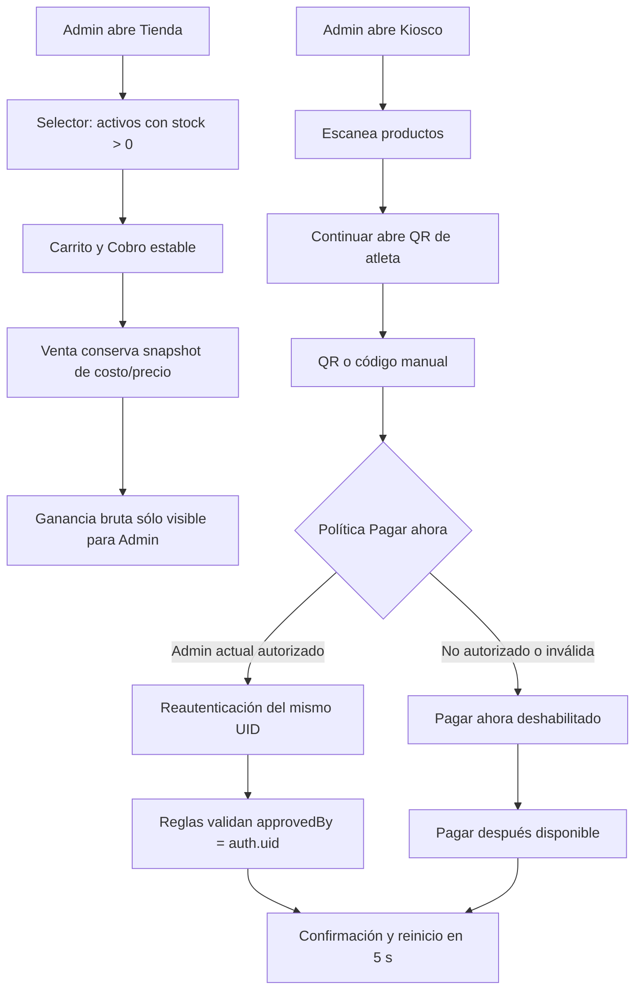

# Implementation Report: Mejoras de Punto de Venta y Kiosco

## Estado

- Spec: ✅ implementada y desplegada
- Tests: ✅
- Typecheck: ✅
- Build: ✅
- Chrome QA: ✅
- Flujo completo afectado en Chrome: ⚠️ recorrido hasta elección de pago; confirmación/éxito no ejecutados para evitar crear una venta
- Playwright responsive: ✅ matriz autenticada ejecutada mediante la API Playwright de Chrome
- Login manual requerido: Sí

## Árbol de archivos modificados

```text
app/
├── database.rules.json
├── e2e/responsive/store-kiosk-improvements-responsive.spec.ts
├── package.json
├── playwright.config.ts
├── src/
│   ├── pages/
│   │   ├── kiosco.vue
│   │   ├── tienda.vue
│   │   └── usuarios.vue
│   ├── services/kiosk-settings.service.ts
│   ├── stores/kiosk-settings.ts
│   ├── types/
│   │   ├── access.ts
│   │   └── domain.ts
│   └── utils/store-kiosk.ts
└── tests/
    ├── database.rules.test.mjs
    └── store-kiosk-improvements.test.ts
Docs/implementation-reports/2026-08-27-store-kiosk-improvements.md
specs/SPEC-store-kiosk-improvements.md
tasks/plan.md
tasks/todo.md
```

## Flujos afectados

- Punto de Venta: oferta de productos con stock, armado/vaciado del carrito, estado de `Cobro` y tarjeta administrativa de ganancia bruta.
- Usuarios y permisos: creación/edición del perfil Coach y configuración de `Pagar ahora` para todos o determinados Admin habilitados.
- Kiosco: identificación QR como opción primaria, captura manual de respaldo, autorización de pago inmediato y reinicio posterior a una venta.
- Realtime Database: validación del rol Coach, configuración `v1/settings/kiosk` y ventas pagadas de Kiosco.

## Recorrido completo validado

- Entrada del flujo local: contratos puros y componentes de Tienda, Usuarios y Kiosco.
- Resultado final local: 7 pruebas unitarias y 29 pruebas de reglas aprobadas; typecheck, lint enfocado y build aprobados.
- Segmentos de integración comprobados: Coach sin permisos implícitos; configuración fail-closed; allowlist de Admin; `approvedBy === auth.uid`; catálogo con `stock > 0`; margen histórico; carrito idempotente; temporizador exacto de 5 segundos.
- Chrome publicado: Tienda mostró la tarjeta de ganancia; el selector ofreció 15 productos sin stock cero; el carrito recorrió `2 → 1 → 0`; `Cobro` permaneció visible en `$0`; consola limpia desde la carga del bundle nuevo.
- Usuarios publicado: configuración fail-closed visible en `Deshabilitado para todos`; Coach seleccionable con aviso de cero permisos; el diálogo se canceló sin guardar y la consola quedó limpia.
- Kiosco publicado: se agregó un producto con intervención manual, `Continuar` abrió inmediatamente el lector QR, cerrar la cámara enfocó el código manual y reactivarla restauró el lector. Tras identificar al atleta, `Pagar ahora` quedó deshabilitado por configuración y `Pagar después` permaneció disponible. Se regresó sin pagar y el carrito local quedó vacío.

## Flujos no afectados

- No se cambió el formato persistido de ventas ni la operación de `Pagar después`.
- No se modificaron pagos de membresía, visitas, cierres, recibos, inventario fuera de la venta ni credenciales QR de atletas.
- No se creó ningún usuario, venta o configuración de prueba en la instancia publicada.

## Diagrama



## Evidencia

- `npm run test:store-kiosk`: 7/7 aprobadas.
- `npm run test:rules`: 29/29 aprobadas con Firebase Database Emulator y JDK 21 temporal verificado.
- `npm run typecheck`: aprobado.
- `npx eslint` sobre los archivos modificados: aprobado.
- `npm run build`: aprobado; 1124 módulos transformados.
- `npx firebase deploy --only hosting,database --project kronos-training-fd5e5`: Hosting y reglas publicados correctamente desde `dec97f8`.
- `npx playwright test ... --list --reporter=line`: 8 casos descubiertos para 320, 768, 1024 y 1440 px.
- Viewports revisados sobre la versión nueva: 320, 768, 1024 y 1440 px en Tienda, Usuarios y pantalla principal del Kiosco; sin desbordamiento horizontal.
- Errores o warnings nuevos en la versión nueva: ninguno durante Tienda, Usuarios, identificación/pago del Kiosco ni la matriz responsive. Los errores históricos observados pertenecían al bundle previo y desaparecieron al cargar el release `dec97f8`.
- Evidencia Playwright/Chrome: DOM, accesibilidad básica, comportamiento y capturas revisados en la sesión Chrome autorizada; 12 combinaciones superficie/viewport aprobadas.

## Revisión de calidad

- Correctitud: los criterios se aislaron en utilidades deterministas y pruebas de regresión.
- Seguridad: la política falla cerrada, sólo acepta Admin habilitados y una venta pagada de Kiosco debe atribuir la aprobación al mismo UID autenticado.
- Regresión: el esquema de ventas se conserva y las ventas de crédito no dependen de la política de pago inmediato.
- Mantenibilidad: política, parseo y cálculos viven fuera de las vistas; la configuración usa servicio y store dedicados.
- Cobertura: lógica, reglas, responsive e integración publicada sin escritura están cubiertos. El retorno de éxito a 5 segundos se valida con la prueba automatizada del contrato, no con una venta real.

## Riesgos y pendientes

- Hosting y reglas ya están publicados en `kronos-training-fd5e5`; la reversión preparada consiste en recompilar `4613e68` y redesplegar ambos destinos si aparece un fallo crítico.
- La pantalla posterior a una venta y su retorno a 5 segundos no se ejecutaron en producción porque la spec prohíbe crear ventas durante QA; el temporizador exacto está cubierto por prueba automatizada.
- La configuración publicada permanece en `Deshabilitado para todos`; no se modificó durante QA y por diseño mantiene `Pagar ahora` deshabilitado.
- La QA publicada no completó ventas ni guardó usuarios/configuración.
