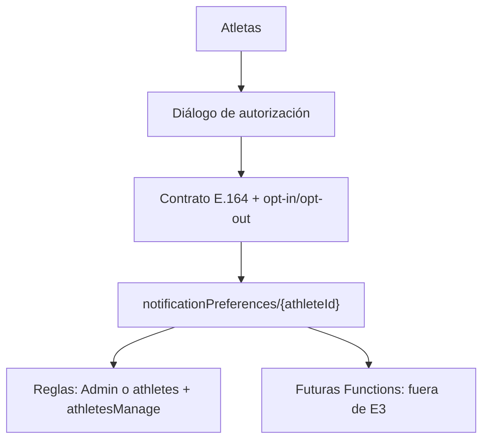

# Implementation Report: Consentimiento de notificaciones de pagos E3

## Estado

- Spec: ✅ `SPEC-payment-notifications-whatsapp.md` aprobada el 2026-08-28
- Tests: ✅ contratos 13/13; reglas Realtime Database 30/30; regresiones enrollment 8/8, kiosk 8/8 y store kiosk 7/7
- Typecheck: ✅ `npm run typecheck`
- Build: ✅ `npm run build` pasa con permiso de ejecución para el temporal de Vite; el sandbox restringido conserva el fallo basal `EPERM`
- Chrome QA: ✅ confirmado manualmente por el usuario en localhost
- Flujo completo afectado en Chrome: ✅ el usuario confirmó el recorrido local; no se usó la instancia publicada
- Playwright responsive: ⚠️ pendiente; no existe sesión QA local autorizada
- Login manual requerido: Sí

## Árbol de archivos modificados

```text
app/database.rules.json
app/src/components/kronos/WhatsAppConsentDialog.vue
app/src/pages/atletas.vue
app/src/services/notification-preferences.service.ts
app/src/stores/notification-preferences.ts
app/src/utils/payment-notification.ts
app/tests/database.rules.test.mjs
app/tests/payment-notification.test.ts
tasks/plan.md
tasks/todo.md
```

## Flujos afectados

- Atletas → acción de consentimiento WhatsApp → lectura/escritura aislada de `v1/notificationPreferences/{athleteId}`.
- Registro de opt-in independiente para recibos y recordatorios.
- Retiro explícito de propósitos conservando el historial mínimo y bloqueando futuros envíos.
- Autorización sólo para Admin o usuario habilitado con `athletes` y `athletesManage`.

## Recorrido completo validado

- Entrada del flujo: implementación estática en la tabla de Atletas y diálogo dedicado.
- Resultado final: contrato de consentimiento validado y persistencia protegida por reglas.
- Segmento modificado y pasos de integración comprobados: normalización E.164, confirmación explícita, opt-out, parser fail-closed, store/service y reglas de lectura/escritura.
- Confirmado: el usuario abrió Atletas en Chrome local y compartió evidencia del diálogo; se observan teléfono enmascarado, propósitos independientes y la advertencia de que guardar no envía mensajes.
- Limitación de la evidencia del agente: no hubo Chrome DevTools MCP disponible para inspección automatizada de consola, red o árbol de accesibilidad.

## Flujos no afectados

- Registro financiero de mensualidades y ventas.
- Functions, scheduler, webhook y proveedor Meta.
- Plantillas, PDFs enviados y secretos.
- Kiosco, Punto de Venta, perfil Coach y ficha de admisión, salvo regresiones automatizadas.

## Diagrama



## Evidencia

- Comandos ejecutados:
  - `node --require ./scripts/node-userinfo-preload.cjs --import tsx --test tests/payment-notification.test.ts`
  - `npm run test:enrollment-sheet`
  - `npm run test:kiosk-code`
  - `npm run test:store-kiosk`
  - `npm run typecheck`
  - lint enfocado de archivos E3
  - `npm run test:rules` con el JDK21 ya instalado en `C:\Users\inged\AppData\Local\Kronos\temurin-21`
  - `npm run build`
- Resultado: pruebas enfocadas, reglas y build pasan; el build requiere permiso del entorno para escribir `.vite-temp`.
- Viewports revisados: el flujo fue confirmado manualmente en Chrome local; Playwright responsive queda pendiente y no se alteró producción.
- Errores o warnings observados: warnings `permission_denied` esperados de casos negativos en las reglas; sin errores nuevos de TypeScript/lint.
- Evidencia Chrome: captura proporcionada por el usuario en localhost; no se automatizó autenticación. Evidencia Playwright: pendiente.

## Riesgos y pendientes

- Ejecutar matriz responsive 320/768/1024/1440 y revisar DOM, accesibilidad, consola y red mediante una herramienta DevTools disponible.
- Confirmar después, en un gate separado, cualquier write QA, Functions, dependencias, credenciales Meta y despliegue.
