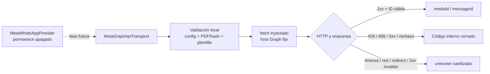

# Implementation Report: E8-PROD-2 — Transporte Meta local

## Estado

- Spec: ✅ autorizada, implementada y sincronizada
- Tests: ✅ 169/169 en Functions; 21 verificaciones enfocadas contando subtests
- Typecheck: ✅
- Build: ✅
- Lint focalizado: ✅
- Whitespace: ✅
- Revisión de cinco ejes: ✅ sin hallazgos Critical/Required
- Chrome QA: No aplica
- Flujo completo afectado en Chrome: No aplica
- Playwright responsive: No aplica
- Login manual requerido: No

## Árbol de archivos modificados

```text
app/functions/
├── SPEC-whatsapp-meta-transport.md
├── src/
│   ├── index.ts
│   └── whatsapp/
│       └── meta-graph-api-transport.ts
└── tests/
    └── meta-graph-api-transport.test.ts
tasks/
├── plan.md
└── todo.md
Docs/implementation-reports/
└── 2026-09-10-whatsapp-meta-transport.md
```

## Flujos afectados

- Construcción backend del upload privado de un PDF a `/{version}/{phone}/media`.
- Construcción backend del envío de una plantilla Utility a
  `/{version}/{phone}/messages`.
- Traducción de respuestas HTTP ciertas a códigos internos de rechazo temporal o
  definitivo.
- Traducción de red, timeout, redirect o respuesta 2xx inválida a incertidumbre
  sanitizada.
- Export del transporte para una fase de ensamble posterior.

## Recorrido completo validado

- Entrada del flujo: documento PDF sintético, versión Graph explícita, phone-number ID,
  token ficticio y datos de plantilla ficticios.
- Resultado final: `mediaId` y `messageId` sólo aparecen para respuestas 2xx acotadas
  con forma e identificadores válidos.
- Segmento modificado y pasos de integración comprobados: validación → request fake →
  timeout/lectura acotada → clasificación → contrato `MetaWhatsAppTransport`.
- El proveedor existente conserva `enabled !== true` como estado inicial y convierte
  las excepciones del transporte a `META_TRANSPORT_UNKNOWN`, sin reintento ciego.

## Flujos no afectados

- Worker exportado, scheduler, recordatorios, webhooks y política de reintentos.
- Firebase Realtime Database, reglas, esquema, Auth, permisos y datos.
- Aplicación Vue, bundle cliente, interfaz de pagos y consentimiento.
- Secret Manager, configuración productiva, WABA, número remitente y plantillas Meta.
- CI, hosting, despliegue y cualquier mensaje real.

## Diagrama



## Evidencia

- RED T1: la prueba inicial falló por módulo inexistente.
- RED T2: fallaron rate limit, 5xx, red, timeout y respuestas mayores a 64 KiB antes
  de implementar su contrato.
- RED de hardening: la entrada sin objeto falló antes de añadir el control de frontera;
  la misma rebanada añadió la comprobación de integridad bytes/SHA-256.
- GREEN enfocado:
  `node --require ./scripts/node-userinfo-preload.cjs --import tsx --test functions/tests/meta-graph-api-transport.test.ts functions/tests/meta-provider.test.ts`.
- Regresión: `npm --prefix functions test` → 169 pruebas, 169 aprobadas.
- Typecheck: `npm --prefix functions run typecheck` → aprobado.
- Build: `npm --prefix functions run build` → aprobado. El primer intento falló sólo
  por `EPERM` del sandbox al escribir `functions/lib`; la repetición autorizada fuera
  del sandbox terminó correctamente.
- Lint: ESLint sobre `src/index.ts`, transporte y prueba → aprobado; sólo se desactivó
  `import/extensions` porque la suite usa imports `.ts` con `tsx`.
- `git diff --check` → aprobado; sólo se mostraron avisos existentes de conversión
  LF/CRLF en otros archivos del árbol sucio.
- Red real y mensajes: cero; todos los `fetch` ejecutados fueron fakes inyectados.

## Revisión de cinco ejes

- Corrección: requests y respuestas cumplen la spec; errores y límites tienen cobertura.
- Legibilidad: transporte, validadores y parsing están encapsulados en un módulo.
- Arquitectura: implementa la interfaz vigente, usa dependencias de Node 22 y no se
  conecta al worker.
- Seguridad: token fuera de logs/resultados, redirects bloqueados, host fijo, entradas
  e IDs cerrados, PDF con firma/hash y respuesta remota acotada.
- Rendimiento: PDF limitado a 10 MiB, respuesta a 64 KiB y timeout entre 1 y 60 s; no
  hay bucles ni buffers sin límite.

## Riesgos y pendientes

- La versión Graph real, forma vigente del document header, plantilla aprobada y
  formato exacto de IDs deben revalidarse con los recursos Meta elegidos antes de QA.
- El transporte todavía no recibe secretos de Secret Manager ni se conecta al worker.
- No se verificaron red, permisos, cuotas, costos, WABA ni número remitente en esta fase.
- La activación, destinatario QA, mensajes, escrituras y despliegue requieren specs y
  autorizaciones separadas.
