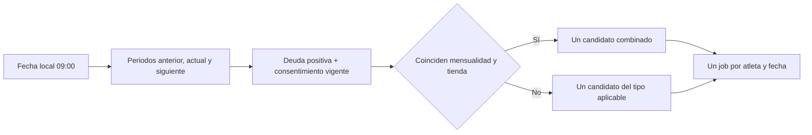

# Implementation Report: E8-PROD-1 — contrato operativo de recordatorios

Fecha: 2026-09-10, America/Mexico_City.
Estado: implementación y QA local completados. No es un lanzamiento productivo.
Spec: `app/functions/SPEC-whatsapp-production-configuration.md`, autorizada mediante
«Sí, autorizo».

## Estado

- Spec: ✅ contrato operativo autorizado y sincronizado con la spec matriz.
- Tests: ✅ 153/153 pruebas de Functions.
- Typecheck: ✅ Functions.
- Build: ✅ Functions; requirió acceso de escritura a `functions/lib` fuera del sandbox.
- Lint: ✅ archivos de implementación y prueba del alcance.
- Chrome QA: No aplica; no se modificó la aplicación web.
- Flujo completo afectado en Chrome: No aplica.
- Playwright responsive: No aplica.
- Login manual requerido: No.

## Árbol de archivos modificados

```text
app/functions/
├── SPEC-whatsapp-production-configuration.md
├── src/notifications/reminders.ts
└── tests/reminders.test.ts
Docs/implementation-reports/
└── 2026-09-10-whatsapp-production-configuration.md
specs/
└── SPEC-payment-notifications-whatsapp.md
tasks/
├── plan.md
└── todo.md
```

La compilación actualizó `app/functions/lib` localmente; el directorio está ignorado
por Git. No se instalaron dependencias ni se modificaron paquetes o locks.

## Flujos afectados

- La cadencia queda fijada en 09:00 America/Mexico_City, mensualidad -3/0/+3 días,
  tienda miércoles/viernes y máximo de un recordatorio por atleta/fecha.
- El barrido mensual evalúa el periodo anterior, actual y siguiente, además de los
  periodos que ya existen en pagos.
- Un aviso previo al inicio del siguiente mes y un vencido del mes anterior ya no
  dependen de que exista previamente una fila de pago para ese periodo.
- Los balances pagados de periodos adyacentes continúan excluidos.

## Recorrido completo validado

Entrada del flujo: snapshot sintético de atleta, adeudos y consentimiento con reloj
inyectado. Resultado final: candidato de recordatorio o exclusión fail-closed y job
diario idempotente. Se recorrieron previo, vencimiento, vencido, tienda, combinado,
consentimiento, opt-out, teléfono cambiado, atleta inactivo, saldo liquidado y
configuración inválida. No hubo I/O remoto.

## Flujos no afectados

- Pagos, ventas y consentimiento persistidos.
- Worker, reintentos, webhook, BAJA, inbox y mantenimiento.
- PDF, plantillas y UI de estados.
- Meta, secretos, infraestructura, reglas, esquema, producción y despliegue.

## Diagrama



## Evidencia

Comandos ejecutados desde `app/`:

```powershell
npm --prefix functions test
npm --prefix functions run typecheck
npm --prefix functions run build
.\node_modules\.bin\eslint.cmd functions/src/notifications/reminders.ts functions/tests/reminders.test.ts -c .eslintrc.cjs --rule "import/extensions: off"
git diff --check
```

Resultado:

- RED: 11/13 pruebas enfocadas; fallaron los dos casos de periodo adyacente.
- GREEN inicial: 13/13 pruebas enfocadas.
- Regresión final: 153/153 pruebas de Functions.
- Typecheck, build, lint focalizado y revisión de whitespace aprobados.
- El primer build dentro del sandbox falló con `EPERM` al escribir `functions/lib`;
  la misma compilación autorizada fuera del sandbox terminó correctamente.
- `import/extensions` se desactivó sólo para el lint de la prueba porque la convención
  existente de la suite usa imports `.ts` ejecutados mediante `tsx`.

## Revisión de calidad

Correctitud: la corrección cubre ambos lados del cambio de mes y conserva pagos ya
liquidados. Legibilidad: un helper pequeño mantiene el cálculo localizado.
Arquitectura: la lógica permanece en el módulo dueño de la cadencia, sin dependencias
nuevas. Seguridad: no incorpora entradas remotas, secretos o salidas con PII.
Rendimiento: añade tres periodos acotados por atleta; no introduce consultas ni bucles
remotos adicionales. No quedaron hallazgos Critical/Required.

## Riesgos y pendientes

- La fuente de datos productiva todavía lee colecciones completas; volumen,
  paginación y límites pertenecen a una fase posterior.
- La pérdida de una corrida diaria aún no tiene política de catch-up productiva.
- Transporte Meta, scheduler administrado, reintentos operativos, retención,
  observabilidad, piloto y despliegue siguen pendientes y requieren specs/gates.
- No se hicieron commit, push, mensajes, writes remotos ni despliegue.
