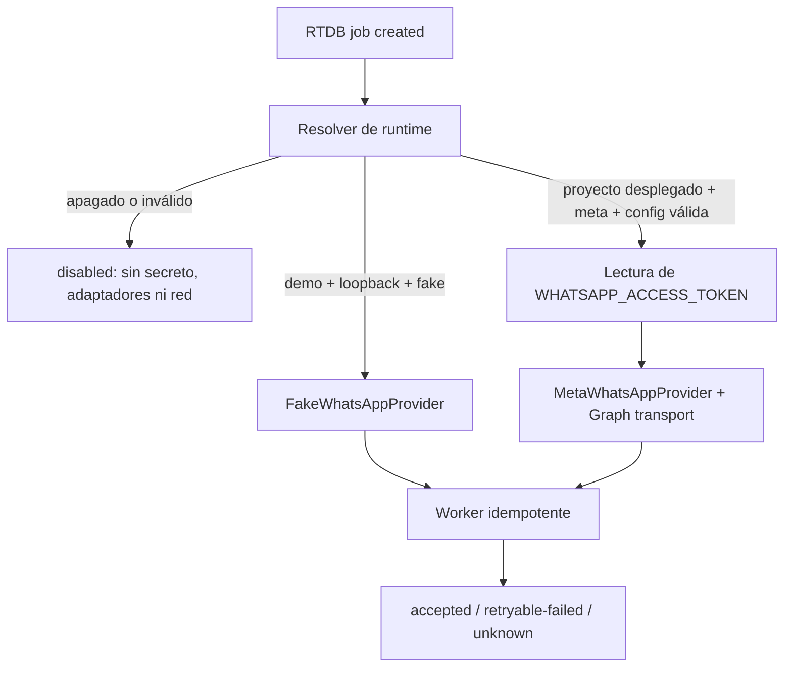

# Implementation Report: E8-PROD-3 — Runtime productivo seguro de WhatsApp

## Estado

- Spec: ✅ implementada y verificada localmente
- Tests: ✅ 37 focalizadas; 184/184 en Functions
- Typecheck: ✅
- Build: ✅
- Lint focalizado: ✅
- Whitespace: ✅
- Revisión de cinco ejes: ✅
- Chrome QA: No aplica
- Flujo completo afectado en Chrome: No aplica
- Playwright responsive: No aplica
- Login manual requerido: No

## Árbol de archivos modificados

```text
app/functions/
├── SPEC-whatsapp-production-runtime.md
├── src/
│   ├── notifications/local-worker.ts
│   └── whatsapp/
│       ├── meta-graph-api-transport.ts
│       └── provider-runtime.ts
└── tests/
    ├── local-worker.test.ts
    ├── notification-runtime-worker.test.ts
    └── provider-runtime.test.ts
Docs/implementation-reports/
└── 2026-09-11-whatsapp-production-runtime.md
tasks/
├── plan.md
└── todo.md
```

## Flujos afectados

- Selección del proveedor al recibir un job nuevo en
  `v1/notificationJobs/{jobId}`.
- Construcción diferida del fake local o del proveedor Meta.
- Lectura del secreto `WHATSAPP_ACCESS_TOKEN` dentro del único handler autorizado.
- Traducción de accepted, rate limit e incertidumbre a los estados existentes del
  worker, incluido el bloqueo del reintento automático de `unknown`.

## Recorrido completo validado

- Entrada del flujo: evento RTDB `created` de un job de notificación.
- Resultado final: runtime apagado sin adaptadores/red, fake local aceptado o estado
  durable `accepted`, `retryable-failed` o `unknown` según la respuesta fake de Meta.
- Segmento modificado y pasos de integración comprobados: resolución fail-closed,
  lectura diferida del secreto, creación del proveedor, doble lectura de elegibilidad,
  reserva durable previa al dispatch, transporte inyectado y persistencia del estado.

## Flujos no afectados

- Scheduler, catch-up y barrido productivo de retries.
- Webhook, app secret, verify token, inbox, BAJA y retención.
- Creación o asignación de secretos y selección de recursos Meta.
- Firebase Auth, reglas, índices, esquema y datos reales.
- Aplicación Vue, CI, hosting, despliegue y mensajes reales.

## Diagrama



## Evidencia

- RED T1: `provider-runtime.test.ts` falló porque el módulo del resolver no existía.
- RED T3: `notification-runtime-worker.test.ts` falló porque el ensamble del worker no
  estaba exportado.
- GREEN focalizado: 37/37 pruebas de resolver, worker, guard local, proveedor y
  transporte Meta.
- Suite completa: `npm --prefix functions test` — 184/184 pruebas aprobadas.
- `npm --prefix functions run typecheck` — aprobado.
- `npm --prefix functions run build` — aprobado; fue necesaria ejecución autorizada
  fuera del sandbox para escribir `app/functions/lib`.
- ESLint focalizado con `import/extensions` desactivado como en las fases precedentes —
  aprobado.
- `git diff --check` — aprobado; sólo avisos de conversión LF/CRLF ya presentes en el
  árbol de trabajo.
- Inspección de bundle/metadata: un solo export y un solo evento `created` de
  `onNotificationJobCreated`; único secret binding `WHATSAPP_ACCESS_TOKEN`; sin acceso
  `process.env.WHATSAPP_ACCESS_TOKEN` ni logs del token.
- Revisión de cinco ejes: corrección, seguridad, arquitectura, rendimiento y
  mantenibilidad sin hallazgos bloqueantes.
- Viewports revisados: no aplica.
- Errores o warnings observados: ninguno nuevo atribuible a esta fase.
- Evidencia Playwright/Chrome: no aplica; no hubo cambios web.

## Riesgos y pendientes

- Ningún secreto ni parámetro productivo fue configurado; el runtime sigue apagado.
- El contrato real de cuenta, número, plantillas y versión Graph requiere una prueba
  QA aislada antes de enviar mensajes.
- Los jobs existentes y los estados `retryable-failed` todavía requieren un barrido
  productivo acotado; esta fase sólo procesa eventos nuevos.
- El endpoint webhook aún no enlaza sus secretos de producción en esta fase.
