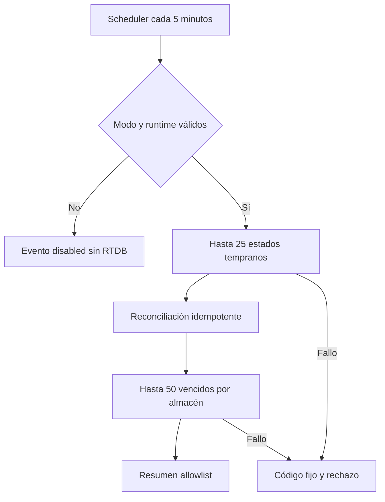

# Implementation Report: mantenimiento y telemetría productiva de WhatsApp

## Estado

- Spec: ✅ implementada y cerrada localmente
- Tests: ✅
- Typecheck: ✅
- Build: ✅
- Chrome QA: No aplica
- Flujo completo afectado en Chrome: No aplica
- Playwright responsive: No aplica
- Login manual requerido: No

## Árbol de archivos modificados

```text
app/
├── database.rules.json
├── tests/
│   └── database.rules.test.mjs
└── functions/
    ├── SPEC-whatsapp-production-operations.md
    ├── src/
    │   ├── index.ts
    │   ├── operations/
    │   │   └── telemetry.ts
    │   ├── notifications/
    │   │   └── production-recovery.ts
    │   └── whatsapp/
    │       ├── http.ts
    │       ├── production-maintenance.ts
    │       └── realtime-webhook-events.ts
    └── tests/
        ├── whatsapp-production-operations.integration.ts
        ├── whatsapp-production-operations.test.ts
        └── whatsapp-webhook.integration.ts
tasks/
├── plan.md
└── todo.md
Docs/implementation-reports/
└── 2026-09-21-whatsapp-production-operations.md
```

## Flujos afectados

- Fallback de estados tempranos: procesa una página de hasta 25 eventos por ciclo y
  conserva cursor por instancia.
- Retención transitoria: limpia hasta 50 filas vencidas por almacén mediante
  comprobación transaccional de `expiresAt`.
- Deduplicación general del webhook: nuevos marcadores vencen a 30 días; los
  históricos sin TTL se preservan.
- Telemetría: maintenance, recovery y webhook emiten códigos fijos, conteos y duración
  sin identificadores, payloads, PII, secretos o errores crudos.

## Recorrido completo validado

- Entrada del flujo: runner con configuración productiva inyectada y stores reales
  contra RTDB Emulator con eventos sintéticos vencidos, pendientes y completados.
- Resultado final: el evento pendiente permaneció, el completado se reconoció, el
  vencido se eliminó y sólo desaparecieron los marcadores transitorios expirados.
- Segmento modificado y pasos de integración comprobados: gate previo a RTDB, página,
  correlación, cursor, revalidación de identidad, tres limpiezas, resumen sanitizado e
  índices privados.

## Flujos no afectados

- Interfaz Vue, permisos de usuario, navegación y autenticación.
- Pagos, atletas, preferencias, jobs y proyecciones visibles.
- Cadencia y contenido de recordatorios, plantillas y política de reintentos.
- Recursos Cloud Monitoring/Scheduler, Secret Manager, Meta, datos publicados,
  dependencias, CI, hosting y despliegue.

## Diagrama



## Evidencia

- RED inicial: faltaban `production-maintenance.ts` y `operations/telemetry.ts`.
- Pruebas focalizadas: 7/7.
- Suite completa de Functions: 218/218.
- Rules Emulator + integraciones RTDB: 44/44.
- Typecheck, build, lint focalizado, whitespace y `git diff --check`: correctos.
- Metadata compilada: una exportación `onWhatsAppMaintenanceScheduled`, cron
  `*/5 * * * *`, UTC, timeout 540, una instancia, concurrencia uno y cero secretos.
- Revisión estática: ninguna ruta de telemetría serializa IDs de evento/job, wamid,
  teléfonos, scope, payload, PDF, tokens, `error.message` o stack trace.
- Chrome y Playwright: no aplican porque no se modificó la aplicación web.
- Warnings: RTDB emitió `permission_denied` esperados para las pruebas negativas de
  reglas; Git informó únicamente normalización LF/CRLF del árbol existente.
- El primer build dentro del sandbox falló con `EPERM` al escribir `functions/lib`;
  se repitió con el permiso de escritura autorizado y compiló correctamente.

## Revisión de cinco ejes

- Corrección: límites, cursor, TTL y borrado condicionado quedaron cubiertos con RTDB
  real del emulador.
- Seguridad: modo fail-closed antes de stores, ramas privadas y telemetría allowlist.
- Arquitectura: reutiliza stores, correlación y runtime existentes; añade una sola
  Function programada.
- Rendimiento: 25 eventos y 50 borrados por almacén, índice `expiresAt`, una instancia
  y una invocación concurrente.
- Mantenibilidad: eventos discriminados, dependencias inyectables, reloj controlable y
  pruebas separadas por contrato e integración.

## Riesgos y pendientes

- El cursor reside en la instancia. Un arranque frío puede repetir desde el inicio de
  forma idempotente; el trigger por job continúa como ruta primaria. Profundidad de
  cola y reinicios deben monitorizarse antes de habilitar el servicio.
- Los marcadores históricos sin `expiresAt` se conservan. Su inventario y posible
  backfill requieren autorización independiente.
- No existen todavía alertas, dashboards ni budgets remotos. La telemetría deja las
  señales necesarias, pero esos recursos son un gate previo al rollout.
- La retención de jobs, proyecciones, consentimiento y auditoría de negocio continúa
  sin definirse y no se modificó en esta fase.
- El modo sigue `disabled`; no se probó Scheduler real, Secret Manager ni Meta.
