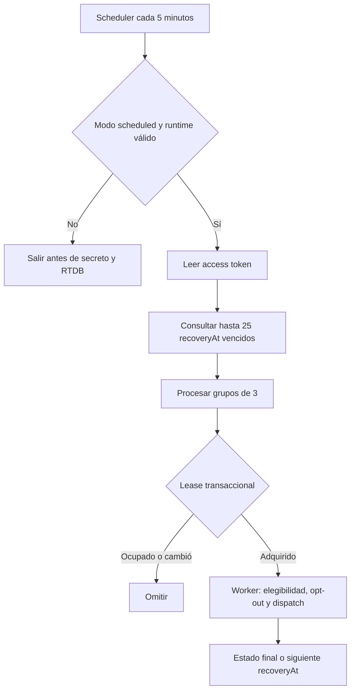

# Implementation Report: recuperación productiva de jobs de WhatsApp

## Estado

- Spec: ✅ implementada y cerrada localmente
- Tests: ✅
- Typecheck: ✅
- Build: ✅
- Chrome QA: No aplica
- Flujo completo afectado en Chrome: No aplica
- Playwright responsive: No aplica
- Login manual requerido: No

## Árbol de archivos modificados

```text
app/
├── database.rules.json
├── tests/
│   └── database.rules.test.mjs
└── functions/
    ├── SPEC-whatsapp-production-recovery.md
    ├── src/
    │   ├── index.ts
    │   └── notifications/
    │       ├── jobs.ts
    │       ├── production-recovery.ts
    │       └── realtime-job-store.ts
    └── tests/
        ├── notification-recovery.integration.ts
        └── notification-recovery.test.ts
tasks/
├── plan.md
└── todo.md
Docs/implementation-reports/
└── 2026-09-21-whatsapp-production-recovery.md
```

## Flujos afectados

- Creación y transición de jobs privados: cada escritura mantiene una fecha canónica
  `recoveryAt` sólo mientras el job admita recuperación automática.
- Recuperación programada: un scheduler cada cinco minutos selecciona hasta 25 jobs
  vencidos mediante índice RTDB y los procesa en grupos de tres.
- Reintentos: se conservan los intervalos 1/5/30/180 minutos, cuatro reintentos y la
  ventana de 24 horas; al agotarse, el worker terminaliza sin un nuevo dispatch.
- Concurrencia: scheduler y trigger de creación compiten por el mismo lease
  transaccional y no reservan dos envíos para un intento.

## Recorrido completo validado

- Entrada del flujo: scheduler con modo `scheduled`, runtime Meta válido y un job QA
  vencido en RTDB Emulator.
- Resultado final: el runner consultó el índice, adquirió el lease, ejecutó el worker
  con proveedor fake, dejó el job `accepted` y eliminó `recoveryAt`.
- Segmento modificado y pasos de integración comprobados: selección indexada,
  validación de página, límite de lote, concurrencia interna, lease, relectura de
  elegibilidad, dispatch fake, persistencia final y exclusión de estados no
  recuperables.

## Flujos no afectados

- Interfaz Vue, autenticación y navegación web.
- Cadencia y contenido de recordatorios, plantillas y destinatarios.
- Recursos Cloud Scheduler, parámetros o secretos remotos, webhook registrado y red
  Meta.
- Datos publicados, migraciones o backfills, CI, hosting y despliegue.

## Diagrama



## Evidencia

- RED inicial: la prueba focalizada falló porque aún no existía
  `production-recovery.ts`.
- Pruebas focalizadas: 9/9.
- Suite completa de Functions: 211/211.
- Rules Emulator + integración RTDB: 40/40, incluidas pruebas negativas de acceso de
  cliente y la consulta Admin SDK.
- Recorrido automático Functions + RTDB: 1/1 con proyecto demo, loopback, valores QA
  sintéticos y proveedor fake.
- Typecheck, build, lint focalizado, comprobación de whitespace y metadata compilada:
  todos en verde.
- Metadata: una exportación `onNotificationRecoveryScheduled`, cron `*/5 * * * *`,
  UTC, timeout de 540 segundos, una instancia, concurrencia uno y sólo
  `WHATSAPP_ACCESS_TOKEN` enlazado.
- Chrome y Playwright: no aplican porque la fase sólo cambia backend y reglas privadas.
- Warnings: el emulador de reglas emitió `permission_denied` esperados en pruebas
  negativas; Firebase mostró el aviso ya existente de versión de
  `firebase-functions`; el emulador de Functions ignoró el trigger programado porque
  no se inició Pub/Sub. La metadata y las pruebas unitarias validaron el handler, y el
  runner se cubrió contra RTDB real del emulador.
- La primera invocación del recorrido automático usó por error un flag local del
  webhook incompatible con su fixture histórica; se corrigió el comando y el mismo
  recorrido pasó 1/1 sin cambios de producto.

## Revisión de cinco ejes

- Corrección: fecha canónica por estado, terminalización al agotar política y lease
  compartido con el trigger existente.
- Seguridad: fail-closed antes del secreto y RTDB, rama privada, token validado una
  vez, resultados agregados y ausencia de payloads o errores crudos en logs.
- Arquitectura: un único scheduler reutiliza store, worker, elegibilidad, opt-out y
  transporte existentes.
- Rendimiento: consulta indexada, lote máximo de 25, grupos de tres y una sola
  invocación concurrente.
- Mantenibilidad: cálculo puro de `recoveryAt`, dependencias inyectables y pruebas
  unitarias e integradas separadas.

## Riesgos y pendientes

- Los jobs históricos recuperables que no tengan `recoveryAt` no aparecerán en la
  consulta. Antes de cualquier rollout se requiere inventario read-only; un backfill
  necesita una fase y autorización independientes.
- El scheduler real, Secret Manager y Meta no se probaron porque siguen fuera del
  alcance autorizado. El modo permanece `disabled`.
- Alertas, dashboard operativo, reintento manual, TTL y retención definitiva continúan
  pendientes para una fase posterior.
