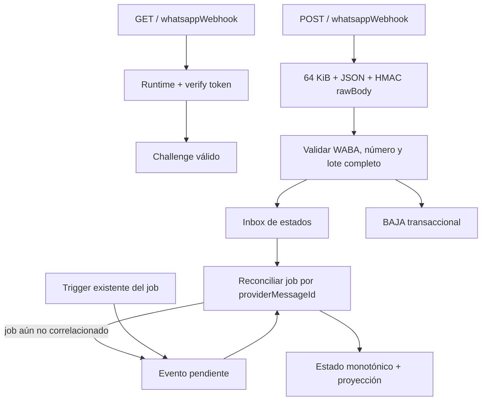

# Implementation Report: E8-PROD-4 — Webhook productivo seguro y opt-out

## Estado

- Spec: ✅ implementada y verificada localmente
- Tests: ✅ 28 focalizadas; 202/202 en Functions
- Integración RTDB: ✅ 23/23 relevantes
- Integración Functions + RTDB: ✅ recorrido de estado temprano
- Typecheck: ✅
- Build: ✅
- Lint focalizado: ✅
- Whitespace: ✅
- Revisión de cinco ejes: ✅
- Chrome QA: No aplica
- Flujo completo afectado en Chrome: No aplica
- Playwright responsive: No aplica
- Login manual requerido: No

## Árbol de archivos modificados

```text
app/functions/
├── SPEC-whatsapp-production-webhook.md
├── src/whatsapp/
│   ├── http.ts
│   ├── local-status-inbox.ts
│   ├── realtime-opt-out.ts
│   ├── realtime-status-inbox.ts
│   └── webhook-runtime.ts
└── tests/
    ├── opt-out-http.integration.ts
    ├── status-inbox-http.integration.ts
    └── whatsapp-production-webhook.test.ts
Docs/implementation-reports/
└── 2026-09-21-whatsapp-production-webhook.md
tasks/
├── plan.md
└── todo.md
```

## Flujos afectados

- Verificación GET del webhook con runtime, cuenta, número y verify token válidos.
- Recepción POST autenticada con HMAC-SHA256 sobre los bytes originales.
- Validación total del lote contra WABA y phone-number ID antes de escribir.
- Persistencia deduplicada de `sent`, `delivered`, `read` y `failed`.
- BAJA transaccional para ambos propósitos, con idempotencia y precedencia sobre jobs.
- Recuperación de un estado recibido antes de correlacionar el `providerMessageId`.

## Recorrido completo validado

- Entrada del flujo: POST local firmado con un estado `delivered` para un `wamid` cuyo
  job todavía no existía.
- Resultado final: el inbox conservó el evento como pendiente; los triggers reales del
  emulador crearon y procesaron el job, recuperaron el estado temprano y proyectaron
  `delivered`; un evento posterior avanzó a `read` sin duplicar el intento.
- Segmento modificado y pasos de integración comprobados: frontera HTTP, firma,
  validación de cuenta/número, inbox scoped, correlación del job, estado monotónico,
  marcador completado y proyección privada.

## Flujos no afectados

- Creación, asignación o rotación de secretos reales.
- Registro del webhook o configuración de WABA, app, número y plantillas en Meta.
- Envío por red real, mensajes a destinatarios o escritura de datos publicados.
- Barrido productivo de jobs queued/retryable, alertas y limpieza TTL programada.
- Firebase Auth, reglas, índices, esquema, dependencias, CI, hosting y despliegue.
- Aplicación Vue y flujos visuales.

## Diagrama



## Evidencia

- RED del runtime: la prueba falló inicialmente porque no existía
  `webhook-runtime.ts`.
- RED del recuperador: la prueba falló inicialmente porque no existía el export
  `syncNotificationStatusInbox`.
- Focalizadas: 23 pruebas principales, 28 totales, para inbox y recuperador.
- Suite completa: `npm --prefix functions test` — 181 pruebas principales, 202 totales,
  todas aprobadas.
- RTDB Emulator: 23/23 integraciones de reglas, opt-out, webhook e inbox aprobadas.
- Functions + RTDB Emulator: 1/1 recorrido real de estado temprano aprobado.
- `npm --prefix functions run typecheck` — aprobado.
- `npm --prefix functions run build` — aprobado.
- ESLint focalizado — aprobado.
- `git diff --check` y revisión explícita de archivos no rastreados — aprobados; sólo
  avisos de conversión LF/CRLF ya presentes en el árbol de trabajo.
- Metadata: un solo `whatsappWebhook` con `WHATSAPP_WEBHOOK_VERIFY_TOKEN` y
  `WHATSAPP_APP_SECRET`; un solo `onNotificationProviderStatusWritten`, con retry y sin
  secret bindings; sin lectura de estos secretos por `process.env` ni logs.
- Los overrides `.env.local` y `.secret.local` contenían sólo valores sintéticos QA y
  fueron eliminados al finalizar. No quedaron emuladores escuchando.
- Revisión de cinco ejes: corrección, seguridad, arquitectura, rendimiento y
  mantenibilidad sin hallazgos bloqueantes.
- Viewports revisados: no aplica.
- Evidencia Playwright/Chrome: no aplica; no hubo cambios web.

## Errores o warnings observados

- Un primer arranque sin `.secret.local` devolvió 503, como corresponde al cierre
  seguro; la integración pasó al proporcionar el override sintético requerido.
- Firebase CLI intentó la sonda local de metadata GCP y mostró timeout; no fue tráfico
  de Meta ni una operación con datos reales.
- Firebase CLI advirtió que existe una versión más reciente de `firebase-functions`.
  No se actualizó porque las dependencias están fuera del alcance autorizado.

## Riesgos y pendientes

- El runtime sigue apagado hasta configurar parámetros y secretos reales mediante una
  fase autorizada y verificar los recursos Meta seleccionados.
- El contrato real del webhook y de los recursos Meta aún requiere QA aislada antes de
  cualquier mensaje.
- Los jobs existentes en `queued` o `retryable-failed` no tienen todavía un barrido
  productivo programado y acotado.
- La limpieza/retención productiva y las alertas operativas siguen pendientes.
- No se realizó despliegue.
