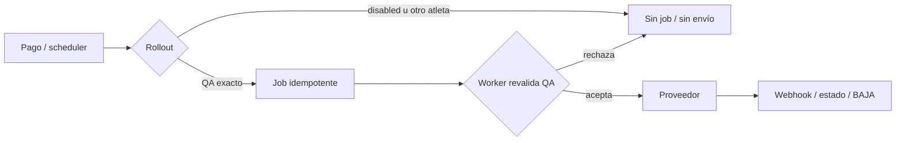

# Implementation Report: endurecimiento local del rollout de WhatsApp

## Estado

- Spec: ✅ P7-1–P7-6; gates remotos pendientes
- Tests: ✅ 228/228 Functions, 20/20 integración RTDB, 38/38 Rules
- Typecheck: ✅
- Build: ✅
- Chrome QA: No aplica — no cambió la aplicación web
- Flujo completo afectado en Chrome: No aplica — backend local, sin endpoint desplegado
- Playwright responsive: No aplica
- Login manual requerido: No

## Árbol de archivos modificados

```text
app/
├── firebase.json
└── functions/
    ├── SPEC-whatsapp-production-rollout.md
    ├── src/
    │   ├── index.ts
    │   ├── runtime-options.ts
    │   ├── notifications/
    │   │   ├── rollout.ts
    │   │   ├── triggers.ts
    │   │   ├── reminders.ts
    │   │   ├── local-worker.ts
    │   │   ├── production-recovery.ts
    │   │   └── local-status-projection.ts
    │   └── whatsapp/
    │       ├── http.ts
    │       ├── local-status-inbox.ts
    │       └── production-maintenance.ts
    └── tests/
        ├── deployment-safety.test.ts
        ├── notification-rollout.test.ts
        ├── notification-runtime-worker.test.ts
        ├── notification-recovery.test.ts
        ├── reminders.test.ts
        ├── triggers.test.ts
        └── fixtures de integración actualizados
tasks/
├── plan.md
└── todo.md
```

## Flujos afectados

- Escritura de pago o venta → productor de jobs.
- Scheduler de recordatorios → productor de jobs.
- Job RTDB o recovery → worker → proveedor WhatsApp.
- Metadata y predeploy de todas las Functions del flujo de notificaciones.

## Recorrido completo validado

- Entrada del flujo: pago, recordatorio o job RTDB en emulador aislado.
- Resultado final: sólo el atleta QA exacto crea/procesa jobs; otro atleta queda sin
  envío, lectura de secreto, documento o red.
- Segmento modificado y pasos de integración comprobados: productor, idempotencia,
  worker fake, PDF, estado, webhook, BAJA, recovery y proyección RTDB.

## Flujos no afectados

- UI Vue, autenticación y navegación.
- Datos financieros y reglas publicadas.
- Meta real, Cloud Functions publicadas y Scheduler remoto.

## Diagrama



## Evidencia

- `npm test` en `app/functions`: 228/228.
- Integraciones seleccionadas contra RTDB Emulator: 20/20.
- `npm run test:rules`: 38/38.
- `npm run typecheck` y `npm run build` en Functions: aprobados.
- ESLint focalizado y `git diff --check`: aprobados.
- Revisión: corrección, legibilidad, arquitectura, seguridad y rendimiento sin
  hallazgos requeridos.
- Dependencia: `firebase-admin` 14.3.0 → 14.4.0, versión exacta; notas oficiales y
  lockfile revisados. Regresión posterior: 228/228 Functions, 20/20 RTDB,
  typecheck y build.
- Chrome/Playwright: no aplican porque no hubo cambio web ni runtime remoto.

## Riesgos y pendientes

- `production` permanece deliberadamente imposible.
- Cloud Functions API sigue deshabilitada en el proyecto inventariado; no hubo deploy.
- Dos vulnerabilidades moderadas transitivas de `uuid` vía
  `@google-cloud/storage → gaxios`; no hay altas ni críticas y no se aplicó un
  override transitivo no autorizado.
- P7-7–P7-9 requieren decidir entorno QA, preparar Firebase/Meta y autorizar por
  separado datos sintéticos, teléfono QA y mensajes reales.
- P7-7A fue autorizado y Firebase CLI confirmó la creación de `kronos-training-qa`.
  La lectura directa muestra cero apps, pero `projects:list` e IAM/RTDB aún no han
  propagado visibilidad suficiente; P7-7B permanece detenido.
- El usuario adjuntó una captura de Firebase Console con el proyecto
  `kronos-training-qa` y nombre “Kronos Training QA”; confirma visualmente la identidad,
  no el estado de RTDB ni el baseline. P7-7A sigue abierto hasta completar inventario.
- El onboarding Meta se pausó al agregar un teléfono: Meta indica que ya está
  registrado con WhatsApp. El usuario confirma que todos sus números disponibles tienen
  WhatsApp y no puede eliminar esas cuentas. No se desconectará ni migrará ninguna.
- Pendiente para retomar: elegir remitente de prueba Meta, línea dedicada o evaluación
  de coexistencia. La prueba con remitente Meta cambiaría la estrategia aprobada y
  requiere actualizar/autorización de spec; no se han configurado secretos, webhook ni
  enviado mensajes reales.
- La fase E8-PROD-7 quedó pausada por cambio de prioridad solicitado por el usuario el
  2026-09-23; la prioridad siguiente no fue especificada. Retomar primero el inventario
  de Firebase QA y la decisión de remitente.
