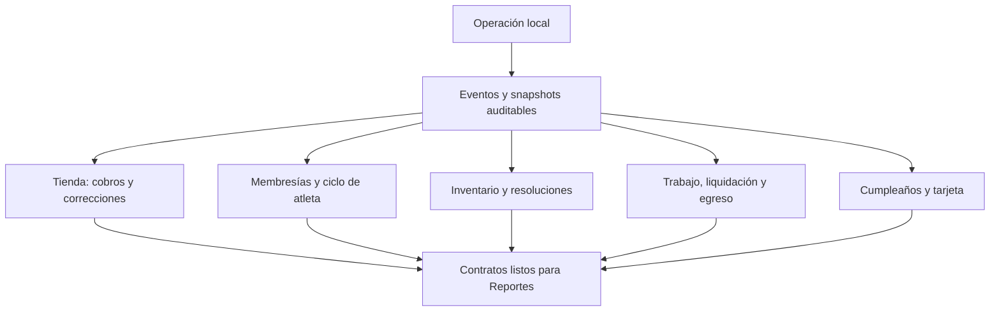

# Implementation Report: Control administrativo y trazabilidad

## Estado

- Spec: ✅ siete specs implementadas; `reporting-contracts` queda lista para implementar
- Tests: ✅ 33/33 funcionales enfocadas y 44/44 reglas
- Typecheck: ✅
- Build: ✅, 1170 módulos transformados
- Chrome QA: ✅ sobre Firebase Emulator local
- Flujo completo afectado en Chrome: ✅
- Playwright responsive: ✅ matriz manual asistida 320/768/1024/1440 px
- Login manual requerido: Sí; realizado por el usuario sin compartir credenciales
- Datos reales o despliegue: No

## Árbol de archivos modificados

```text
app/
├── database.rules.json
├── src/
│   ├── assets/images/birthday-card-template*.png
│   ├── components/kronos/
│   │   ├── AthleteStatusDialog.vue
│   │   ├── BirthdayCardDialog.vue
│   │   ├── InventoryResolutionDialog.vue
│   │   ├── PayrollSettlementDialog.vue
│   │   ├── StoreDebtStatementDialog.vue
│   │   ├── StorePaymentCorrectionDialog.vue
│   │   └── WorkEntryDialog.vue
│   ├── pages/{atletas,cierres,comunidad,dashboard,egresos,empleados,pagos,tienda,visitas}.vue
│   ├── services/{athletes,birthday-greetings,closures,payments,sales,workforce}.service.ts
│   ├── stores/{athletes,birthday-greetings,closures,commerce,inventory-recoveries,workforce}.ts
│   ├── types/{access,domain,workforce}.ts
│   └── utils/{athlete-lifecycle,birthday-card,birthday-greetings,inventory-reconciliation,membership-periods,store-debt-statement,store-payment-adjustments,workforce-payroll}.ts
└── tests/{athlete-lifecycle,birthday-outreach,inventory-reconciliation,membership-advance-payments,store-debt-statement,store-payment-corrections,workforce-payroll}.test.ts
specs/SPEC-{store-payment-corrections,store-debt-statement,membership-advance-payments,athlete-lifecycle-statuses,inventory-reconciliation,workforce-payroll,birthday-outreach-card,reporting-contracts}.md
tasks/{plan,todo}.md
```

## Flujos afectados

- Tienda: cambio auditado de método, reverso y reactivación del adeudo; pagos efectivos compartidos por saldos, recibos y finanzas.
- Estado de cuenta: selección de uno, varios o todos los adeudos de un atleta, excluyendo mensualidad y visitas.
- Mensualidades: abonos al periodo vigente y hasta doce meses futuros con snapshot de plan, monto, día y corte.
- Atletas: estados independientes Activo, Pausa y Baja con eventos append-only y reactivación explícita.
- Inventario: borrador, cierre final, conteo físico como nuevo stock y resoluciones `found`, `covered`, `written-off` o corrección documentada.
- Empleados: catálogo, tarifa, trabajo, aprobación, liquidación y egreso enlazado e idempotente.
- Comunidad: cola anual persistente, marcar/desmarcar felicitado y tarjeta PNG 1080×1080 sin edad, teléfono o fecha completa.

## Recorrido completo validado

- Entrada: primer Admin creado manualmente en Auth/RTDB Emulator y UID autorizado sólo en loopback.
- Tienda: producto 10 → venta de 2 a crédito → estado de cuenta exclusivo de $400 → cobro → corrección efectivo a transferencia → reverso → adeudo reactivado en $400.
- Mensualidad: atleta con plan de $500 → adelanto de octubre antes del corte → pago liquidado → recibo con corte 25/10/2026.
- Atleta: Activo → Pausa con regreso esperado → Activo; la prueba de contrato cubre Pausa → Baja → Activo.
- Inventario: stock esperado 8 → conteo 6 → cierre final → una unidad encontrada y una como fondo perdido → stock vigente 7. La prueba de contrato cubre 10→8 y 8→6 sin acumular -4.
- Empleados: alta de coach → clase a $250 → aprobación → liquidación → egreso de nómina por $250.
- Comunidad: cumpleaños pendiente → tarjeta personalizada → descarga PNG → marcado como felicitado y visible en el historial anual.

## Diagrama



## Evidencia

- Pruebas funcionales: `node --require ./scripts/node-userinfo-preload.cjs --import tsx --test ...` → 33/33.
- Reglas: `npm run test:rules` → 44/44 en Realtime Database Emulator.
- Tipos: `npm run typecheck` → correcto.
- Build: `npm run build` → correcto, 1170 módulos.
- Chrome: recorridos visibles completos; consola sin warnings nuevos después de corregir el recibo de adelanto.
- Responsive: 320, 768, 1024 y 1440 px; Tienda sin desbordamiento global en los cuatro, y Empleados, Comunidad y Cierres comprobados también a 320 px.
- Regresión detectada y corregida durante QA: faltaba importar `formatDate` en `src/utils/receipts.ts`; se añadió prueba que genera el recibo de adelanto con fecha de corte.

## Riesgos y pendientes

- Los historiales previos a estos eventos pueden ser parciales; no se hizo backfill especulativo.
- Nómina operativa no sustituye obligaciones fiscales ni un sistema contable.
- La plantilla maestra pesa aproximadamente 2.9 MB en el build; puede optimizarse en una fase posterior sin cambiar el contrato visual.
- No se ejecutaron migraciones, writes remotos, datos reales, Firebase productivo ni despliegue.
- El siguiente módulo autorizado es `specs/SPEC-reporting-contracts.md`.
