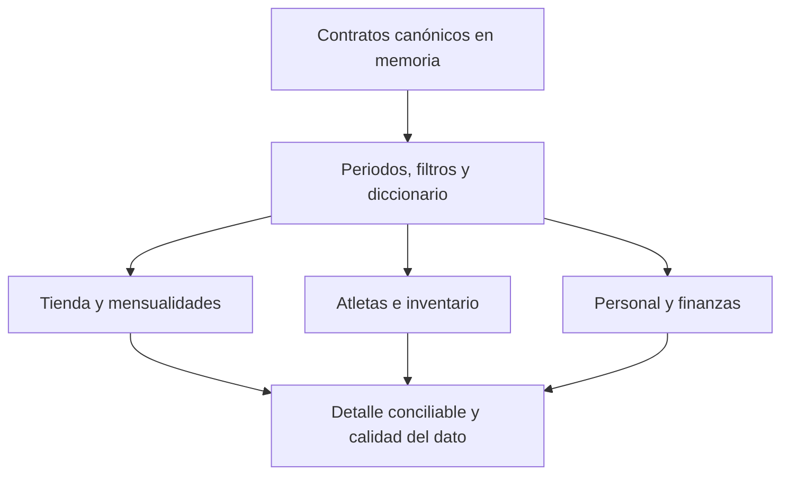

# Implementation Report: Reportes — Fase 1

## Estado

- Spec: ✅ `specs/SPEC-reporting-contracts.md` aprobado
- Tests: ✅ reporting 13/13; regresión financiera 4/4
- Typecheck: ✅
- Build: ✅
- Chrome QA: No aplica; esta fase sólo incorpora tipos y funciones puras, sin ruta ni interfaz
- Flujo completo afectado en Chrome: No aplica
- Playwright responsive: No aplica
- Login manual requerido: No
- Esquema/reglas/permisos: sin cambios
- Datos reales/migración/despliegue: sin uso

## Árbol de archivos modificados

```text
app/
├── src/
│   ├── types/reporting.ts
│   └── utils/
│       ├── reporting-athletes.ts
│       ├── reporting-finance.ts
│       ├── reporting-inventory.ts
│       ├── reporting-memberships.ts
│       ├── reporting-metrics.ts
│       ├── reporting-periods.ts
│       ├── reporting-store.ts
│       └── reporting-workforce.ts
└── tests/
    ├── reporting-contracts.test.ts
    ├── reporting-finance.test.ts
    ├── reporting-operational.test.ts
    └── reporting-store.test.ts
tasks/
├── plan.md
└── todo.md
Docs/implementation-reports/2026-09-24-reporting-phase-1.md
```

## Flujos afectados

- Contratos puros de Reportes para Tienda, mensualidades, atletas, inventario, personal, egresos y flujo.
- Serialización/restauración de filtros en query string y comparación anterior/interanual.
- Asignación de cobros de venta entre productos y aplicación de reversos auditados al saldo al corte.

## Flujos no afectados

- No se añadió navegación ni interfaz; no hay un flujo visual que recorrer todavía.
- Ningún flujo operativo existente ni servicio persistente fue modificado.

## Diagrama



## Evidencia

- Pruebas: `node --require ./scripts/node-userinfo-preload.cjs --import tsx --test tests/reporting-*.test.ts` → 13/13.
- Regresión financiera: `node --require ./scripts/node-userinfo-preload.cjs --import tsx --test tests/financial-reports.test.ts` → 4/4.
- Tipos: `npm run typecheck` → correcto.
- Lint: ESLint focalizado en tipos, utilidades y pruebas nuevas → sin errores ni warnings.
- Build: `npm run build` → correcto, 1172 módulos transformados.
- El runner directo `npx tsx` falló por `uv_os_get_passwd`; se ejecutaron las pruebas con el preload de entorno ya existente.
- Vite requirió permiso de escritura del entorno para sus temporales de compilación; la compilación terminó correctamente.
- Consola, red, viewports y capturas: no aplica hasta incorporar la interfaz en fases posteriores.

## Riesgos y pendientes

- Mensualidades legadas sin total auditable ni snapshot devuelven `No disponible` para esperado, vencido y cartera; no se estiman importes ni fechas.
- La retención se marca no disponible hasta contar con cohortes y ventanas suficientes.
- La Fase 2 debe definir y probar el alcance del permiso `reports`, preservando el acceso Admin-only para finanzas, inventario y personal antes de integrar lecturas.
- Rollback: retirar los tipos, utilidades y pruebas nuevas. No existe estado persistido que restaurar.
