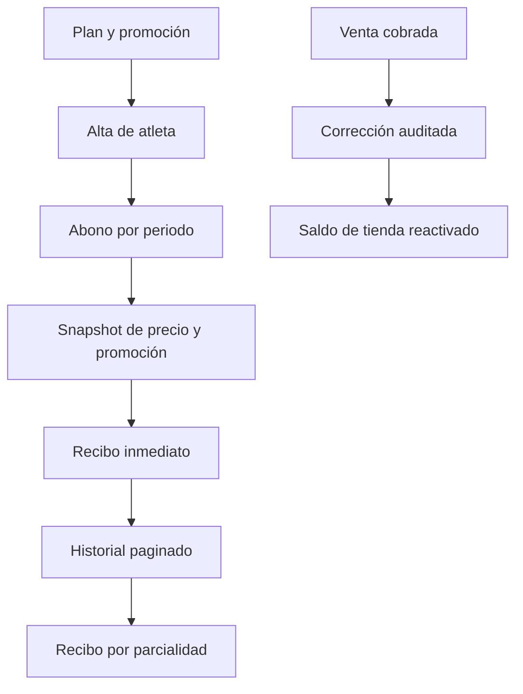

# Implementation Report: Administración, paginación y cobranza

## Estado

- Spec: ✅ seis specs autorizadas para implementación local; sin despliegue ni migración real.
- Tests: ✅ 20/20 focales, 5/5 financieros; reglas 46/46 en una corrida previa de esta implementación.
- Typecheck: ✅
- Build: ✅
- Chrome QA: ✅ flujos principales en emuladores aislados con sesión manual.
- Flujo completo afectado en Chrome: ✅ liquidación de empleado, adeudo de venta, abonos de atleta y promoción; ⚠️ no se probó cada tabla con más de 15 datos.
- Playwright responsive: ⚠️ pendiente prueba repetible autenticada; Chrome verificó 320, 768, 1024 y 1440 px.
- Login manual requerido: Sí, realizado por el usuario en el entorno aislado.

## Árbol de archivos modificados

```text
app/
├── database.rules.json
├── src/
│   ├── components/kronos/{TablePaginator,MembershipPaymentDialog,PayrollSettlementDialog,ReceiptDialog,...}.vue
│   ├── components/kronos/reports/*.vue
│   ├── pages/{atletas,cierres,comunidad,dashboard,egresos,empleados,pagos,planes,rendimiento,tienda,usuarios,visitas}.vue
│   ├── services/{plans,workforce}.service.ts
│   ├── types/{domain,workforce}.ts
│   └── utils/{business-date,employee-birthdays,plan-promotions,table-pagination,receipts}.ts
└── tests/{table-pagination,payroll-settlement-receipts,employee-birthdays-community,plan-promotions,membership-advance-payments}.test.ts
specs/{CAPABILITY-MAP,SPEC-application-table-pagination,SPEC-payroll-settlement-receipts,SPEC-store-sale-debt-reopening,SPEC-membership-advance-payment-discoverability,SPEC-employee-birthdays-community,SPEC-plan-promotions}.md
tasks/{plan,todo}.md
```

## Flujos afectados

- Las tablas operativas y reportes de detalle usan paginación de 15/30/50; la paginación opera sobre el conjunto completo filtrado. Los recortes fijos de Tienda, Cierres y movimientos del Dashboard se quitaron.
- Empleados exige fecha de nacimiento válida; Comunidad muestra cumpleaños próximos de personal activo sólo para Admin.
- Liquidar trabajo genera recibo inmediato y permite reabrirlo desde historial; Egresos registra el movimiento una vez.
- Tienda permite volver una venta pagada a adeudo mediante corrección auditada sin cancelarla.
- Atletas enlaza a abono de mensualidad con el atleta preseleccionado. El recibo inmediato y cada recibo histórico conservan folio, adelanto, promoción, importe, abonos anteriores y saldo.
- Planes administra promociones por vigencia, plan y horario, con porcentaje o monto fijo. El cobro congela el descuento aplicado.

## Recorrido completo validado

- Empleados: alta ficticia con cumpleaños → Comunidad → trabajo aprobado → liquidación → recibo → historial → Egresos.
- Planes y Pagos: plan y promoción ficticios → alta de atleta → abono futuro parcial → recibo → edición de promoción → historial con snapshot original → segundo abono de liquidación → recibos individuales.
- Tienda: producto y venta ficticios cobrados → acción «Marcar nuevamente como adeudo» → motivo y confirmación → comprobante de corrección → venta en crédito → saldo pendiente y cobro original revertido.
- Paginación: navegación visible en Pagos y Tienda; Cierres y Dashboard cargaron sin errores pero su dataset QA no superó 15 filas. En 320/768/1024/1440 px no hubo overflow de documento tras estabilizar el layout. La tabla conserva desplazamiento horizontal contenido en móvil.

## Flujos no afectados

- Kiosco, envío de mensajes, cobros reales, datos productivos y despliegue no se ejecutaron.

## Diagrama



## Evidencia

- Comandos: pruebas focales (20/20), `npm run test:finance` (5/5), `npm run typecheck`, lint focalizado, `npm run build`, `git diff --check`.
- Chrome: emuladores Auth/Database y servidor Vite local; datos completamente sintéticos. El usuario inició sesión manualmente. No se leyeron credenciales, cookies ni tokens.
- Los errores de consola observados correspondieron a recargas HMR durante la edición; no se observaron errores nuevos en la navegación final tras recarga.

## Riesgos y pendientes

- Falta la corrida Playwright responsive autenticada y una prueba UI con más de 15 filas que cubra cambio de filtro, página y acción. Los controles y utilidad compartida sí tienen prueba unitaria.
- No se efectuó despliegue, migración ni modificación de datos reales; esos pasos requieren autorización independiente.
- La paginación es cliente: reduce crecimiento visual, no volumen de lectura en Firebase.
