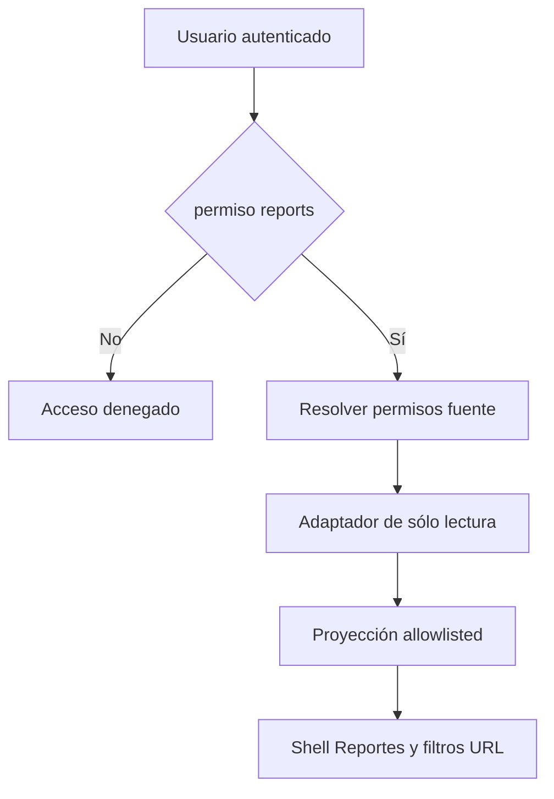

# Implementation Report: Reportes — acceso y shell

## Estado
- Spec: ✅ `SPEC-reporting-phase-2-access-shell.md`, aprobada.
- Tests: ✅ reporting enfocados 19/19; reglas 45/45; config emulador 2/2; helper QA 7/7.
- Typecheck: ✅ `npm run typecheck`.
- Build: ✅ `npm run build`.
- Chrome QA: ✅ sesión iniciada manualmente por el usuario en Firebase Emulator QA.
- Flujo completo afectado en Chrome: ⚠️ se validó entrada protegida → Reportes → estado vacío → filtro URL; no fue posible validar cifras/drill-down por dataset QA vacío. El detalle operativo queda para fases siguientes.
- Playwright responsive: ⚠️ pendiente; no se cerró matriz de viewports en esta fase.
- Login manual requerido: Sí; lo realizó el usuario. No se inspeccionaron credenciales ni material de autenticación.

## Árbol de archivos modificados

```text
app/database.rules.json
app/src/firebase/emulator-config.ts
app/src/plugins/router/routes.ts
app/src/pages/reportes.vue
app/src/services/reporting-access.ts
app/src/services/reporting.firebase.ts
app/src/services/reporting.service.ts
app/src/stores/reporting.ts
app/src/types/access.ts
app/src/types/reporting.ts
app/src/utils/reporting-athletes.ts
app/src/utils/reporting-finance.ts
app/src/utils/reporting-inventory.ts
app/src/utils/reporting-memberships.ts
app/src/utils/reporting-metrics.ts
app/src/utils/reporting-periods.ts
app/src/utils/reporting-store.ts
app/src/utils/reporting-workforce.ts
app/tests/database.rules.test.mjs
app/tests/firebase-emulator-config.test.ts
app/tests/reporting-contracts.test.ts
app/tests/reporting-finance.test.ts
app/tests/reporting-operational.test.ts
app/tests/reporting-service.test.ts
app/tests/reporting-store.test.ts
specs/SPEC-reporting-phase-2-access-shell.md
tasks/plan.md
tasks/todo.md
```

## Flujos afectados
- Inicio de sesión → autorización de dispositivo QA local → acceso Admin → ruta `/reportes`.
- Permiso de módulo `reports` separado de autorización a las colecciones de negocio.
- Suscripciones permitidas de atletas/visitas y filtros restaurables de Reportes.

## Recorrido completo validado
- Entrada: URL `/reportes` en Chrome de QA, Firebase Emulators y login manual del usuario.
- Resultado: navegación protegida y shell de Reportes; cuenta Admin muestra fuentes autorizadas `Atletas` y `Visitas`, y dataset vacío muestra el estado vacío.
- Integración: el filtro de producto actualizó/restauró `productId` en la URL. Se probó volver a la ruta base.
- Los datos del emulador están vacíos: no se inventaron datos ni se validaron cálculos de KPI en pantalla.

## Flujos no afectados
- Producción, migraciones, actualizaciones de datos reales y despliegues.
- Escrituras de negocio, exportación y los drill-downs funcionales de fases posteriores.

## Diagrama


## Evidencia
- Comandos: suites reporting enfocadas (19/19), `npm run test:rules` (45/45), `npm run test:firebase-emulator-config` (2/2), `npm run test:local-device` (7/7), `npm run typecheck`, `npm run build`.
- Chrome: `/reportes`, sesión QA local Admin, fuentes permitidas, estado vacío, filtro de producto reflejado en URL.
- Consola: sin errores; warnings observados: campos sin etiqueta asociada (10) y campos sin `id` o `name` (2). Se documentan como pendientes de accesibilidad.
- Viewports: no se ejecutó Playwright en esta fase.
- Incidente QA corregido: el helper y la URL del RTDB Emulator usaban namespaces distintos. Se alineó el namespace de configuración del emulador con el proyecto demo; pruebas del config/helper pasan. Ningún dato de producción se escribió. Hubo una ejecución previa de Vite con `.env.local` que hizo intentos de conexión/lectura al endpoint de producción, detenida al detectarse; no se inició sesión ni se realizaron escrituras productivas.

## Riesgos y pendientes
- Dataset vacío impide validar cifras y detalle en Chrome; debe cubrirse con fixture aislado durante fases visuales.
- Resolver warnings de accesibilidad en el contexto correspondiente antes del cierre global.
- El permiso de módulo no otorga permisos fuente; cambios de rules siguen cubiertos por pruebas negativas.
- Rollback: revertir en conjunto ruta, permiso, reglas, adaptador y shell; no hay migraciones ni datos productivos que restaurar.
