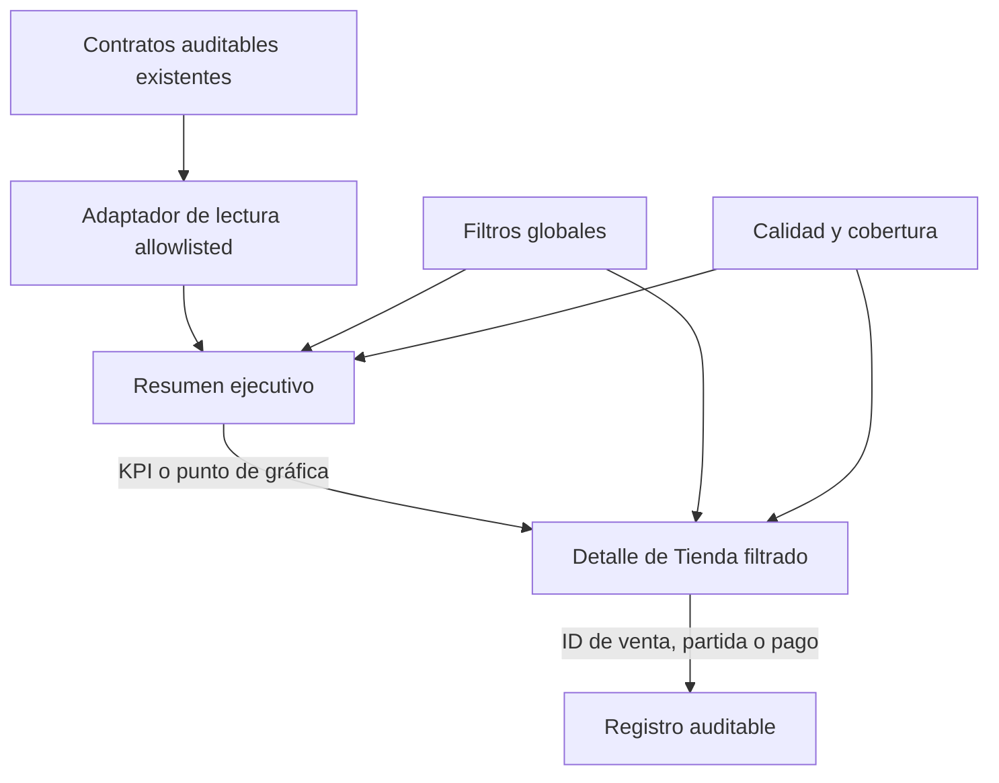

# Implementation Report: Reportes — Resumen ejecutivo y Tienda (Fase 3)

## Estado

- Spec: ✅ Fase autorizada; criterios funcionales implementados. La cobertura histórica se marca no disponible cuando no existe contrato de cobertura.
- Tests: ✅ 39 pruebas de Reportes y 4 pruebas financieras.
- Typecheck: ✅
- Build: ✅
- Lint focalizado: ✅
- Chrome QA: ✅ fixture sintético en memoria, resumen → KPI → tabla → registro, filtro y retorno; no consulta ni escribe la fuente de tienda.
- Flujo completo afectado en Chrome: ✅ incluye Cobrado, fila de pago, diálogo de registro y filtro por método; la URL restaura método y KPI al recargar.
- Playwright responsive: ⚠️ 0/4. La sesión autenticada pasó por Atletas, pero al navegar a Reportes el guard redirigió al Dashboard y no apareció la fixture Admin-only. No se modificaron permisos para forzar acceso ni se inspeccionó el estado de auth. Chrome validó los cuatro anchos con sesión manual.
- Login manual requerido: Sí; realizado por el usuario. No se inspeccionó material de autenticación.

## Árbol de archivos modificados

```text
specs/SPEC-reporting-phase-3-executive-store.md
tasks/plan.md
tasks/todo.md
Docs/implementation-reports/2026-09-25-reporting-phase-3-executive-store.md
app/src/pages/reportes.vue
app/src/components/kronos/reports/
  ExecutiveOverview.vue
  ReportDetailTable.vue
  ReportFilters.vue
  ReportMetricCard.vue
  StoreReport.vue
  StoreTrendChart.vue
app/src/services/reporting.service.ts
app/src/services/reporting.firebase.ts
app/src/stores/reporting.ts
app/src/types/reporting.ts
app/src/utils/reporting-executive.ts
app/src/utils/reporting-load-state.ts
app/src/utils/reporting-metrics.ts
app/src/utils/reporting-store.ts
app/src/utils/reporting-store-qa-fixture.ts
app/src/utils/store-payment-adjustments.ts
app/tests/reporting-service.test.ts
app/tests/reporting-store.test.ts
app/tests/reporting-ui.test.ts
app/e2e/responsive/reporting-responsive.spec.ts
app/e2e/auth.setup.ts
app/playwright.config.ts
```

La implementación previa de Fases 1 y 2 permanece en el árbol compartido; esta fase no cambió reglas ni permisos. Tienda se suscribe sólo para Admin bajo el contrato ya aprobado.

## Flujos afectados

- Resumen ejecutivo: definiciones, unidad y calidad visibles para cada KPI; comparación histórica no disponible si no hay evidencia de cobertura.
- Tienda: filtros globales por periodo, productos (ninguno/uno/varios/todos), atleta, estado y método de pago.
- KPI y gráfica → detalle tabular → registro/partida/pago con ID auditable y filtros restaurables en la URL.
- Separación semántica de venta reconocida, costo histórico, utilidad bruta, pagos aplicados, recuperaciones, cancelaciones y saldo pendiente.

## Recorrido completo validado

- Entrada: `/reportes` en Chrome local con sesión autenticada manualmente.
- Resultado: resumen ejecutivo con fixture no persistente; artículo de tienda muestra 2 unidades, $120 reconocidos, $35 de costo, $85 de utilidad bruta, $55 cobrados, $25 recuperados y $65 pendientes.
- Segmento modificado y pasos de integración comprobados: KPI Cobrado → 2 filas de pago → registro auditable, filtro Transferencia → resultado de $25 → volver al resumen y recargar restaurando filtro/métrica. El diálogo contiene ID, artículo, fecha e importe, sin PII.
- La fixture se habilita sólo con `import.meta.env.DEV`, sesión Admin y `?qaFixture=store`; desconecta la suscripción de tienda antes de inyectar datos sintéticos en memoria y muestra un aviso visible.
- Chrome Device Emulation comprobó viewport real de 320, 768, 1024 y 1440 px: anchura de documento 305/753/1009/1425 respectivamente para viewports 320/768/1024/1440; sin overflow horizontal. Consola `error,warn`: vacía.
- No se escribieron datos Firebase/emulador ni se inspeccionaron secretos.

## Flujos no afectados

- Atletas, mensualidades, inventario, personal, egresos, flujo de efectivo y conciliación permanecen en fases posteriores.
- Exportación no implementada; se mantiene pendiente la definición del formato contemplado por el spec.
- Sin cambios de esquema, reglas/permisos, datos reales, migraciones ni despliegues.

## Diagrama



## Evidencia

- Comandos: suite reporting con `node --require ./scripts/node-userinfo-preload.cjs --import tsx --test tests/reporting-contracts.test.ts tests/reporting-finance.test.ts tests/reporting-operational.test.ts tests/reporting-service.test.ts tests/reporting-store.test.ts tests/reporting-ui.test.ts` (39/39); regresión financiera (4/4); `npm run typecheck`; lint focalizado; `npm run build`.
- Playwright se apuntó explícitamente a `http://127.0.0.1:5173` (sin lanzar el webServer). La captura incluye IndexedDB y se mantiene sólo en la ruta local ignorada por Git; su contenido no se inspecciona. El auth-setup actualizado exige validar Atletas y luego Reportes con la fixture Admin-only antes de escribir estado; la corrida falló en esa última aserción porque se redirigió al Dashboard. La responsive continúa 0/4. Requiere login manual en Playwright con el perfil QA autorizado que puede acceder a Reportes.
- Limitación histórica: la instancia no contiene ventas; las comparativas siguen no disponibles cuando falta cobertura. No se inventaron datos históricos ni se escribió Firebase.
- Lighthouse snapshot móvil: accesibilidad 84/100; cuatro problemas detectados en shell compartido y fuera del alcance de Fase 3: `aria-expanded` no permitido en el avatar de usuario, tooltip sin nombre, botón del encabezado sin nombre accesible y `<ul>` de navegación con hijo `<div>`. Best Practices 100/100. No se modificó el shell en este checkpoint.

## Riesgos y pendientes

- Pendiente para cierre completo de R3: completar login manual en el contexto Playwright con perfil QA Admin autorizado y repetir responsive. No se cambiarán reglas/permisos para superar el gate. Los cuatro hallazgos Lighthouse del shell compartido quedan documentados para su propia corrección.
- Cobros compartidos entre productos se atribuyen proporcionalmente, con política visible; devoluciones sólo se netean si hay movimiento auditable.
- Rollback: retirar la interfaz/componentes y la proyección específica de tienda de esta fase; conservar contratos puros generales, permisos aprobados de Fase 2 y todas las fuentes de negocio. No requiere migración ni restauración de datos.
