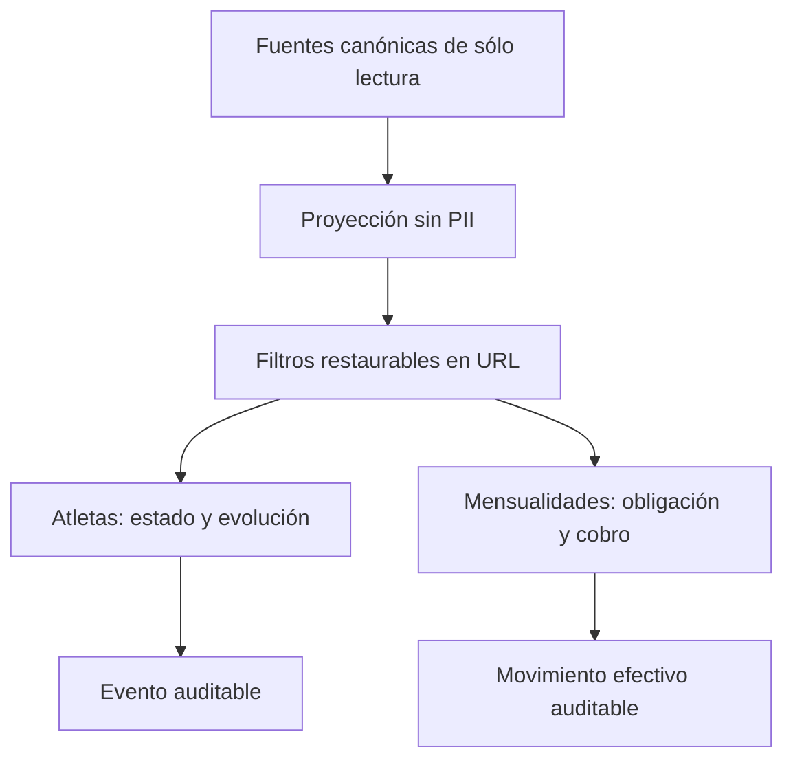

# Implementation Report: Reportes Fase 4 — Atletas y mensualidades

## Estado
- Spec: ✅ implementada y verificada localmente
- Tests: ✅ 38/38 reporting y finanzas
- Typecheck: ✅
- Build: ✅
- Chrome QA: ✅
- Flujo completo afectado en Chrome: ✅
- Playwright responsive: ⚠️ 0/4; el perfil aislado quedó en login
- Login manual requerido: Sí, completado por el usuario en Chrome

## Árbol de archivos modificados
```text
app/
├── e2e/responsive/reporting-responsive.spec.ts
├── src/
│   ├── App.vue
│   ├── components/kronos/reports/
│   │   ├── AthletesReport.vue
│   │   ├── MembershipsReport.vue
│   │   └── ReportFilters.vue
│   ├── pages/reportes.vue
│   ├── services/
│   │   ├── reporting.firebase.ts
│   │   └── reporting.service.ts
│   ├── stores/reporting.ts
│   ├── types/reporting.ts
│   └── utils/
│       ├── reporting-athletes-memberships-qa-fixture.ts
│       ├── reporting-athletes.ts
│       ├── reporting-memberships.ts
│       └── reporting-periods.ts
└── tests/
    ├── reporting-contracts.test.ts
    ├── reporting-operational.test.ts
    ├── reporting-service.test.ts
    └── reporting-ui.test.ts
specs/SPEC-reporting-phase-4-athletes-memberships.md
tasks/plan.md
tasks/todo.md
```

## Flujos afectados
- Reportes → filtros compartidos por periodo, atleta, estado de atleta, estado de mensualidad y método.
- Reportes → Atletas → evolución día/mes/año → evento auditable.
- Reportes → Mensualidades → obligación → abono efectivo con ID, fecha y método.
- Recarga directa de una URL protegida con filtros después de hidratar la sesión.

## Recorrido completo validado
- Entrada del flujo: `/reportes?qaFixture=athletes-memberships` con sesión Admin iniciada manualmente.
- Resultado final: evento de atleta y mensualidad/abono visibles en diálogos auditables, sin PII.
- Segmento modificado y pasos de integración comprobados: proyección allowlisted → store → filtros URL → KPI/evolución → tabla → registro → recarga con filtros restaurados.

## Flujos no afectados
- Tienda, inventario, personal, egresos, cierres y exportación.
- Escrituras de pagos, ciclo de vida, reglas Firebase, esquema, migraciones y despliegue.

## Diagrama


## Evidencia
- Comandos ejecutados: suite focalizada con Node/tsx; `npm run typecheck`; ESLint focalizado; `npm run build`; Playwright focalizado.
- Resultado de pruebas: 38/38 aprobadas; build de 1208 módulos correcto.
- Viewports revisados en Chrome: 320, 768, 1024 y 1440 px; `documentElement.scrollWidth <= innerWidth` en todos.
- Errores o warnings observados: ninguno en consola de Chrome. El primer build dentro del sandbox recibió `EPERM` en `.vite-temp`; fuera del sandbox pasó.
- Evidencia Chrome: fixture DEV sintética y sólo en memoria; recorridos de evento y mensualidad; filtros `athleteStatus=paused` y `membershipStatus=overdue` persistieron tras navegación/recarga.
- Evidencia Playwright: 4 casos ejecutados y 4 bloqueados en la pantalla de login del contexto aislado; no se copiaron credenciales, cookies ni estado de la sesión Chrome.

## Riesgos y pendientes
- La matriz Playwright autenticada requiere regenerar `.playwright/auth/user.json` manualmente con un perfil QA que tenga acceso a Reportes; no bloquea la evidencia responsive ya obtenida en Chrome.
- Los cálculos continúan en memoria; medir volumen antes de autorizar agregados persistidos.
- Rollback: retirar suscripción/proyección de `memberships`, filtros y componentes de Fase 4; `App.vue` puede volver al watcher previo. No existen datos que restaurar.
