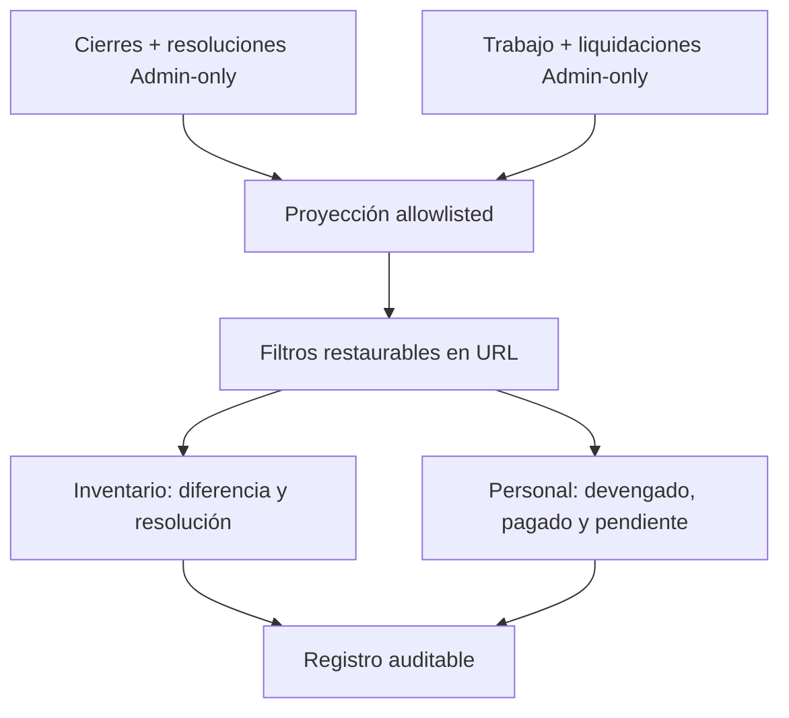

# Implementation Report: Reportes Fase 5 — Inventario y personal

## Estado
- Spec: ✅ implementada y verificada localmente
- Tests: ✅ 49/49 reporting y finanzas
- Typecheck: ✅
- Build: ✅
- Chrome QA: ✅
- Flujo completo afectado en Chrome: ✅
- Playwright responsive: ⚠️ 0/4 de Fase 5; el estado aislado quedó en login
- Login manual requerido: Sí, completado por el usuario en Chrome

## Árbol de archivos modificados
```text
app/
├── e2e/responsive/reporting-responsive.spec.ts
├── src/
│   ├── components/kronos/reports/
│   │   ├── InventoryReport.vue
│   │   ├── ReportFilters.vue
│   │   └── WorkforceReport.vue
│   ├── pages/reportes.vue
│   ├── services/
│   │   ├── reporting.firebase.ts
│   │   └── reporting.service.ts
│   ├── stores/reporting.ts
│   ├── types/reporting.ts
│   └── utils/
│       ├── reporting-athletes-memberships-qa-fixture.ts
│       ├── reporting-inventory-workforce-qa-fixture.ts
│       ├── reporting-inventory.ts
│       ├── reporting-periods.ts
│       ├── reporting-store-qa-fixture.ts
│       └── reporting-workforce.ts
└── tests/
    ├── reporting-contracts.test.ts
    ├── reporting-operational.test.ts
    ├── reporting-service.test.ts
    └── reporting-ui.test.ts
specs/SPEC-reporting-phase-5-inventory-workforce.md
tasks/plan.md
tasks/todo.md
```

## Flujos afectados
- Reportes → filtros de producto, empleado, estado de trabajo, clase de resolución y método con URL restaurable.
- Reportes → Inventario → KPI → cierre/resolución → registro auditable.
- Reportes → Personal → devengado/pagado/pendiente → línea/liquidación → registro auditable.
- Suscripción Admin-only a cierres/resoluciones y trabajo/liquidaciones con proyecciones allowlisted.

## Recorrido completo validado
- Entrada del flujo: `/reportes?qaFixture=inventory-workforce` con sesión Admin iniciada manualmente.
- Resultado final: resolución de faltante cubierto y línea de trabajo pendiente visibles en diálogos auditables; filtros restaurados desde URL.
- Segmento modificado y pasos de integración comprobados: permiso fuente → suscripciones agrupadas → proyección sin texto libre → store → filtros URL → KPI → tabla → registro.

## Flujos no afectados
- Escrituras o reglas de cierres, resoluciones, empleados, trabajo, liquidaciones y egresos.
- Tienda, Atletas, mensualidades, finanzas globales, exportación, esquema, migraciones y despliegue.

## Diagrama


## Evidencia
- Comandos ejecutados: suite Node/tsx focalizada; prueba financiera con preload; `npm run typecheck`; ESLint focalizado; `npm run build`; Playwright focalizado.
- Resultado de pruebas: 49/49 aprobadas; build de 1217 módulos correcto; lint sin errores ni warnings.
- Viewports revisados en Chrome: 320, 768, 1024 y 1440 px; Inventario/Personal visibles y `scrollWidth <= clientWidth` en todos. En 320 se cerró el menú lateral persistido antes de medir el contenido.
- Errores o warnings observados: consola Chrome sin errores ni warnings. El primer build dentro del sandbox recibió `EPERM` en `.vite-temp`; con permiso de escritura local pasó.
- Evidencia Chrome: fixture DEV sólo en memoria; KPI Inventario → resolución `qa-resolution-covered` → método Efectivo; KPI Personal pendiente → `qa-work-pending` → Sin liquidar; URL restauró empleado, estado, resolución y método.
- Evidencia Playwright: 12/12 casos del archivo llegaron al login; los 4 de Fase 5 no ejecutaron el flujo porque `.playwright/auth/user.json` ya no autentica. La captura confirmó login, no una regresión de la página. No se copiaron credenciales, cookies ni estado de Chrome.

## Riesgos y pendientes
- Regenerar manualmente `.playwright/auth/user.json` con un perfil QA aislado para recuperar la matriz automatizada; Chrome ya cubrió los cuatro viewports.
- Las fuentes completas se procesan en memoria; medir volumen antes de autorizar paginación o agregados persistidos.
- Los componentes de dominio superan ligeramente 200 líneas por el marcado accesible de tablas y diálogos; permanecen separados por dominio y sin lógica compartida duplicada crítica.
- Rollback: retirar las cuatro suscripciones/proyecciones, filtros URL y componentes de Fase 5. No existen datos que restaurar.
