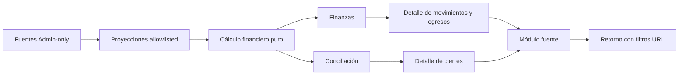

# Implementation Report: Reportes Fase 6 — Finanzas y conciliación

## Estado

- Spec: ✅ autorizada, implementada y actualizada
- Tests: ✅ 56/56 suites reporting/finanzas
- Typecheck: ✅
- Lint focalizado: ✅
- Build: ✅
- Chrome QA: ✅
- Flujo completo afectado en Chrome: ✅
- Playwright responsive: ⚠️ perfil aislado redirigido al login; no se eludió autenticación
- Login manual requerido: Sí, realizado y autorizado por el usuario

## Árbol de archivos modificados

```text
app/
├── e2e/responsive/reporting-responsive.spec.ts
├── src/
│   ├── components/kronos/reports/
│   │   ├── FinanceReport.vue
│   │   ├── ReconciliationReport.vue
│   │   └── ReportFilters.vue
│   ├── pages/reportes.vue
│   ├── services/
│   │   ├── reporting-access.ts
│   │   ├── reporting.firebase.ts
│   │   └── reporting.service.ts
│   ├── stores/reporting.ts
│   ├── types/reporting.ts
│   └── utils/
│       ├── financial-reports.ts
│       ├── reporting-finance-qa-fixture.ts
│       ├── reporting-finance.ts
│       └── reporting-periods.ts
└── tests/
    ├── financial-reports.test.ts
    ├── reporting-contracts.test.ts
    ├── reporting-finance.test.ts
    ├── reporting-service.test.ts
    └── reporting-ui.test.ts
Docs/implementation-reports/2026-09-25-reporting-phase-6-finance-reconciliation.md
specs/SPEC-reporting-phase-6-finance-reconciliation.md
tasks/plan.md
tasks/todo.md
```

Los fixtures QA de las Fases 3–5 también incorporaron los arreglos financieros vacíos requeridos por el contrato ampliado.

## Flujos afectados

- Reportes → Finanzas: ingreso reconocido, utilidad bruta, cartera, cobros y egresos pagados separados.
- Reportes → flujo efectivo: caja, banco, otro y no monetario sin reclasificar crédito de tienda como efectivo.
- Reportes → Conciliación: esperado, contado y variación por cierre, sin alterar el flujo.
- Filtros URL: cuenta financiera, categoría y estado de egreso, además de los filtros compartidos.
- Drill-down: KPI → detalle → registro fuente → retorno con contexto preservado.

## Recorrido completo validado

- Entrada del flujo: `/reportes?qaFixture=finance` con sesión Admin iniciada manualmente.
- Resultado final: KPIs financieros y cierres conciliados a centavos; egreso visible y navegación a `/egresos`; retorno a Reportes conservando el fixture y restauración explícita de filtros por URL.
- Segmento modificado y pasos de integración comprobados: carga allowlisted → cálculo puro → tarjetas → tabla de egresos/cierres → módulo fuente → retorno; revisión de consola, árbol accesible, contenido visible y responsive.

## Flujos no afectados

- No se crearon, editaron ni eliminaron ventas, pagos, visitas, egresos o cierres.
- No cambiaron reglas Firebase, autenticación, permisos, esquema, dependencias, datos reales, CI, hosting o despliegue.
- Exportación permanece fuera de alcance para la Fase 7.

## Diagrama



## Evidencia

- Comandos ejecutados: suite Node de siete archivos reporting/finanzas, `npm run typecheck`, ESLint focalizado, `npm run build` y Playwright responsive focalizado.
- Resultado de pruebas: 56/56; typecheck sin errores; lint focalizado sin errores/warnings; build de 1223 módulos completado en 36.56 s.
- Viewports revisados en Chrome: `320`, `768`, `1024` y `1440` px, todos con Finanzas y Conciliación visibles y sin overflow horizontal.
- Valores QA observados: venta reconocida $120, utilidad bruta $70, cartera Tienda $40, esperado mensualidades $50, cobrado $230, egresos pagados $50, flujo caja $100, flujo banco $80 y variación -$5.
- Filtro banco + egreso pagado: cobrado $80, egresos pagados $0 y flujo banco $80, mientras venta reconocida permaneció en $120 y variación en -$5.
- Errores o warnings observados: ninguno nuevo en la consola Chrome.
- Privacidad visible: no aparecieron teléfono, `closedBy`, `registeredBy`, URL de recibo ni descripción libre.
- Evidencia Playwright/Chrome: Chrome completó el recorrido autenticado. Playwright inició 16 casos, pero los primeros cuatro fueron redirigidos al login por su estado aislado; se detuvo para evitar 12 fallos idénticos y no se copió material de autenticación.

## Riesgos y pendientes

- La matriz Playwright de Fase 6 queda pendiente de un perfil QA aislado autenticado y no versionado; Chrome cubrió manualmente los cuatro viewports.
- El cálculo sigue siendo en memoria y depende de cobertura histórica disponible; calidad parcial/no disponible se mantiene como contrato.
- El volumen futuro puede requerir paginación o agregados, pero eso exige una spec y autorización nuevas.
- Rollback: retirar fuentes/proyecciones financieras, filtros y componentes de Fase 6; los datos y contratos fuente permanecen intactos.
