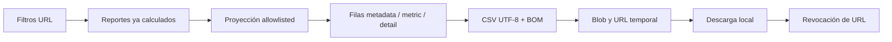

# Implementation Report: Reportes Fase 7 — Exportación CSV y cierre

## Estado

- Spec: ✅ autorizada, implementada y actualizada
- Tests: ✅ reporting/finanzas 61/61; focal posterior 23/23; `test:finance` 5/5
- Typecheck: ✅
- Lint focalizado: ✅
- Build: ✅ 1226 módulos
- Chrome QA: ✅
- Flujo completo afectado en Chrome: ✅
- Playwright responsive: ⚠️ perfil aislado redirigido al login
- Login manual requerido: Sí, sesión existente autorizada por el usuario

## Árbol de archivos modificados

```text
app/
├── package.json
├── e2e/responsive/reporting-responsive.spec.ts
├── src/
│   ├── components/kronos/reports/ReportExportButton.vue
│   ├── pages/reportes.vue
│   └── utils/reporting-export.ts
└── tests/
    ├── reporting-export.test.ts
    └── reporting-ui.test.ts
Docs/implementation-reports/2026-09-25-reporting-phase-7-export-closeout.md
specs/SPEC-reporting-phase-7-export-closeout.md
tasks/plan.md
tasks/todo.md
```

## Flujos afectados

- Reportes Admin → aplicar filtros → exportar CSV local.
- Proyección de metadata, KPIs y detalle de Atletas, Mensualidades, Inventario, Personal, Tienda, Finanzas y Conciliación.
- Estados del botón durante carga, filtros inválidos, fuentes incompletas, error y éxito.
- Runner financiero estabilizado con el preload de usuario ya utilizado por las demás suites Node del repositorio.

## Recorrido completo validado

- Entrada del flujo: `/reportes?qaFixture=finance` con sesión Admin iniciada manualmente.
- Resultado final: descarga local `kronos-reportes_2026-12-01_2026-12-31.csv`, seguida por anuncio `CSV creado con 66 registros auditables` sin abandonar Reportes.
- Segmento modificado y pasos de integración comprobados: filtros URL → cálculos existentes → proyección allowlisted → CSV RFC 4180/BOM → Blob/URL temporal → descarga → revocación → continuidad de la página.
- Archivo descargado: 8115 bytes, 67 líneas incluido encabezado, BOM `239-187-191`; contiene venta reconocida 120, flujo caja 100 y variación caja -5.

## Flujos no afectados

- No se modificaron cálculos fuente, consultas Firebase, reglas, autenticación, permisos ni esquema.
- No se escribieron ventas, pagos, atletas, inventario, personal, egresos o cierres.
- No se añadieron dependencias, PDF/XLSX, envío externo, telemetría, CI, hosting o despliegue.

## Diagrama



## Evidencia

- TDD RED: módulo `reporting-export` inexistente; después función de descarga inexistente; después componente UI inexistente.
- GREEN: serialización, secciones, conciliación, privacidad, nombre de archivo y revocación de URL pasan.
- Suite integral: 61/61; revalidación tras el último ajuste: 23/23; `npm run test:finance`: 5/5.
- Typecheck y ESLint focalizado: sin errores ni warnings.
- Build Vite: 1226 módulos en 25.01 s.
- Chrome: botón visible/habilitado, anuncio accesible, descarga real y consola sin errores/warnings.
- Viewports Chrome: `320`, `768`, `1024`, `1440`; botón, Finanzas y Conciliación visibles, sin overflow horizontal.
- Privacidad del archivo: sin coincidencias para teléfono, salud/admisión, recibo, descripción, notas o actores excluidos.
- Playwright: los primeros cuatro casos a 320 px llegaron a login; el quinto se interrumpió al confirmar el mismo bloqueo. No se copiaron cookies, tokens ni estado de Chrome.

## Riesgos y pendientes

- Playwright autenticado queda pendiente de regenerar manualmente su estado QA aislado no versionado.
- La exportación es síncrona sobre el dataset ya cargado; volúmenes futuros podrían requerir trabajo incremental, sujeto a una nueva spec.
- El CSV QA sintético permanece en `C:\Users\inged\Downloads\kronos-reportes_2026-12-01_2026-12-31.csv`; no contiene datos reales.
- Rollback: retirar componente, utilidad y enlace en Reportes; restaurar el script financiero anterior si fuera necesario. No hay datos ni migraciones que revertir.
