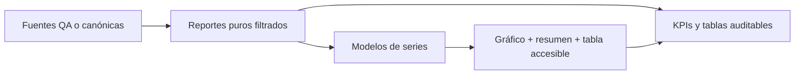

# Implementation Report: Fase 8 — Analítica visual de Reportes

## Estado

- Spec: ✅ autorizada e implementada.
- Tests: ✅ 63 reporting y 5 finanzas.
- Typecheck: ✅
- Build: ✅
- Lint focalizado: ✅
- Chrome QA: ✅ fixtures sintéticos; consola sin errores/warnings nuevos.
- Flujo completo afectado en Chrome: ✅ gráfico → KPI → tabla auditable; selección local de cuenta verificada.
- Playwright responsive: ⚠️ no ejecutado; su perfil aislado no tiene sesión manual. Chrome DevTools cubrió 320/768/1024/1440.
- Login manual requerido: Sí; se usó la sesión de pruebas previamente iniciada y autorizada por el usuario.

## Árbol de archivos modificados

```text
app/
  src/utils/reporting-charts.ts                 nuevo: seis proyecciones puras
  src/components/kronos/reports/
    ReportSeriesChart.vue                       nuevo: gráfico, resumen y tabla
    FinanceReport.vue                           selector local y gráfico
    ReconciliationReport.vue                    variaciones
    MembershipsReport.vue                       esperado/cobrado/pendiente
    AthletesReport.vue                          transiciones
    InventoryReport.vue                         diferencia/resoluciones
    WorkforceReport.vue                         devengado/pagado/pendiente
  src/pages/reportes.vue                        rango compartido
  tests/reporting-charts.test.ts                nuevo: buckets, nulos y conciliación
specs/SPEC-reporting-phase-8-visual-analytics.md
tasks/plan.md
tasks/todo.md
Docs/implementation-reports/2026-09-25-reporting-phase-8-visual-analytics.md
```

`app/components.d.ts` se regeneró con el componente nuevo; las otras entradas de Reportes en ese archivo procedían de fases anteriores. Se preservaron todos los cambios preexistentes del árbol de trabajo.

## Flujos afectados

- Finanzas: movimientos filtrados → selección local de cuenta → entradas/egresos/flujo → KPI → partidas auditables. No monetario queda explícitamente separado.
- Conciliación: cierres → variaciones con signo y baseline → KPI → detalle del cierre.
- Mensualidades: obligaciones/cobros/saldo → gráfico por periodo con nulos → KPIs y filas.
- Atletas: eventos efectivos → tendencia → KPIs y evolución/filas. Las altas legadas sin evento no se inventan en el gráfico.
- Inventario: producto/cierre → top diez y `Otros` → KPIs y registros completos.
- Personal: trabajo y liquidaciones → atribución temporal → KPIs y líneas auditables.

## Recorrido completo validado

- Entrada: `/reportes?qaFixture=finance`, `/reportes?qaFixture=athletes-memberships` y `/reportes?qaFixture=inventory-workforce` en sesión Admin de pruebas.
- Resultado: seis gráficos presentes en DOM accesible y cifras conciliadas con KPIs/filas de los fixtures; la tabla expandible se abre desde teclado/botón. Cambiar la cuenta local de Finanzas a Caja cambió el flujo mostrado de $180 a $100, igual al KPI, sin cambiar la URL.
- Integración: el gráfico se muestra antes del detalle existente; se conservaron enlaces al origen, filtros URL y exportación. No se ejecutaron escrituras de datos.

## Flujos no afectados

- Tienda y su gráfico existente, edición de origen, autorización, reglas de Firebase, CSV, hosting y despliegue.

## Diagrama



## Evidencia

- Comandos: suite `reporting-*.test.ts` 63/63, `npm run test:finance` 5/5, `npm run typecheck`, ESLint focalizado y `npm run build`, todos exitosos.
- Chrome: fixtures de Finanzas/Conciliación, Atletas/Mensualidades e Inventario/Personal; 320, 768, 1024 y 1440 px sin overflow. Tema oscuro revisado visualmente; se corrigió el contraste de ejes y leyenda. Tema claro comprobado y preferencia oscura restaurada.
- Consola: sin errores ni warnings en los tres fixtures a 320 px; red del fixture financiero sólo mostró renovación/autoconsulta de autenticación contra emulador, sin solicitudes añadidas por gráficos.

## Riesgos y pendientes

- La matriz Playwright autenticada requiere que el usuario inicie sesión manualmente también en su perfil QA aislado; Chrome ya cubrió los cuatro viewports.
- Un histórico legado de atletas puede incluir altas reconstruidas en KPI pero no en serie de eventos; el gráfico avisa que la historia es parcial.
- La serie de pendiente de Personal agrupa el saldo al corte por fecha del trabajo de origen; no debe leerse como saldo histórico de cada fecha.
- Rollback: retirar `reporting-charts.ts`, `ReportSeriesChart.vue` y sus inserciones/props en seis secciones y la página. Fuentes, datos, permisos y CSV quedan intactos.
