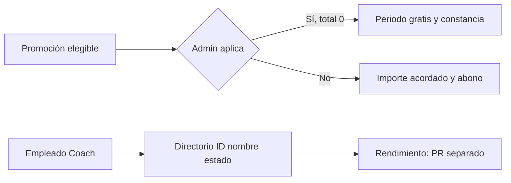

# Implementation Report: mensualidad gratis y PRs de coaches

## Estado
- Spec: ✅ `SPEC-plan-promotions.md` y `SPEC-coach-performance-prs.md`, autorizadas.
- Tests: ✅ 171 unitarias TypeScript, 3 de carga inicial y 48 de reglas Firebase.
- Typecheck/build: ✅ build final de 1241 módulos.
- Chrome QA: ✅ flujo protegido en entorno aislado, sesión iniciada manualmente por el usuario.
- Playwright responsive público: ✅ 320, 768, 1024 y 1440 px (4/4).
- Despliegue: ✅ reglas, carga inicial y Hosting en `kronos-training-fd5e5`.

## Árbol de archivos modificados
```text
app/
├── database.rules.json
├── scripts/backfill-coach-directory.mjs
├── src/
│   ├── components/kronos/{CoachPerformanceSection,MembershipPaymentDialog,ReceiptDialog}.vue
│   ├── components/kronos/reports/MembershipsReport.vue
│   ├── pages/{pagos,planes,rendimiento}.vue
│   ├── services/{payments,performance,workforce}.service.ts
│   ├── stores/{payments,performance}.ts
│   ├── types/{domain,workforce}.ts
│   └── utils/{coach-directory,kronos,receipts,reporting-memberships}.ts
└── tests/{coach-directory-backfill,coach-directory,performance-date,plan-promotions,membership-advance-payments,database.rules,financial-reports,reporting-operational}.*
specs/{CAPABILITY-MAP,SPEC-plan-promotions,SPEC-coach-performance-prs}.md
tasks/{plan,todo}.md
Docs/implementation-reports/2026-09-26-mensualidad-gratis-pr-coaches.md
```

## Flujos afectados y recorrido completo validado
- Planes → promoción de monto fijo $500 → mensualidad de septiembre de Atleta QA → confirmación Admin de $0 → periodo liquidado sin abono ni método → constancia diferenciada → historial y reporte con $0 cobrado.
- Planes → promoción vigente para noviembre en QA → Admin desmarca «Aplicar promoción» antes del primer abono → total acordado $500 → abono anticipado $50 → recibo y saldo $450. Se restauró la vigencia original de la promoción QA tras la prueba.
- Empleados → ficha Coach QA → directorio mínimo → crear skill en Rendimiento → registrar y editar PR de coach → tabla, fecha local, métricas y comparativo. Se verificó en paralelo un PR de atleta sin migrar su historial.
- Lectura de directorio y PRs restringida por permiso Rendimiento; fichas laborales permanecen Admin-only. Un empleado que no es Coach no puede recibir PR de coach.

## Diagrama


## Evidencia y lanzamiento
- Tests: 171/171 TypeScript, 3/3 backfill, 48/48 reglas; typecheck, build, lint focalizado y `git diff --check` correctos.
- Chrome: 320/768/1024/1440 px en Rendimiento y Mensualidades, sin desbordamiento tras cerrar menú móvil; consola sin errores/warnings nuevos.
- Playwright público: 4/4.
- Auditoría de dependencias de producción: 0 vulnerabilidades.
- Producción: reglas publicadas; dry-run del directorio: 1 Coach, 1 por crear; carga verificada: 1 creado, 0 existentes. Hosting publicado, HTTP 200 y bundle servido.
- Flujos no ejecutados en producción: operaciones protegidas de cobro y PR; su recorrido completo se hizo sólo en QA aislado para no escribir datos reales.

## Riesgos y pendientes
- El lint global del repositorio sigue fallando por SCSS fuera del alcance y errores preexistentes; el conjunto de archivos de aplicación modificados pasó lint focalizado.
- El directorio replica únicamente ID, nombre y estado. Si la carga detecta conflicto, falla sin sobrescribir; una reversión de datos debe limitarse a entradas creadas por la carga y no modificadas después. Para revertir Hosting se puede seleccionar la versión anterior en Firebase Hosting; reglas anteriores están en el commit base `f5cbb8c`.
- La comprobación HTTP de producción no sustituye una prueba autenticada allí. No se usó ni inspeccionó material de autenticación.
