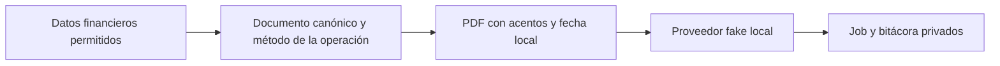

# E8 — Worker simulado, bitácora y PDF legible

Fecha local: 2026-09-08 (America/Mexico_City).

## Actualización posterior: E8-UI autorizada

El usuario autorizó E8-UI el 2026-09-08. Se implementaron localmente la proyección,
reglas acotadas, lector y diálogo en Pagos; ver `functions/E8-UI-QA.md` para la
evidencia más reciente. Sigue pendiente el recorrido protegido con login manual.
Las menciones a «propuesta/no implementada» siguientes pertenecen al checkpoint
histórico anterior a esa autorización; no describen el estado actual de E8-UI.

## Checkpoint histórico: PDF, antes de E8-UI

### Continuación completada localmente: legibilidad del PDF

Plan local dentro del alcance E7 aprobado (sin nuevos datos persistidos):

- [x] P1 — Probar y corregir acentos españoles y fechas con zona explícita
  America/Mexico_City. Verificación: RED/GREEN, offsets y longitudes del PDF.
- [x] P2 — Proyectar el método de la operación aplicada y mostrarlo en recibos;
  no inventarlo cuando falta o los métodos difieren. Verificación: mensualidad,
  pago combinado, tienda inicial, abono y grupo; avisos sin método de pago.
- [x] P3 — Renderizar fixtures sintéticos y revisar todas sus páginas; ejecutar
  regresiones, tipos, compilación y lint. Sin cambios de interfaz ni despliegue.

P2 depende de P1 y P3 de ambos. Archivos previstos: generador PDF, formatters,
documento financiero canónico, sus pruebas y generador de fixtures. Se conserva
el plan en este checkpoint dentro de app/ porque las tareas de la raíz están
fuera del directorio autorizado. La proyección de estados en UI y sus reglas
permanecen sin implementar. Su propuesta identificable es
`functions/SPEC-notification-status-ui.md` (E8-UI): requiere autorización específica
para la proyección mínima, índice y reglas de lectura. No se ha cambiado ninguno.

**El circuito backend está conectado y validado localmente con proveedor fake.
E8 y la fase E siguen abiertas; esto no es una autorización de despliegue.**

El primer checkpoint corrigió los webhooks y el siguiente conectó pago → job →
consentimiento → documento canónico → PDF → proveedor simulado → bitácora → webhook.
La continuación actual corrige la legibilidad del PDF y conserva ese circuito.
Todavía no integra el estado en la interfaz.

| Control | Resultado |
| --- | --- |
| Functions | 92/92 pruebas unitarias |
| App | 53/53 pruebas seleccionadas de contratos y regresión |
| RTDB rules | 31/31 con emulador y proyecto demo |
| Integración | 10/10: seis de worker y cuatro de webhook |
| Total de pruebas | 186 pasan, sin fallos ni omitidas en estas suites |
| Typecheck | App y Functions pasan |
| Build | App y Functions pasan |
| Lint | Pasan los seis archivos TS de la corrección del PDF; no se afirma lint global |
| PDF | Dos recibos de una página y aviso de seis páginas: ocho páginas inspeccionadas |
| Chrome / Playwright del flujo completo | Pendientes; sin sesión autenticada |
| Despliegue / Meta real | No ejecutados |

## Contexto preservado

Directorio exclusivo: `C:\Projects\Kronos\kronos-training-app\app`.
Rama `develop`, HEAD `044e645`, 11 commits por delante de la referencia local
`origin/develop`. No se hizo fetch, pull, reset, checkout, rebase, commit ni push.
No se trabajó en el árbol histórico `AppKronos/`.

Se preservaron las modificaciones previas de reglas, configuración Firebase,
tests y el directorio `functions/` aún sin seguimiento. No se cambiaron reglas,
índices, dependencias, autenticación ni configuración de despliegue en esta
continuación. La bitácora concreta los campos de intento previstos en la spec,
dentro del job privado existente; no abre una nueva ruta de lectura al cliente.

La checklist de la raíz sigue desactualizada: queda fuera del directorio
autorizado. Este archivo registra el checkpoint local vigente.

## Cambios implementados

### Worker y documento canónico

- Worker con proveedor inyectable y adaptadores de memoria/RTDB. Revalida
  consentimiento por finalidad, atleta activo y teléfono antes de leer nombre o
  información financiera, y otra vez inmediatamente antes de reservar el envío.
- Reconstrucción de mensualidades, pagos combinados, compras iniciales, abonos y
  cobros agrupados desde los registros financieros. El pago combinado reúne los
  abonos de tienda explícitamente vinculados, aunque dos triggers creen el mismo job.
- Los recibos usan el saldo histórico de la operación. Los recordatorios vuelven
  a calcular deuda y fecha local; una deuda liquidada o un aviso ya desfasado se
  suprime. Un corte de tienda no se etiqueta como vencimiento contractual.
- El worker no modifica pagos, ventas, saldos, inventario ni consentimiento.
  Las pruebas de integración comparan los registros financieros antes y después.
- `onNotificationJobCreated` invoca el consumidor local. Las pruebas ejercitan
  directamente los handlers de dominio, no un despliegue de Functions.
- `runLocalNotificationBatch` recorre 25 jobs por lote mediante cursor para
  trabajo pendiente, recuperación y reintentos. No se añadió un Scheduler de
  reintentos ni se activó una tarea periódica.

### Reserva duradera, reintentos y bitácora

La reserva `dispatching` se persiste antes de llamar al proveedor. Un lease
vencido no puede reservar un envío. Si la ejecución se interrumpe después de
reservarlo, la recuperación marca `unknown` y no reenvía automáticamente.
Esto prioriza evitar duplicados; puede requerir reconciliación manual.

Los rechazos temporales inequívocos siguen la política existente:
1/5/30/180 minutos y ventana máxima de 24 horas. Un timeout o respuesta ambigua
queda en `unknown`, no en reintento. Los errores se traducen a códigos fijos;
no se guardan mensajes crudos del proveedor.

El lease también compara atómicamente estado, intento y fecha de la lectura que
fundamentó el reintento. Si otro worker ya recibió un nuevo rechazo, una lectura
vieja no puede saltarse su espera. La regresión unitaria reprodujo un envío
indebido antes del cambio; después pasan tanto esa prueba como su equivalente
con RTDB. Esta expectativa es un argumento de la operación, no un nuevo campo
persistido ni un cambio de reglas.

La bitácora privada vive en
`v1/notificationJobs/{jobId}/delivery/attempts/attempt-N` y contiene:

- Inicio/fin, identificador del worker y resultado de cada intento.
- Folio, plantilla, idioma, SHA-256 y tamaño del documento.
- Hash y últimos cuatro dígitos del destinatario.
- Código de error sanitizado y `wamid`, cuando existe.

No almacena el nombre, teléfono completo, bytes del PDF ni datos médicos.
El hash de teléfono es seudonimización, no anonimización. No habilitar producción
sin completar la política y el mecanismo de retención/borrado.

La aceptación y el `wamid` se guardan juntos en una transacción. Una respuesta
tardía conserva la correlación sin hacer retroceder un estado más reciente.
Un webhook posterior puede reconciliar `unknown` cuando el identificador ya existe.

Dos regresiones encontradas sólo con RTDB quedaron corregidas:

1. La primera invocación de una transacción puede recibir `null` por caché local
   vacía: se devuelve ese valor para permitir el conflicto/reintento contra el
   servidor, en vez de abortar prematuramente con `undefined`.
2. Las claves numéricas de intentos se convertían en arrays al serializar RTDB.
   Se usan claves `attempt-1`, `attempt-2`; el historial sobrevive a reintentos
   y webhooks.

### PDF multipágina

Se reemplazó el layout de una sola página por paginación A5 determinista:
ajuste de texto, conceptos indivisibles entre páginas, encabezados repetidos,
totales agrupados, advertencia y numeración en todas las páginas.

Se mantienen las regresiones de paginación del checkpoint anterior. Esta
continuación añade nueve pruebas con fallo confirmado antes de sus correcciones:
acentos/escapes, fecha local, estructura binaria con texto acentuado, etiquetas
de método, rechazo de método desconocido, selección del método en tres tipos
de operación y folio canónico sin un carácter huérfano en otra línea.

Los textos se normalizan a NFC y se codifican en Latin-1, con fuentes WinAnsi
explícitas. Se conservan ñ, acentos y diéresis; los caracteres fuera del rango
compatible se sustituyen por `?`, sin truncar códigos Unicode a bytes peligrosos.
Se mantienen los escapes de paréntesis y barras, longitudes de streams y offsets
del xref en bytes. No se afirma soporte tipográfico Unicode completo.

La fecha de emisión usa explícitamente America/Mexico_City, independiente de la
zona del proceso. La prueba verifica el cambio de día: 2026-09-09 02:30 UTC se
presenta como 08/09/2026 20:30. La fecha calendario de vencimiento conserva su
contrato YYYY-MM-DD y no se transforma en un instante UTC.

El documento canónico incorpora un método sólo si todos los abonos de la operación
lo tienen y coinciden. No toma el método de un abono posterior ni inventa uno
cuando falta o es mixto: muestra «No especificado», igual que el contrato de
recibos de la aplicación. Los avisos de deuda no muestran método de pago.
El método es una proyección en memoria; no cambia esquema ni datos persistidos.

Se renderizaron tres fixtures sintéticos con Poppler y se inspeccionaron todas
las páginas finales: recibo (1), pago combinado canónico (1) y aviso largo de 20
conceptos (6). pdfplumber encontró cero caracteres fuera de página y confirmó
la extracción real de acentos. El fixture combinado verificó método, importe
aplicado y saldo histórico desde el constructor canónico hasta el PDF.

Evidencia local ignorada por Git en `app/test-results/pdf-e8/`:
`receipt.pdf`, `receipt-combined.pdf`, `reminder-long.pdf`,
`locale-receipt-1.png`, `locale-receipt-combined-1.png` y
`locale-reminder-long-1.png` a `locale-reminder-long-6.png`.
Los renders `final-*` del checkpoint anterior son evidencia histórica, no los
documentos vigentes de esta corrección.

La marca conserva el fallback tipográfico; falta incorporar el logo oficial y
revisar la fidelidad de folios de negocio (en especial grupos) frente al recibo
de la aplicación. No se declara terminado todo E7 por esta corrección.
Poppler emitió avisos ambientales de fuentes Symbol/ArialUnicode; las fuentes
Courier/Helvetica utilizadas se renderizaron y los PDF se abrieron correctamente.



Flujos no modificados en esta continuación: captura de pagos, consentimiento,
reglas, roles, scheduler, transporte y UI. Chrome/Playwright del flujo web completo
siguen pendientes; revisar los PDF no sustituye ese gate.

### Corrección de webhook preservada

Continúan pasando las regresiones del checkpoint anterior: recorrer todos los
estados de un lote, `accepted → read`, reconciliación de `unknown`, concurrencia,
repetición parcial y fallos inyectados antes/después de persistir el estado.

La marca `v1/notificationWebhookEvents/{hash}` con `{ receivedAt }` se escribe
después del cambio monotónico. Un fallo no consume el evento pendiente.
No se probó un POST firmado procedente de Meta ni un handler HTTP publicado.

## Seguridad y límites operativos

El consumidor local exige simultáneamente:

- `KRONOS_NOTIFICATION_WORKER_MODE=fake`.
- `GCLOUD_PROJECT=demo-kronos-training`.
- `FIREBASE_DATABASE_EMULATOR_HOST` en localhost/127.0.0.1.

El guard se comprueba antes de abrir la base. Cualquier otro modo o destino
desactiva este consumidor. La ejecución local sólo inyecta el proveedor fake;
no se habilitó ni configuró transporte real.

Límites de esta rebanada: 20 conceptos por PDF; más de 500 ventas del atleta se
rechazan en preparación en lugar de producir un documento silenciosamente
incompleto. El historial de mensualidades se lee completo para ese atleta:
faltan pruebas de volumen y paginación financiera antes de habilitación real.
El runner por lotes requiere que su llamador recorra el cursor y vuelva a
invocarlo cuando venza un reintento.

Las reglas siguen denegando al cliente los jobs y la bitácora. La verificación
estática de `dist/` no encontró los marcadores `WHATSAPP_APP_SECRET`,
`WHATSAPP_ACCESS_TOKEN`, `WHATSAPP_WEBHOOK_VERIFY_TOKEN` ni
`META_TRANSPORT_UNKNOWN`. No equivale a una auditoría exhaustiva de secretos.

No se hizo auditoría de dependencias para release: no hubo cambios de paquetes
ni lanzamiento. Ese control permanece obligatorio antes de publicar.

## Archivos principales

```text
app/functions/
├── E8-LOCAL-QA.md
├── SPEC-notification-status-ui.md (propuesta, no implementada)
├── src/
│   ├── index.ts
│   ├── formatters.ts
│   ├── notifications/
│   │   ├── delivery-state.ts
│   │   ├── worker.ts
│   │   ├── local-worker.ts
│   │   ├── realtime-notification-data.ts
│   │   ├── financial-documents.ts
│   │   ├── jobs.ts
│   │   ├── realtime-job-store.ts
│   │   └── reminders.ts
│   └── pdf/payment-receipts.ts
└── tests/
    ├── worker.test.ts
    ├── local-worker.test.ts
    ├── financial-documents.test.ts
    ├── worker.integration.ts
    ├── pdf-receipts.test.ts
    └── render-pdf-fixtures.ts
```

## Comandos reproducibles

Ejecutar desde `C:\Projects\Kronos\kronos-training-app\app`:

```powershell
npm --prefix functions test
npm --prefix functions run typecheck
npm --prefix functions run build
npm run typecheck
npm run build
node --require ./scripts/node-userinfo-preload.cjs --import tsx --test tests/payment-notification.test.ts tests/firebase-emulator-config.test.ts tests/local-device-authorization.test.mjs tests/enrollment-sheet.test.ts tests/kiosk-code.test.ts tests/store-kiosk-improvements.test.ts tests/athlete-intake.test.ts tests/financial-reports.test.ts
.\node_modules\.bin\eslint.cmd functions/src/formatters.ts functions/src/pdf/payment-receipts.ts functions/src/notifications/financial-documents.ts functions/tests/pdf-receipts.test.ts functions/tests/financial-documents.test.ts functions/tests/render-pdf-fixtures.ts -c .eslintrc.cjs --ext .ts --rule 'no-trailing-spaces: error'
node --require ./scripts/node-userinfo-preload.cjs --import tsx functions/tests/render-pdf-fixtures.ts
```

Emulador aislado, sin sesión ni credenciales reales (variables quitadas sólo
del proceso de prueba, sin imprimir su valor):

```powershell
$env:XDG_CONFIG_HOME = 'C:\Projects\Kronos\kronos-training-app\app\test-results\firebase-cli-e8'
$env:CI = 'true'
Remove-Item Env:FIREBASE_TOKEN, Env:GOOGLE_APPLICATION_CREDENTIALS -ErrorAction SilentlyContinue
.\node_modules\.bin\firebase.cmd emulators:exec --only database --project demo-kronos-training "node --require ./scripts/node-userinfo-preload.cjs --import tsx --test --test-concurrency=1 tests/database.rules.test.mjs functions/tests/worker.integration.ts functions/tests/whatsapp-webhook.integration.ts"
```

La concurrencia entre archivos es 1 porque las suites comparten la raíz de
fixtures del emulador. Las suites nuevas rechazan destinos distintos de loopback
y del proyecto demo antes de escribir. Los 41 casos pasan; los emuladores se
apagaron al terminar. Los rechazos `permission_denied` son esperados en los
casos negativos de reglas. No hubo exportación de datos ni mensajes reales.

`git diff --check` pasa para los archivos con seguimiento; no cubre por sí solo
el directorio `functions/` sin seguimiento. Por eso se ejecutó lint explícito
sobre los archivos modificados. Windows requirió permisos puntuales para las
compilaciones, el formateador y el emulador dentro de `app/`.

## Pendientes para cerrar E8

1. **Estado en UI y permisos de lectura acotados.** La bitácora existe, pero
   sigue privada. Revisar y aprobar la propuesta E8-UI antes de crear su ruta,
   índice y reglas. El documento no autoriza ni implementa esos cambios.
2. **Bajas entrantes y correlación temprana.** El worker respeta la baja en la
   app, pero falta procesar mensajes de texto BAJA. Un webhook anterior al
   registro del `wamid` aún se reconoce como ignorado: se permite replay,
   pero no hay inbox persistente ni replay automático.
3. **Operación real.** Faltan aprobación de plantillas Meta, credenciales,
   transporte real, programación de reintentos/recuperación, retención/borrado
   y pruebas de volumen. El modo fake no acredita entrega real.
4. **Acabado documental.** Logo/identidad final, fidelidad de folios de negocio
   y campos restantes según spec; ampliar fixtures representativos. Acentos,
   fecha de emisión local y método de pago quedan verificados en este corte.
5. **QA de extremo a extremo.** Tras completar la integración, Chrome y
   Playwright a 320/768/1024/1440 en entorno y con datos autorizados.
   No se sustituyó ese recorrido por una prueba de login ni se accedió a producción.

Las guías de pruebas e implementación incremental dirigieron las regresiones
y la integración por capas; la guía PDF exigió revisar los renders finales.
La revisión de seguridad delimitó los datos privados, el guard local y los
gates de producción; la guía de documentación mantiene aquí la evidencia y
las limitaciones, sin declarar la fase terminada.

En esta continuación, la revisión de cinco ejes comprobó selección histórica
del método, entradas no reconocidas, integridad binaria y ausencia de nuevos
accesos a datos. La guía PDF provocó la corrección adicional del folio partido.
La referencia común `definition-of-done.md` de la instalación global no estaba
disponible; se aplicaron los gates explícitos de `AGENTS.md` del repositorio.
La guía `spec-driven-development` mantiene E8-UI en propuesta hasta aprobación.
