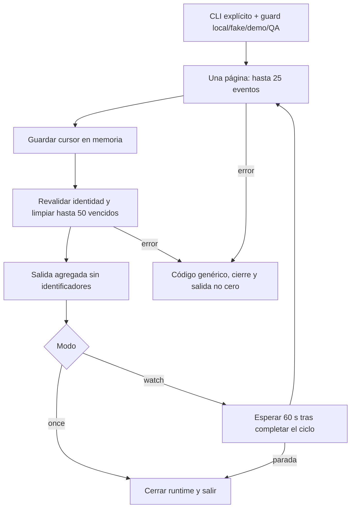

# Implementation Report: E8-MANT — mantenimiento periódico local

Fecha: 2026-09-09, America/Mexico_City.
Estado: implementación y QA local completados. No es un lanzamiento productivo.
Spec: `SPEC-whatsapp-status-maintenance.md`, autorizada mediante «si, autorizo».

## Estado y resultado

- Spec y checklist M0–M4: cumplidos dentro del alcance local aprobado.
- Pruebas: **234 aprobadas** en cuatro ejecuciones complementarias, sin sumar repeticiones.
- Typecheck y build: Functions y aplicación aprobados.
- ESLint: aprobado en los cinco archivos TypeScript nuevos; whitespace comprobado.
- Chrome: recorrido afectado verificado con sesión iniciada previamente por el usuario.
- Playwright: responsive aprobado a 320, 768, 1024 y 1440 px; no sustituye al QA de backend.
- Revisión independiente: sin hallazgos Critical/Required abiertos tras reforzar las pruebas.
- Parada: manejadores, espera real y cierre del SDK verificados; la entrega de Ctrl+C desde
  la PTY de esta herramienta no funcionó. La limpieza final del proceso QA fue forzada
  y acotada a su PID. No se presenta como una parada elegante validada desde el sistema operativo.

El nuevo CLI recupera estados tempranos y elimina eventos vencidos del inbox QA,
sin enviar mensajes. Cada ciclo termina antes de esperar 60 segundos e iniciar el
siguiente. Se conserva el TTL existente de 30 días, una página de hasta 25 eventos y
una limpieza de hasta 50 vencidos. El proceso no queda ejecutándose al entregar.

## Árbol de archivos de esta fase

Rutas relativas a `app/`; los cambios anteriores del árbol de trabajo se conservaron.

```text
functions/
├── src/whatsapp/
│   ├── local-status-maintenance.ts       nuevo: ciclo, guard y cursor en memoria
│   └── status-maintenance-cli.ts         nuevo: opt-in, bucle, señales y cierre
├── tests/
│   ├── status-maintenance.test.ts        nuevo: 7 unitarias
│   ├── status-maintenance-cli.test.ts    nuevo: 7 unitarias
│   └── status-maintenance.integration.ts nuevo: 4 integraciones
├── SPEC-whatsapp-status-maintenance.md   autorización y checklist actualizado
└── E8-STATUS-MAINTENANCE-QA.md            este reporte
test-results/
└── status-maintenance-manual.local.ts    auxiliar QA nuevo, ignorado por Git
```

No se añadieron dependencias, scripts de paquete ni exports en `functions/src/index.ts`.
La compilación regeneró artefactos locales, no una configuración de despliegue.
No se hicieron commits, push ni cambios al checklist histórico de la raíz.

## Flujos afectados y decisiones

1. Inicio explícito: exactamente `--once --apply` o `--watch --apply`. Argumentos
   inválidos devuelven ayuda fija y código 2 antes de importar el runtime de datos.
2. Guard: modo de mantenimiento `local`, guard del inbox, worker `fake`, proyecto
   `demo-kronos-training`, cuenta/receptor QA y RTDB `localhost`/`127.0.0.1` en 9000/9010.
   Se captura la identidad y se revalida antes de cada ciclo y antes de limpiar.
3. Ciclo: reutiliza el runner y la limpieza existentes. Sólo avanza el cursor después
   de una página exitosa. Los eventos sin job no bloquean páginas posteriores.
4. Watch: ciclos seriales, sin `setInterval` ni checkpoint persistido. Al terminar
   un recorrido, vuelve a empezar. Un fallo detiene el bucle con salida genérica y código 1.
5. Parada: cancela la espera siguiente, espera el trabajo activo y cierra únicamente
   la app Firebase nombrada por el runtime. No promete cancelar una transacción en vuelo.

Se eligió un ejecutable local porque permite probar recuperación y retención sin
instalar un servicio ni introducir infraestructura. Persistir un checkpoint o añadir
un scheduler cloud cambiaría el alcance aprobado y queda diferido.



## Evidencia automatizada

| Ejecución | Resultado | Alcance |
| --- | --- | --- |
| Unitarias de Functions | 146/146 | 132 existentes y 14 nuevas; guard, cursor, serialización, errores y lifecycle |
| Integración y reglas, RTDB 9010 | 83/83 | Estados, worker, webhook, BAJA, inbox, reglas y 4 integraciones nuevas |
| Transporte real con triggers, Functions 5002/RTDB 9010 | 1/1 | Regresión existente del inbox y encadenamiento de triggers; no ejecuta el nuevo CLI |
| Playwright responsive | 4/4 | UI de notificaciones con fixture de UI a cuatro anchos |
| Total | **234/234** | Sin atribuir a Playwright la comprobación del backend |

TDD: se comprobó RED por módulo ausente antes de implementar el ciclo y después
el CLI; ambas rebanadas pasaron a GREEN. La revisión independiente detectó que una
prueba del fallo de cierre quedaba enmascarada por un fallo previo de la espera.
Se separó el caso `--once` exitoso cuyo único fallo ocurre al cerrar. También se
reforzaron cancelación del temporizador real, cambio de identidad durante la página
y rechazo de ciclos concurrentes. No fue necesario cambiar el comportamiento del
runtime para cerrar ese hallazgo de cobertura.

La integración nueva acredita:

- 53 vencidos propios eliminados en dos ciclos: 50 y 3; 31 eventos vigentes conservados.
- Recuperación en páginas posteriores pese a 30 eventos sin job; job `delivered` con un intento.
- Registro vencido de otro scope y documentos completos de pago/consentimiento sin cambios.
- CLI compilado `--once`: salida sólo agregada, cierre real y replay que no retrocede `read`.
- Fila corrupta: error genérico, código 1 y preservación del registro.
- Proceso hijo con runtime compilado, SDK y temporizador reales: manejadores de SIGINT
  y SIGTERM ejercitados mediante `process.emit` dentro del hijo, salida `stopped` y código 0.
  Esto no equivale a haber probado la entrega externa de esas señales en Windows.

## Recorrido completo en Chrome

Entrada: sesión ya abierta en Dashboard, navegación a `/pagos` y apertura de
Notificaciones del atleta nuevo **QA mantenimiento periódico** (`qa-maint-ui`).
Se comprobó ausencia antes de crear sus fixtures y se preservaron los anteriores.

1. Sembrar pago, preferencia, atleta y plan ficticios; crear el job y proyectar Pendiente.
2. Enviar un único webhook sintético firmado `delivered` antes de asociar el wamid:
   HTTP 200, evento pendiente en inbox y job aún en cola.
3. Añadir un evento propio vencido e iniciar el CLI compilado con `--watch --apply`.
4. Primer ciclo real: 2 visitados, 1 pendiente, 1 eliminado, 97 ms, sin más páginas.
5. Ejecutar explícitamente el worker fake una sola vez para asociar el mensaje;
   proyectar y observar **Aceptado** en el diálogo.
6. Tras la espera real de 60 segundos, segundo ciclo: 1 visitado, 0 pendientes,
   0 eliminados, 40 ms, sin más páginas. Recuperación realizada por el CLI.
7. Verificar job `delivered`, un intento, y proyectar explícitamente el resultado:
   Chrome muestra **Entregado**. No hubo segundo POST ni otro envío fake.

Importante: la suite manual usa Functions-only en 5003 junto con el RTDB original
9000, sin registrar triggers de RTDB. El worker y la proyección se invocaron de forma
explícita con el auxiliar QA; el mantenimiento periódico sí se ejecutó como proceso
real. Los triggers automáticos se acreditaron por separado en la regresión 5002/9010.
No se afirma haber observado Leído en este recorrido; su no regresión sí está cubierta
por la integración automatizada.

Pago antes/después: abonado 200 de 500, restante 300, un abono, estado financiero
pendiente. Se compararon completos el documento de pago y el consentimiento del fixture
después de cada etapa, sin cambios. Entregado describe el mensaje, no liquida el pago.

DOM y accesibilidad: viewport observado de 767 × 674 CSS px, diálogo con nombre
accesible y `aria-modal`, anuncio `aria-live=polite`, sin desbordamiento horizontal.
Tab llega a Cerrar; Escape cierra y devuelve el foco al botón Notificaciones del atleta.
Consola final sin errores ni warnings. Las solicitudes inspeccionadas de documento,
scripts y estilos locales respondieron 200; no se inspeccionaron credenciales,
cookies, tokens ni cuerpos/headers de autenticación. Evidencia visual revisada inline
en Chrome; no se atribuye a esa captura un archivo PNG guardado.

## Comandos ejecutados

Desde `C:/Projects/Kronos/kronos-training-app/app`, con las dependencias existentes:

```powershell
npm --prefix functions test
npm --prefix functions run typecheck
npm --prefix functions run build
npm run typecheck
npm run build
.\node_modules\.bin\eslint.cmd functions/src/whatsapp/local-status-maintenance.ts functions/src/whatsapp/status-maintenance-cli.ts functions/tests/status-maintenance.test.ts functions/tests/status-maintenance-cli.test.ts functions/tests/status-maintenance.integration.ts -c .eslintrc.cjs
git diff --check
.\node_modules\.bin\playwright.cmd test --config e2e/payment-notifications.config.ts
```

La comprobación explícita de whitespace en los cinco archivos nuevos también pasó;
`git diff --check` por sí solo no incluye archivos sin seguimiento. Typecheck de ambas
partes aprobado y build de la aplicación: 1136 módulos, 27.06 s.

Con RTDB aislado iniciado mediante `firebase.status-qa.local`, proyecto demo y puerto
9010 verificados, se ejecutó la suite de 83 pruebas:

```powershell
$env:FIREBASE_DATABASE_EMULATOR_HOST='127.0.0.1:9010'
$env:GCLOUD_PROJECT='demo-kronos-training'
node --require ./scripts/node-userinfo-preload.cjs --import tsx --test --test-reporter=spec --test-concurrency=1 tests/database.rules.test.mjs tests/notification-opt-out.rules.integration.ts tests/notification-status-inbox.rules.integration.ts functions/tests/status-projection.integration.ts functions/tests/worker.integration.ts functions/tests/whatsapp-webhook.integration.ts functions/tests/opt-out.integration.ts functions/tests/opt-out-http.integration.ts functions/tests/status-inbox.integration.ts functions/tests/status-inbox-http.integration.ts functions/tests/status-maintenance.integration.ts
```

Después de cerrar ese RTDB, la regresión de transporte se ejecutó con flags locales
del inbox/BAJA, proveedor fake, cuenta `qa-business`, receptor `qa-number` y firma
sintética del fixture, sin usar credenciales reales:

```powershell
.\node_modules\.bin\firebase.cmd emulators:exec --config firebase.functions-qa.local --only functions,database --project demo-kronos-training "node --require ./scripts/node-userinfo-preload.cjs --import tsx --test functions/tests/status-inbox-transport.integration.ts"
```

Para el recorrido manual: proyecto demo, RTDB 9000, worker fake, flags de inbox y
mantenimiento `local`, cuenta `qa-maint-ui` y receptor `qa-number`. El auxiliar se
ejecutó en etapas `seed`, `early`, `expired`, `dispatch` y `verify`; no se ejecutó `read`.
El proceso periódico utilizado fue:

```powershell
node functions/lib/src/whatsapp/status-maintenance-cli.js --watch --apply
```

## Preservación, limpieza y advertencias

- Los trece hashes protegidos coinciden con el inicio: configuración Firebase,
  reglas, ambos paquetes/locks, Functions index, runner e inbox previos, worker,
  webhook HTTP, Pagos y Atletas. No se revirtieron cambios preexistentes.
- Se mantienen el atleta/plan/pago/preferencia QA nuevos, su job y proyección
  Entregado y el evento vigente completado. El evento vencido manual fue eliminado
  por el primer ciclo; no se recupera desde el inbox, pero es reproducible mediante
  el fixture. Las pruebas aisladas limpiaron únicamente sus registros propios.
- Los servicios originales 4173, 9000 y 9099 se conservaron y se confirmó al cierre
  que seguían escuchando. No se cerró sesión. 5002, 5003 y 9010 quedaron sin listeners.
- La PTY no propagó dos intentos de Ctrl+C al CLI QA. Se observaron ciclos posteriores
  idempotentes, sin otro envío ni borrados. Tras verificar nombre y comando exactos,
  se terminó únicamente el proceso Node QA PID 4928 con `taskkill /PID 4928 /F`.
  La sesión terminó con código 1 por esa limpieza forzada; no quedó un watcher activo.
- Firebase CLI intentó consultar metadata GCP y recibió EACCES; no se eludió la
  restricción. Hubo aviso de suites simultáneas con puertos separados, advertencias
  `permission_denied` esperadas en pruebas negativas y `NO_COLOR` de Playwright.
  Git avisó de normalización LF/CRLF, no de errores de whitespace. Ninguno se oculta
  como un fallo nuevo de la aplicación: las suites indicadas pasaron.

## Flujos no modificados, riesgos y pendientes

- Sin mensajes reales, Meta, generación PDF nueva, despliegue, scheduler, servicio
  instalado, nueva autenticación, permisos o reglas. Sin cambios de negocio en pagos,
  consentimiento, BAJA, política de reintentos ni pantallas.
- Cursor sólo en memoria: reinicios frecuentes pueden retrasar páginas finales.
  Varias instancias duplican lecturas; no se añadió un lock distribuido.
- La espera es 60 segundos **después** de cada ciclo, no una ejecución cada minuto
  exacto. No existe garantía de latencia si una operación de base queda pendiente.
- La limpieza funciona sólo mientras se ejecuta el proceso; el TTL no es un servicio
  automático. No se amplió la retención ni el borrado a otros documentos.
- Queda sin acreditar la propagación externa de señales desde esta PTY de Windows;
  la limitación no se confunde con la cobertura de manejadores y cierre del SDK.
- El QA local no habilita producción ni cierra toda la fase E8. Proveedor real,
  plantillas, PDF y gates de lanzamiento siguen fuera de esta entrega. No se ejecutó
  auditoría de release ni se actualizaron dependencias.

TDD e implementación incremental guiaron las rebanadas RED/GREEN; seguridad fijó
guard, scope y salida sanitizada; revisión independiente reforzó cobertura de cierre;
Chrome y Playwright separaron evidencia runtime de responsive. La guía de documentación
se aplicó con la convención existente de specs/reportes de Functions, sin un ADR paralelo.
Las referencias globales `definition-of-done.md` y `security-checklist.md` no estaban
disponibles; se aplicaron las instrucciones de las skills y los gates de `AGENTS.md`.
