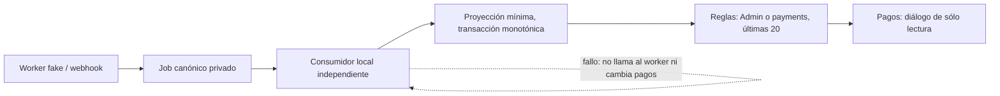

# E8-UI — Estado de notificaciones en Pagos

Fecha local: 2026-09-08, America/Mexico_City.
Alcance autorizado: código y datos sintéticos locales en `app/`.
Estado: **E8-UI/UI4 cerrada localmente**, con recorrido protegido, red y
rendimiento verificados en Chrome. El disparo automático de mensualidad →
worker → proyección y el webhook HTTP se verificaron en emuladores aislados.
Tras la recuperación autorizada, el usuario creó el nuevo Admin manualmente;
Pagos autenticado y un checkpoint posterior al alta quedaron confirmados.
No desplegado. Meta real permanece deshabilitado. E8 general sigue abierta.

## Resultado

Pagos incorpora un botón por atleta registrado para consultar sus últimas
20 notificaciones. El diálogo muestra tipo, fecha de Ciudad de México, estado
y folio/periodo cuando son válidos. No atribuye la entrega al pago seleccionado,
no envía mensajes, no permite reintentos manuales y no modifica movimientos financieros.

La nueva ruta `v1/notificationStatus/{athleteId}/{jobId}` permite únicamente:
type, status, updatedAt, folio y period opcionales. No expone teléfonos,
documentos, importes, nombres, hashes de destinatario, IDs Meta ni errores internos.
Los nombres del encabezado provienen del atleta que Pagos ya conoce, no de la proyección.

Lectura: usuario habilitado Admin o con permiso payments. No basta administrar
consentimiento. No hay acceso anónimo, ni lectura de todos los atletas.
La consulta exige orderByChild(updatedAt), limitToLast(20), sin límites de rango.
Ningún cliente, tampoco Admin, puede escribir o borrar estados. Jobs y eventos
de webhook permanecen privados.

## Estado de verificación

| Verificación | Resultado |
| --- | --- |
| Spec y autorización | Registradas antes de implementar |
| Functions unitarias | 98/98 |
| Regresiones seleccionadas de aplicación | 58/58 |
| RTDB reglas + integraciones | 51/51 (36 reglas, 15 integraciones) |
| Functions automático + webhook HTTP local | 1/1; control negativo sin Functions falló como se esperaba |
| Playwright, componente sintético | 4/4; cinco estados por viewport |
| Typecheck aplicación y Functions | Aprobados |
| Build aplicación y Functions | Aprobados, sin despliegue |
| ESLint focalizado | Sin errores ni advertencias |
| Revisión independiente | Hallazgos corregidos; segunda revisión sin nuevos hallazgos |
| Chrome, componente aislado | Apertura, 20 filas, etiquetas, cierre y devolución de foco verificados |
| Chrome, consola del componente | 0 errores y 0 advertencias observados |
| Chrome, Pagos autenticado | Pendiente → Aceptado → Entregado → Leído, vacío, cambio de atleta y cierre aprobados |
| Chrome, contraste en modo oscuro | Cerrar y folio corregidos y medidos: ≥4.81:1 y 7.03:1 |
| Chrome, responsive real | 320/768/1024/1440, encabezado/cierre visibles y sin desbordes del panel |
| Chrome, consola del flujo protegido | 0 errores y 0 advertencias observados |
| Traza de red y métricas de rendimiento | Verificadas: LCP 638 ms, INP 50 ms, CLS 0.00; metadatos de 414 solicitudes sin errores HTTP ni destinos Meta observados |

Total automatizado: **212 pruebas aprobadas**. No se cuenta como aprobada ninguna
prueba del flujo protegido que no se haya ejecutado. En esta continuación se
repitieron 58 pruebas de aplicación y las 4 responsive tras los ajustes de
contraste, más typecheck, build y ESLint de aplicación. Los 98 tests Functions
y 51 RTDB conservaban su evidencia anterior al recorrido Chrome. En la
continuación automática se repitieron las 98 unitarias Functions y se añadió
una integración por eventos/HTTP (1/1), con typecheck, build y lint aprobados.
Las 51 RTDB y la matriz web no se repitieron: no cambió código runtime ni reglas.
No se reinició el emulador que conserva la cuenta.

## Árbol de archivos de esta fase

```text
app/
├── database.rules.json
├── components.d.ts                         (registro generado del componente)
├── firebase.functions-qa.local             (config aislada, ignorada por Git)
├── functions/
│   ├── SPEC-notification-status-ui.md       (autorización y checklist)
│   ├── E8-LOCAL-QA.md                       (checkpoint anterior referenciado)
│   ├── E8-UI-QA.md                          (este reporte)
│   ├── src/index.ts                        (export del consumidor)
│   ├── src/notifications/
│   │   ├── status-projection.ts
│   │   └── local-status-projection.ts
│   └── tests/
│       ├── status-projection.test.ts
│       ├── status-projection.integration.ts
│       └── automatic-pipeline.integration.ts
├── src/
│   ├── pages/pagos.vue
│   ├── components/kronos/PaymentNotificationStatusDialog.vue
│   ├── services/notification-status.service.ts
│   └── utils/notification-status.ts
├── tests/
│   ├── database.rules.test.mjs
│   └── notification-status.test.ts
└── e2e/
    ├── payment-notifications.config.ts
    ├── responsive/payment-notifications-responsive.spec.ts
    └── fixtures/
        ├── payment-notifications.html
        ├── payment-notifications.ts
        └── PaymentNotificationsFixture.vue
```

Los cambios previos en firebase.json, emulator-config y sus pruebas se preservaron.
No se modificó AppKronos, no se instalaron dependencias y no se hicieron
commits, push, reset, despliegues ni escrituras sobre datos reales.

## Flujo y límites de la evidencia



- Backend comprobado en emulador: worker fake → job → proyección; duplicados,
  fallos de escritura y concurrencia. Las integraciones anteriores llaman a
  handlers directamente; la nueva prueba automática usa eventos y HTTP locales.
  Ninguna prueba certifica un despliegue real.
- Frontend comprobado por separado: servicio de consulta construido con query
  acotada; controlador probado con callbacks tardíos, permisos revocados,
  cambio de atleta, cierre y payload malformado.
- Chrome abrió el componente real mediante fixture sintético sin autenticación.
  El diálogo identifica correctamente Aceptado, Entregado, Leído y Por confirmar;
  cerrar elimina las filas y devuelve el foco al botón de apertura.
- Playwright revisó 320, 768, 1024 y 1440 px: 20 filas, encabezado visible,
  carga, vacío, error, permiso revocado, cierre, foco y ausencia de desbordes.
  Se bloquearon destinos HTTP externos; no hubo solicitudes externas en el fixture.
- Se recorrió Pagos → botón del atleta → suscripción RTDB autenticada → resultado
  → cierre en Chrome con login manual del usuario. Se ejecutaron los handlers
  locales existentes contra el emulador, sin iniciar Functions ni desplegar.
  Posteriormente se verificó el disparo automático en un emulador aislado,
  sin conectar Chrome a ese segundo dataset ni modificar la sesión manual.

### Continuación en Chrome con sesión local

- Atleta A: `qa-e8-ui-a`, job `job-11721cb199b881f8aa98034c7515f9c8`.
  El panel mostró Pendiente, Aceptado (sin prometer entrega), Entregado y Leído,
  actualizándose sin recargar. Worker y proyección invocados directamente.
- Se aplicaron webhooks sintéticos mediante el handler existente: lectura,
  duplicado de lectura y un Enviado atrasado. El duplicado se descartó y el
  evento atrasado no hizo retroceder Leído. Job y proyección permanecieron en
  `read`, con un único intento de envío fake.
- Cada paso comparó el pago sintético antes/después: total 500, abono 200,
  saldo 300, sin cambios. No se usó el proveedor Meta ni se enviaron mensajes.
- Atleta B: `qa-e8-ui-b`, sin historial. Se vio el mensaje de vacío, cero
  filas y ausencia del folio del atleta A.
- Tab mantuvo el foco dentro del diálogo. Enter cerró A y Escape cerró B;
  ambos devolvieron foco al botón correspondiente. Tras cerrar: cero diálogos.
- Matriz Chrome: viewports solicitados 320/768/1024/1440 × 900; el ancho útil
  de documento fue 305/753/1009/1425 por el scrollbar de 15 px. Sin desborde
  horizontal de documento o tarjeta, y encabezado/cierre visibles. Override
  retirado al terminar; regresó al ancho habitual de 759 px.
- Capturas Chrome visibles en esta conversación: Pendiente, Entregado, Leído
  a 320/1440 y vacío. No se guardaron como archivos locales. La matriz Playwright
  volvió a generar los 20 PNG en el directorio de resultados indicado abajo.
- Los casos de permiso revocado, carga y error conservan cobertura del fixture
  y pruebas de reglas/controlador; no se alteraron permisos de la cuenta manual.

No afectados: cálculo de saldos, abonos, cancelaciones, caja, inventario,
PDF/recibos anteriores, bajas por WhatsApp y otros módulos.
Se ejecutaron regresiones financieras relevantes, no recorridos web de todos esos módulos.

### Continuación: disparo automático y webhook HTTP

Prueba nueva: `functions/tests/automatic-pipeline.integration.ts`. No importa
ni invoca handlers de enqueue, worker, proyección o webhook. Usa Admin SDK para
escribir un pago sintético y esperar su proyección; después hace POST firmados
con una clave de prueba al webhook HTTP local.

- Destino fijo: demo-kronos-training, RTDB 9010, Functions 5002, hub 4410,
  logging 4510; todos en 127.0.0.1. Config local ignorada por Git.
- Control negativo: sólo RTDB activo, límite de 3000 ms. Falló exactamente por
  no recibir Aceptado. Demuestra que la prueba no ejecuta handlers a escondidas.
- Positivo: ambos emuladores activos. Se observaron ejecuciones automáticas de
  onMembershipPaymentWritten, onNotificationJobCreated y onNotificationJobStatusWritten.
  La proyección Aceptado apareció en 8095 ms; prueba completa en 11.1 s. Son
  observaciones de esta ejecución local con arranque de runtimes, no métricas web
  ni una garantía de latencia de producción.
- POST de Entregado y Leído: HTTP 200 y proyección actualizada automáticamente.
  Repetir Leído dio duplicate; Enviado atrasado dio ignored. Job final read,
  un único intento fake y auditoría de envío intacta.
- El contrato expuesto tiene sólo type/status/updatedAt/folio/period.
  El pago permaneció idéntico: total 500, abono 200, saldo 300.
- El emulador separado se apagó al terminar. Lectura posterior de RTDB manual
  9000 confirmó bootstrap inicializado, fixture anterior read y saldo 300.
- Esta prueba cubre mensualidad, worker, proyección y webhook. No ejecuta el
  trigger de tienda ni el programador de recordatorios. El scheduler se ignoró
  porque no se inició Pub/Sub; E8 general conserva esos alcances independientes.

La configuración sigue la integración automática de ambos emuladores descrita
por [Firebase: conectar Realtime Database](https://firebase.google.com/docs/emulator-suite/connect_rtdb).
La conexión usa proyecto demo y host local explícitos; no se cambiaron reglas,
autenticación ni configuración de despliegue.

## Correcciones demostradas con RED/GREEN

1. La revisión encontró que un rango endAt permitía paginar historial anterior.
   Una prueba falló antes de denegar startAt/endAt/equalTo y pasó después.
2. Relojes invertidos en webhooks concurrentes podían congelar un estado anterior.
   El reductor ahora prioriza avances canónicos, mantiene updatedAt no decreciente
   y rechaza regresiones. Incluye Enviado, Entregado y Leído. La integración RTDB
   retiene Leído aunque termine después un proyector que había leído Aceptado.
3. Un array como type pasaba por coerción y podía etiquetarse incorrectamente.
   La validación estricta ahora vacía el panel y cancela la suscripción.
4. La revisión visual detectó que VCardText contraía el encabezado a 320 px.
   La prueba toBeInViewport reprodujo el recorte; el encabezado fijo lo corrigió.
5. El QA protegido detectó contraste insuficiente de Cerrar: prueba RED de
   2.66:1 frente al mínimo 4.5:1. Se añadió `color="on-surface"` al botón,
   sin cambiar el tema global. Chrome confirmó 4.81:1 con foco.
6. El folio heredaba énfasis bajo: RED de 3.29:1. Se añadió
   `text-medium-emphasis` y Chrome midió 7.03:1. Ambos controles de contraste
   pasan en los cuatro viewports. El cálculo incluye alfa y capas del botón.

La revisión incremental de estos dos cambios comprobó tests primero, uso de
tokens existentes, alcance del componente, ausencia de nuevas dependencias y
ausencia de cambios de permisos, consultas o coste runtime. No hubo hallazgos
adicionales en este incremento; la revisión independiente anterior cubrió el
resto de la fase, no estas dos clases/propiedades añadidas después.

Las reglas usan las expresiones de consulta documentadas por
[Firebase: condiciones de seguridad y queries](https://firebase.google.com/docs/database/security/rules-conditions).

## Comandos reproducibles

Ejecutar siempre desde `C:\Projects\Kronos\kronos-training-app\app`:

```powershell
npm --prefix functions test
npm --prefix functions run typecheck
npm --prefix functions run build
npm run typecheck
npm run build
node --require ./scripts/node-userinfo-preload.cjs --import tsx --test tests/notification-status.test.ts tests/payment-notification.test.ts tests/firebase-emulator-config.test.ts tests/local-device-authorization.test.mjs tests/enrollment-sheet.test.ts tests/kiosk-code.test.ts tests/store-kiosk-improvements.test.ts tests/athlete-intake.test.ts tests/financial-reports.test.ts
.\node_modules\.bin\playwright.cmd test --config e2e/payment-notifications.config.ts --project=responsive
```

Emuladores: proyecto fijo demo-kronos-training; XDG_CONFIG_HOME aislado en
app/test-results/firebase-cli-e8; variables de credenciales eliminadas sólo del
proceso de prueba, sin leerlas. La última suite usó el puerto RTDB separado 9010
mediante `firebase.status-qa.local` (ignorado) para no resetear el entorno manual:

```powershell
.\node_modules\.bin\firebase.cmd emulators:exec --config firebase.status-qa.local --only database --project demo-kronos-training "node --require ./scripts/node-userinfo-preload.cjs --import tsx --test --test-concurrency=1 tests/database.rules.test.mjs functions/tests/status-projection.integration.ts functions/tests/worker.integration.ts functions/tests/whatsapp-webhook.integration.ts"
```

Comando de la prueba automática, desde el mismo directorio app:

```powershell
$env:XDG_CONFIG_HOME='C:\Projects\Kronos\kronos-training-app\app\test-results\firebase-cli-e8'
$env:CI='true'
$env:KRONOS_NOTIFICATION_WORKER_MODE='fake'
$env:WHATSAPP_APP_SECRET='qa-only-synthetic-not-for-production'
$env:KRONOS_QA_PIPELINE_TIMEOUT_MS='45000'
Remove-Item Env:FIREBASE_TOKEN,Env:GOOGLE_APPLICATION_CREDENTIALS -ErrorAction SilentlyContinue
.\node_modules\.bin\firebase.cmd emulators:exec --config firebase.functions-qa.local --only functions,database --project demo-kronos-training "node --require ./scripts/node-userinfo-preload.cjs --import tsx --test functions/tests/automatic-pipeline.integration.ts"
```

La clave anterior es deliberadamente ficticia y pública; no es una credencial
de Meta. Sólo se asignó al proceso de prueba. No se creó ningún archivo .env.
Para repetir el control negativo, usar timeout 3000 y `--only database`;
su salida no-cero es el resultado esperado, no una prueba positiva aprobada.

Contenido reproducible de `firebase.functions-qa.local` (no cambia firebase.json):

```json
{
  "functions": { "source": "functions" },
  "database": { "rules": "database.rules.json" },
  "emulators": {
    "functions": { "host": "127.0.0.1", "port": 5002 },
    "database": { "host": "127.0.0.1", "port": 9010 },
    "hub": { "host": "127.0.0.1", "port": 4410 },
    "logging": { "host": "127.0.0.1", "port": 4510 },
    "ui": { "enabled": false },
    "singleProjectMode": true
  }
}
```

Capturas: `app/test-results/payment-notifications/`, 20 PNG (cinco estados por
viewport). Revisión visual manual de panel a 320/768/1440 y error a 320; las demás
capturas y dimensiones están cubiertas por la matriz automatizada.
El fixture y su configuración están fuera del bundle de producción y rechazan
ejecución fuera de Vite dev, modo emulator y host loopback.

En el checkpoint inicial Chrome DevTools MCP no estaba disponible. Se utilizó
el conector de Chrome para AX, DOM, estilos calculados, consola, teclado y
responsive. La falta de red/Performance de aquel conector queda resuelta por
la captura posterior con DevTools, documentada al final. La ausencia de llamadas
externas del fixture aislado no describe la sesión real: ésta carga fuentes
de Google. Se verificó previamente que el handler ejecutado utiliza el fake.
Warnings esperados de herramientas: permission_denied en pruebas negativas;
NO_COLOR/FORCE_COLOR en el runner; dos emuladores del mismo proyecto con puertos
distintos durante QA. No son errores nuevos de consola de la interfaz.
Al arrancar Functions, la CLI intentó descubrir metadatos de Google Cloud en
169.254.169.254 y el sandbox bloqueó la conexión (EACCES). No impidió la prueba
ni se concedió acceso a esa dirección. El build requirió permiso de escritura
del proceso sobre functions/lib y terminó aprobado. No se instalaron dependencias.

## Punto de continuación y riesgos

1. El nuevo Admin fue creado manualmente y Pagos abre autenticado. El checkpoint
   after-admin contiene Auth y RTDB; su importación aún no se ha ensayado.
   No ejecutar suites que reseteen `v1` contra el puerto 9000.
2. Red y rendimiento completados en DevTools. Son mediciones locales de Vite dev,
   sin throttling ni datos de campo. El scrollbar global presenta un reflow de
   32 ms informado por DevTools; se documenta sin ampliar esta fase.
3. Disparo automático de mensualidad/worker/proyección y webhook local verificado.
   El emulador aislado no se dejó activo. Publicación, Meta real y el resto de E8
   siguen fuera de este cierre parcial.

La proyección es eventualmente consistente. Su consumidor sólo ejecuta I/O con
modo fake, proyecto demo y RTDB loopback; no está habilitado para producción.
La fecha conserva el máximo observado cuando hay carreras, no necesariamente
el timestamp original del último webhook recibido. No hay backfill ni política
de retención implementados aquí. Retención/borrado, BAJA, correlación temprana de
webhooks y Meta real mantienen sus gates independientes.

Servicios dejados para continuar: Vite local 4173 y emuladores Auth 9099 /
RTDB 9000. La pestaña Pagos autenticada quedó conservada como handoff; no se tomó
control de las pestañas publicadas. Las pruebas aisladas del puerto 9010 finalizaron.

## Checkpoint histórico: recuperación local antes del nuevo Admin

El usuario autorizó recrear únicamente el entorno local y sus dos atletas
sintéticos. Chrome DevTools MCP ya está habilitado y accesible en esta tarea;
se abrió su perfil separado de QA, sin conectar pestañas de producción.

- Vite en 127.0.0.1:4173, modo emulator; Auth 9099 y RTDB 9000 del proyecto
  demo-kronos-training activos. Functions no se inició en esta recuperación.
- Recreados el plan qa-e8-ui-plan, atletas qa-e8-ui-a/qa-e8-ui-b, sus pagos
  2026-09 y preferencias de prueba de A. Cada pago: total 500, abono 200,
  saldo 300 y un abono. Transacciones abortan ante rutas existentes; no se
  borró v1 ni se sobrescribieron registros.
- El handler existente creó job-11721cb199b881f8aa98034c7515f9c8 y el proyector
  publicó pending. A tiene historial; B no tiene proyección. Cero intentos de
  envío, ni siquiera fake. La verificación posterior de ambos pagos pasó.
- En pending aún no existe folio de despacho. Una aserción inicial exigía
  incorrectamente ese campo opcional; se comprobó el mapper existente y se
  validó el contrato de cuatro campos, sin cambiar código ni relanzar el seed.
- Dispositivo de bootstrap identificado en la página local y habilitado
  únicamente en la instancia demo-kronos-training-default-rtdb. No se crearon
  usuarios ni contraseñas mediante scripts.
- Chrome mostró «Crea el primer Admin», con campos vacíos, y quedó al frente.
  Último estado comprobado: bootstrap todavía no inicializado. El usuario debe
  completar manualmente el formulario y confirmar antes del QA autenticado.
  No hace falta Firebase Console ni enviar otro UID.

Checkpoint local recuperado:
app/test-results/kronos-qa-recovery-20260908-before-admin/
incluye firebase-export-metadata.json, auth_export y database_export.
La CLI 15.28.1 generó la exportación, pero Windows bloqueó su rename (EPERM).
Se movió la carpeta temporal completa al destino validado con permiso; no se
leyó el contenido Auth. El destino está ignorado por Git. No se reiniciaron
los emuladores durante la recuperación del checkpoint.

Se preparó --export-on-exit test-results/kronos-qa-emulators para un cierre
limpio, pero no garantiza persistencia ante cierres forzados ni ante el EPERM
observado. **Exportar otro checkpoint después del alta manual**, antes de cerrar
los servicios; no sobrescribir el checkpoint anterior. El checkpoint actual
es anterior al alta Admin y no puede restaurar una cuenta aún no creada.
Al reabrir, importar el checkpoint completo más reciente confirmado, usando
--import, en lugar de arrancar una base vacía.

Flujo actual:
Vite + Auth/RTDB demo → dos fixtures + job pending → dispositivo autorizado →
formulario Admin manual → checkpoint posterior al alta → traza de Pagos pendiente.

Archivos de aplicación ejecutable/reglas/dependencias: sin cambios. Sólo se
actualizaron esta evidencia y la autorización en SPEC-notification-status-ui.md.
No se repitieron suites, typecheck o build por esta recuperación de datos:
los 212 resultados anteriores conservan su carácter histórico. En ese checkpoint
UI4 seguía pendiente del acceso manual y de red/rendimiento; se completan abajo.

## Cierre posterior: Pagos autenticado y Chrome DevTools

El usuario confirmó «listo ya esta en pagos». Se comprobó la ruta local
/pagos autenticada con ambos atletas sintéticos, sin inspeccionar credenciales,
tokens, cookies, cuerpos Auth ni tramas de la conexión de Firebase.

### Recorrido y rendimiento de esta ejecución

- Recarga autenticada: LCP 638 ms, TTFB 14 ms y CLS 0.00. Desglose LCP:
  espera del recurso 546 ms, descarga 3 ms, demora de render 74 ms; valores
  redondeados por DevTools. Traza de carga de aproximadamente 5.7 segundos.
- Pagos → notificaciones de A: recibo Pendiente, periodo 2026-09, sin folio
  de despacho aún. Escape cierra y devuelve el foco al botón de A.
- Abrir B: mensaje de historial vacío, sin contenido de A. Escape cierra;
  cero diálogos y foco de vuelta al botón de B. Sin desborde horizontal observado.
- Traza de interacciones: INP 50 ms, CLS 0.00; aproximadamente 41 segundos,
  incluyendo pausas entre herramientas. Esa duración no es latencia de la UI.
- Consola después de recarga e interacciones: cero errores y advertencias.
- Ambos pagos visibles conservaron total 500, abono 200 y saldo 300. No se
  ejecutó worker, webhook, nuevo pago ni envío en este cierre de navegador.
  El recorrido accepted/delivered/read conserva la evidencia previa.
- Entorno: Vite dev, perfil QA persistente, CPU 1x, sin limitación artificial
  de red. No es una medición de producción, una matriz de dispositivos, un
  percentil poblacional ni una certificación de Core Web Vitals de usuarios.
- Hallazgo no bloqueante: DevTools atribuye reflow al scrollbar global
  vue3-perfect-scrollbar, invocado desde flushJobs; total reportado 32 ms
  (un frame constructor inclusivo figura con 42 ms; no sumar ambos valores).
  No se cambió esa dependencia ni el layout global.

### Red observada y privacidad

Captura de metadatos de 414 entradas tras la navegación: 267 con estado 200,
146 con 304 y una con 204; sin 4xx/5xx o fallos en el listado. Incluye 26
recursos data: embebidos, que no son solicitudes a un servidor externo.

| Origen | Entradas |
| --- | ---: |
| http://127.0.0.1:4173 | 377 |
| http://127.0.0.1:9099 | 2 |
| http://127.0.0.1:9000 | 5 |
| https://fonts.googleapis.com | 1 |
| https://fonts.gstatic.com | 3 |
| data: | 26 |

Auth consultó su emulador local con HTTP 200 y preflight 204; RTDB mostró
cinco entradas locales /.lp con 200. Las cuatro peticiones externas observadas
fueron CSS/fuentes Google (Montserrat, Mulish y Syncopate), no Meta.
Abrir/cerrar A y B no añadió entradas HTTP al listado comparado. El filtro
WebSocket no devolvió entradas: esto no demuestra ausencia de una conexión
persistente. No se inspeccionaron tramas ni se deduce de estos metadatos el
número de suscripciones; la query acotada y su limpieza conservan pruebas
de servicio/controlador/reglas y verificación de contenido visible.

Se eliminaron query strings y fragmentos antes de guardar los metadatos
resumidos. No se exportó HAR ni traza cruda con posible material Auth.
Resumen portable: outputs/E8-UI-devtools-evidence.json en la carpeta de esta tarea.
Las trazas fueron analizadas en DevTools; se conservan resultados resumidos,
no archivos de traza cruda reabribles. La captura PNG a test-results fue
rechazada por los roots del conector y no se creó; la evidencia visual
histórica y las 20 capturas Playwright siguen identificadas arriba.

### Checkpoint que conserva la cuenta creada

Destino confirmado:
app/test-results/kronos-qa-recovery-20260908-after-admin/

La exportación posterior al alta incluyó auth_export, database_export y
firebase-export-metadata.json (CLI/Auth 15.28.1, RTDB 4.11.2). Windows volvió
a impedir el rename con EPERM; se recuperó la carpeta temporal completa
mediante Move-Item con destino validado, permiso explícito y sin sobrescribir.
Se comprobaron metadata, directorios e ignorado por Git, sin leer Auth.
El checkpoint before-admin se conserva. No se detuvieron ni reiniciaron
los servicios y no se ensayó una importación sobre el entorno activo.

Para próximas sesiones, con los emuladores detenidos, reutilizar el arranque
local documentado añadiendo:
--import test-results/kronos-qa-recovery-20260908-after-admin
No arrancar vacío ni sobrescribir estos checkpoints. El contenido Auth local
sigue siendo sensible: no compartirlo ni versionarlo.

Flujo final:
Admin manual → Pagos autenticado → A pendiente → cerrar → B vacío → cerrar →
red/Performance verificados; respaldo Auth+RTDB guardado en paralelo.

UI4 y el checkpoint de cierre E8-UI quedan completos con los límites anteriores.
E8 general, producción, Meta real, retención/BAJA y los triggers no cubiertos
siguen fuera de este cierre. No cambió código runtime, reglas o dependencias
en esta ejecución; no se repitieron suites/build/typecheck sobre código intacto.
Se actualizaron sólo el reporte, su copia de entrega, la spec y el resumen
sanitizado de evidencia. No hubo commit, push ni despliegue.
