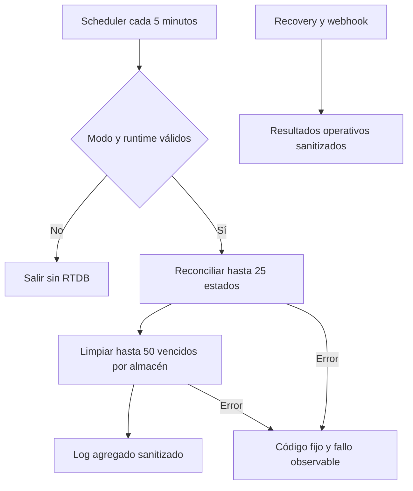

# Spec: E8-PROD-6 — Mantenimiento y telemetría operativa de WhatsApp

Estado: **implementada y verificada localmente el 2026-09-21**.
Fecha de propuesta: 2026-09-21, America/Mexico_City.
Autorización: el usuario confirmó `autorizo` el 2026-09-21.
Módulo: `athletes-payments`; verificación transversal: `experience-quality`.
Capability map: `../../specs/CAPABILITY-MAP.md`.
Spec matriz: `../../specs/SPEC-payment-notifications-whatsapp.md`.
Precedentes: `SPEC-whatsapp-production-webhook.md`,
`SPEC-whatsapp-production-recovery.md` y `SPEC-whatsapp-status-maintenance.md`.

## Objetivo

Cerrar los controles operativos locales que deben existir antes de preparar un
despliegue: recuperar como fallback estados tempranos que no fueron correlacionados,
eliminar marcadores transitorios vencidos en lotes acotados y emitir telemetría
estructurada suficiente para detectar fallos sin registrar PII, payloads o secretos.

La implementación permanecerá apagada por defecto y se probará sólo con emuladores,
fixtures QA y dependencias inyectadas. No creará alertas, dashboards, secretos o
recursos remotos; no consultará datos publicados, no llamará a Meta y no desplegará.

## Alcance propuesto

### Incluye

- Crear un runner inyectable que, por ciclo, procese una página de hasta 25 eventos
  del status inbox y limpie hasta 50 eventos vencidos de cada almacén transitorio:
  status inbox, opt-out y deduplicación general del webhook.
- Generalizar para producción segura el mantenimiento local ya probado, conservando
  su cursor, operaciones seriales y revalidación antes de borrar.
- Añadir `expiresAt` con retención de 30 días a nuevos marcadores de deduplicación del
  webhook y el índice RTDB correspondiente. Marcadores históricos sin `expiresAt`
  se preservan y se reportan en el inventario previo al rollout.
- Crear un único `onWhatsAppMaintenanceScheduled` cada cinco minutos, apagado por
  defecto mediante `KRONOS_WHATSAPP_MAINTENANCE_MODE=disabled`, con una instancia,
  una invocación concurrente, timeout acotado y sin secretos enlazados.
- Exigir runtime productivo y WABA/phone-number ID válidos antes de inicializar RTDB.
- Emitir eventos estructurados con códigos fijos para mantenimiento, recovery y
  webhook: resultado, conteos, duración y causa sanitizada. No incluir IDs de jobs o
  eventos, wamid, teléfonos, nombres, scope, payload, PDF, tokens, errores crudos ni
  stack traces.
- Mantener errores como fallos de la invocación después de emitir un código genérico,
  para que Cloud Functions/Monitoring pueda observarlos sin falso éxito.
- Probar modo apagado, límites, cursor, idempotencia, borrado condicionado,
  aislamiento de scope, metadata y ausencia de campos sensibles.

### Excluye

- Crear o configurar Cloud Monitoring, alertas, dashboards, canales de notificación,
  budgets o recursos de Scheduler en un proyecto real.
- Definir o borrar la retención de `notificationJobs`, proyecciones visibles,
  preferencias, auditoría de consentimiento, pagos o atletas.
- Ejecutar backfill o borrar marcadores históricos sin `expiresAt`.
- Reintento manual, panel operativo, endpoints nuevos o cambios en la aplicación Vue.
- Cambiar plantillas, cadencia de recordatorios, política de reintentos, proveedor,
  permisos, autenticación o cálculos financieros.
- Secretos reales, red Meta, mensajes, datos publicados, dependencias, CI/hosting y
  despliegue.

## Contrato operativo propuesto

Cada ejecución sigue este orden:

1. Validar modo, entorno, WABA y número remitente. Si falla, terminar antes de RTDB.
2. Procesar una página de hasta 25 eventos tempranos mediante la correlación existente.
3. Limpiar como máximo 50 filas vencidas por almacén, con comparación transaccional de
   `expiresAt` inmediatamente antes del borrado.
4. Emitir un único resumen estructurado de éxito con conteos y duración.
5. Ante cualquier error, emitir un código fijo sin detalles privados y rechazar la
   invocación para conservar la señal de error administrada.

El cursor sólo progresa después de completar una página. Un reinicio puede repetir una
página de forma idempotente. Dos invocaciones accidentales pueden repetir lecturas,
pero la deduplicación y las transacciones impiden aplicar dos veces un estado o borrar
una fila que dejó de estar vencida.

Eventos permitidos:

| Código | Datos permitidos |
| --- | --- |
| `whatsapp_maintenance_disabled` | razón fija |
| `whatsapp_maintenance_completed` | visitados, pendientes, eliminados por almacén, duración |
| `whatsapp_maintenance_failed` | etapa y código fijo |
| `whatsapp_recovery_completed` | conteos agregados ya devueltos por el runner |
| `whatsapp_recovery_failed` | etapa y código fijo |
| `whatsapp_webhook_result` | método, clase HTTP y conteos agregados |

La telemetría habilita alertas posteriores, pero esta fase no afirma que exista un
dashboard o una alerta activa.

## Diseño propuesto



## Incrementos propuestos

1. T1 — Contrato de telemetría allowlist y pruebas de ausencia de PII/secretos.
2. T2 — `expiresAt`, cleanup e índice para nuevos marcadores de webhook.
3. T3 — Runner de mantenimiento productivo con página y limpiezas acotadas.
4. T4 — Scheduler apagado, metadata y telemetría de recovery/webhook.
5. T5 — Emuladores, regresión, revisión de cinco ejes y reporte.

## Archivos probables

Rutas relativas a `app/functions/` salvo donde se indica:

```text
SPEC-whatsapp-production-operations.md
src/operations/telemetry.ts                    nuevo
src/whatsapp/production-maintenance.ts          nuevo
src/whatsapp/realtime-webhook-events.ts
src/whatsapp/realtime-status-inbox.ts
src/whatsapp/realtime-opt-out.ts
src/whatsapp/http.ts
src/notifications/production-recovery.ts
src/index.ts
tests/whatsapp-production-operations.test.ts    nuevo
tests/whatsapp-production-operations.integration.ts nuevo
../database.rules.json
../tests/database.rules.test.mjs
../../tasks/plan.md
../../tasks/todo.md
../../Docs/implementation-reports/2026-09-21-whatsapp-production-operations.md
```

Si TDD demuestra que un archivo adicional es necesario dentro de estos mismos
contratos, se documentará en la spec. Cualquier cambio de datos, permisos,
dependencias o infraestructura devuelve la fase a propuesta.

## Criterios de aceptación

- [x] El mantenimiento está `disabled` por defecto y una configuración inválida
  termina antes de inicializar RTDB o ejecutar trabajo.
- [x] Cada ciclo procesa como máximo 25 eventos tempranos y elimina como máximo 50
  vencidos por almacén, sin scan completo ni ciclos solapados dentro de la Function.
- [x] Sólo filas cuyo `expiresAt` continúa vencido se eliminan; pagos, jobs,
  proyecciones, preferencias y auditoría permanecen intactos.
- [x] Los nuevos marcadores generales del webhook vencen a 30 días, se consultan por
  índice y los registros históricos sin vencimiento se preservan.
- [x] Existe un único scheduler de mantenimiento, sin secretos, cada cinco minutos,
  con una instancia, concurrencia uno y timeout acotado.
- [x] Maintenance, recovery y webhook emiten sólo códigos y agregados permitidos; las
  pruebas rechazan teléfonos, IDs, wamid, scope, payloads, PDF, tokens y errores crudos.
- [x] Un fallo operativo rechaza la invocación y conserva una señal genérica; nunca se
  registra éxito parcial como ciclo completado.
- [x] Rules Emulator confirma índices y privacidad; Admin SDK confirma selección y
  borrado acotados.
- [x] No se crean recursos remotos, alertas, secrets, mensajes, datos publicados,
  dependencias, CI/hosting ni despliegue.
- [x] Pruebas focalizadas, suite de Functions, Rules y Functions+RTDB Emulator,
  typecheck, build, lint, whitespace, metadata y revisión de cinco ejes pasan.

## Riesgos y mitigaciones

| Riesgo | Mitigación |
| --- | --- |
| Log filtra PII o secreto | esquema allowlist, códigos fijos y pruebas negativas |
| Limpieza elimina una fila renovada | relectura transaccional de `expiresAt` antes de borrar |
| Dos schedulers aplican dos veces | correlación idempotente y stores transaccionales |
| Cola crece más rápido que un ciclo | límites medibles y conteo `pending`; alertas se configuran antes de rollout |
| Histórico sin TTL se borra por inferencia | preservar registros sin `expiresAt`; inventario/backfill separado |
| Scheduler aparenta éxito parcial | rechazo tras log genérico de fallo |
| Activación accidental | modo independiente apagado y validación fail-closed |
| Retención de negocio incorrecta | jobs, proyecciones, preferencias y pagos quedan fuera |

## Verificación propuesta

Desde `app/`:

```powershell
node --require ./scripts/node-userinfo-preload.cjs --import tsx --test functions/tests/whatsapp-production-operations.test.ts
npm --prefix functions test
npm --prefix functions run typecheck
npm --prefix functions run build
npm run test:rules
git diff --check
```

La integración usará exclusivamente `demo-kronos-training`, loopback, fixtures QA y
dependencias inyectadas. Chrome y Playwright no aplican porque no se modifica la web.

## Gate de autorización

Autorización recibida el 2026-09-21 para:

- añadir el campo `expiresAt` a nuevos marcadores privados del webhook y su índice
  local en `database.rules.json`;
- añadir el scheduler codificado cada cinco minutos, apagado por defecto y sin secretos;
- incorporar logs estructurados sanitizados en maintenance, recovery y webhook;
- ejecutar pruebas locales y emuladores con datos sintéticos.

La autorización no cubrirá datos o recursos productivos, backfill, borrado real,
Secret Manager, Meta, mensajes, alertas Cloud, cambios de dependencias ni despliegue.

## Resultado de implementación

La fase añadió una allowlist de telemetría estructurada, el runner de mantenimiento
productivo y una sola Function programada. El runner conserva un cursor por instancia,
reconcilia hasta 25 eventos y limpia transaccionalmente hasta 50 filas vencidas por
almacén. Los nuevos marcadores generales del webhook reciben un TTL de 30 días; los
históricos sin `expiresAt` permanecen intactos.

Evidencia del 2026-09-21:

- RED inicial por ausencia de `production-maintenance.ts`; después, 7/7 pruebas
  focalizadas y 218/218 pruebas totales de Functions en verde.
- 44/44 pruebas combinadas de Rules + RTDB, incluida la integración completa del
  runner con status inbox, opt-out y marcadores generales.
- Typecheck, build, lint focalizado, whitespace y metadata compilada en verde.
- Metadata: una sola `onWhatsAppMaintenanceScheduled`, cada cinco minutos en UTC,
  timeout 540, una instancia, concurrencia uno y cero secretos.
- Revisión de corrección, seguridad, arquitectura, rendimiento y mantenibilidad sin
  hallazgos bloqueantes. La búsqueda estática confirmó que ninguna ruta de telemetría
  serializa IDs, teléfono, wamid, payload, token o error crudo.
- Chrome y Playwright no aplican porque no se modificó la aplicación web.

El cursor no es un checkpoint durable: un arranque frío puede repetir desde el inicio
de forma idempotente. El trigger por cambio de job continúa como ruta primaria y el
scheduler es un fallback; la profundidad de cola y los reinicios deberán convertirse
en alertas antes de habilitar producción.
