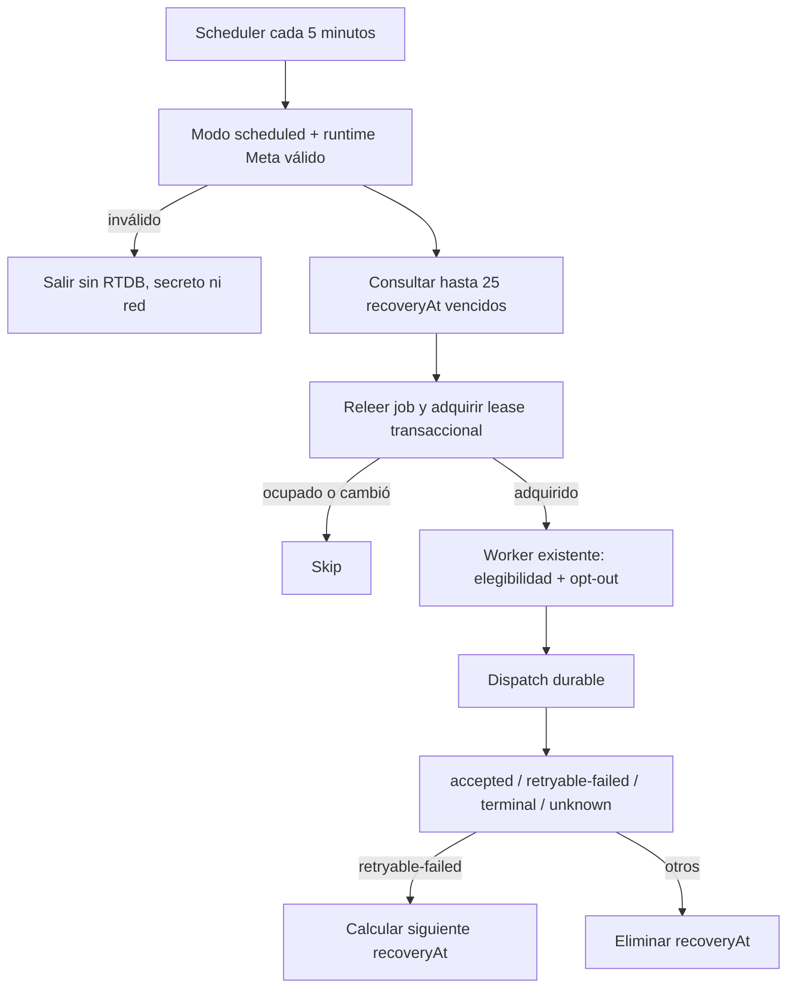

# Spec: E8-PROD-5 — Recuperación productiva de jobs y reintentos

Estado: **implementada y verificada localmente el 2026-09-21**.
Fecha de propuesta: 2026-09-21, America/Mexico_City.
Autorización: el usuario confirmó `sí autorizo` el 2026-09-21.
Módulo: `athletes-payments`; verificación transversal: `experience-quality`.
Capability map: `../../specs/CAPABILITY-MAP.md`.
Spec matriz: `../../specs/SPEC-payment-notifications-whatsapp.md`.
Precedentes: `SPEC-whatsapp-production-runtime.md` y
`SPEC-whatsapp-production-webhook.md`.

## Objetivo

Recuperar automáticamente, sin duplicar envíos, los jobs que quedaron `queued`, los
leases `processing` vencidos y los fallos `retryable-failed` cuyo backoff ya terminó.
La rebanada añadirá un scheduler backend apagado por defecto y una clave indexada
`recoveryAt` que permita leer exclusivamente trabajo vencido en lotes acotados.

Al terminar, el código y las reglas quedarán verificables localmente. No se habilitará
el scheduler remoto, no se configurarán parámetros o secretos, no se usarán datos
publicados, no se llamará a Meta y no se desplegará.

## Alcance propuesto

### Incluye

- Confirmar para producción la política ya probada: reintentos a 1, 5, 30 y 180
  minutos, máximo cuatro reintentos después del intento inicial y ventana de 24 horas.
- Añadir `recoveryAt` al contrato privado de cada job: creación para `queued`,
  `leaseUntil` para `processing`, siguiente backoff para `retryable-failed` y ausencia
  para estados sin recuperación automática.
- Añadir el índice RTDB `recoveryAt` bajo `v1/notificationJobs`; clientes continúan sin
  acceso de lectura o escritura a esa rama.
- Crear un runner inyectable que consulte `recoveryAt <= now`, ordene de forma estable
  y procese como máximo 25 jobs por invocación, en grupos internos de tres, mediante el
  worker, lease, marcador de dispatch, elegibilidad y opt-out existentes.
- Añadir un único `onNotificationRecoveryScheduled` cada cinco minutos. Sólo se activa
  cuando `KRONOS_NOTIFICATION_RECOVERY_MODE=scheduled` y el runtime Meta productivo es
  válido; el valor predeterminado es `disabled`. Limitarlo a una instancia, una
  invocación concurrente y 540 segundos.
- Enlazar únicamente `WHATSAPP_ACCESS_TOKEN` al scheduler y leerlo dentro del handler,
  después de validar el modo. No compartir secretos con consultas o resultados.
- Verificar concurrencia entre trigger de creación y scheduler, cursor por
  `recoveryAt`/job ID, agotamiento de reintentos, ventana de 24 horas, opt-out y el
  bloqueo permanente de `unknown`.
- Cubrir el índice y la denegación al cliente con Rules Emulator; cubrir el scheduler
  y el worker sólo con fake/fetch inyectado y emuladores locales.

### Excluye

- Habilitar Cloud Scheduler, cambiar configuración remota, asignar secretos o desplegar.
- Ejecutar migraciones o backfills sobre jobs existentes. Antes de un despliegue, una
  fase de rollout deberá confirmar de forma sólo lectura si existen filas sin
  `recoveryAt`; cualquier corrección de datos requerirá autorización independiente.
- Reintentar `unknown`, resultados aceptados o estados terminales.
- Cambiar cadencia de recordatorios, contenido, plantillas, destinatarios o proveedor.
- Alertas, dashboards, reintento manual, limpieza TTL y retención definitiva.
- Añadir dependencias, cambiar Auth/permisos, tocar Vue o usar Chrome autenticado.

## Contrato operativo propuesto

| Estado | `recoveryAt` | Acción al vencer |
| --- | --- | --- |
| `queued` | hora de creación | competir por el lease y procesar |
| `processing` | `leaseUntil` | recuperar sólo si el lease venció |
| `retryable-failed` | `updatedAt + backoff` | reintentar si sigue dentro de política |
| `accepted`, `sent`, `delivered`, `read` | ausente | ninguna |
| `terminal-failed`, `suppressed`, `unknown` | ausente | ninguna automática |

La consulta usa `orderByChild('recoveryAt').endAt(now).limitToFirst(25)`. El job se
vuelve a leer y el lease transaccional confirma estado, intento y timestamp antes de
preparar o enviar. Si dos invocaciones observan el mismo job, sólo una obtiene el
lease. Un resultado incierto conserva `unknown` sin nueva fecha de recuperación.

## Diseño propuesto



## Incrementos propuestos

1. T1 — Contrato puro `recoveryAt` y política de cuatro reintentos con RED/GREEN.
2. T2 — Persistencia RTDB e índice `recoveryAt`, incluidas reglas y pruebas de acceso.
3. T3 — Runner paginado/acotado con concurrencia, opt-out y `unknown` en RED/GREEN.
4. T4 — Scheduler apagado por defecto, parámetro, secret binding y export único.
5. T5 — Integración de emuladores, regresión, revisión de cinco ejes y reporte.

## Archivos probables

Rutas relativas a `app/functions/` salvo donde se indica:

```text
SPEC-whatsapp-production-recovery.md
src/notifications/jobs.ts
src/notifications/delivery-state.ts
src/notifications/realtime-job-store.ts
src/notifications/local-worker.ts
src/notifications/production-recovery.ts       nuevo
src/index.ts
tests/notification-recovery.test.ts             nuevo
tests/notification-recovery.integration.ts      nuevo
../database.rules.json
../tests/database.rules.test.mjs
../../tasks/plan.md
../../tasks/todo.md
../../Docs/implementation-reports/2026-09-21-whatsapp-production-recovery.md
```

## Criterios de aceptación

- [x] El scheduler queda `disabled` por defecto y termina antes de RTDB, secretos o red
  si modo, proyecto, Graph version, phone-number ID o runtime no son válidos.
- [x] La política queda fijada en 1/5/30/180 minutos, cuatro reintentos y 24 horas; el
  agotamiento termina en `terminal-failed` sin otro dispatch.
- [x] Sólo `queued`, `processing` vencido y `retryable-failed` vencido conservan una
  `recoveryAt` válida; todos los demás estados la eliminan.
- [x] Cada ejecución lee como máximo 25 jobs vencidos mediante el índice, los procesa
  en grupos máximos de tres y no hace un scan completo de `notificationJobs`.
- [x] Dos schedulers o un scheduler y el trigger de creación no pueden reservar dos
  envíos para el mismo intento.
- [x] Consentimiento retirado, teléfono cambiado e inactividad se vuelven a comprobar
  antes del dispatch; BAJA suprime el job en vez de reintentarlo.
- [x] `unknown`, aceptados y estados terminales nunca reciben recuperación automática.
- [x] Existe un solo scheduler de recuperación, enlaza sólo el access token y no expone
  secreto, teléfono completo, PDF, payload o error crudo en resultados o logs.
- [x] Las reglas mantienen `notificationJobs` privado y declaran el índice
  `recoveryAt`; pasan pruebas negativas de clientes y positivas con Admin SDK.
- [x] No se crean recursos remotos, no se modifican datos publicados, no hay red Meta,
  mensajes, dependencias, CI/hosting ni despliegue.
- [x] Suite de Functions, Rules Emulator, integración Functions+RTDB, typecheck, build,
  lint, whitespace, metadata y revisión de cinco ejes pasan.

## Riesgos y mitigaciones

| Riesgo | Mitigación |
| --- | --- |
| Dos consumidores duplican un envío | lease transaccional y marcador durable antes del dispatch |
| Scheduler reintenta una aceptación incierta | `unknown` nunca recibe `recoveryAt` |
| Cola grande agota la Function | consulta indexada y máximo 25 jobs por ejecución |
| Lease caído deja un job bloqueado | `processing.recoveryAt = leaseUntil` y recuperación tras vencer |
| Reintento ignora una BAJA reciente | doble lectura de elegibilidad existente antes del dispatch |
| Error temporal se reintenta sin límite | cuatro reintentos, backoff fijo y ventana de 24 horas |
| Job anterior no tiene `recoveryAt` | inventario read-only antes de rollout; migración separada si aplica |
| Activación accidental | parámetro independiente apagado y runtime Meta fail-closed |

## Verificación propuesta

Desde `app/`:

```powershell
node --require ./scripts/node-userinfo-preload.cjs --import tsx --test functions/tests/notification-recovery.test.ts functions/tests/worker.test.ts functions/tests/retry-policy.test.ts
npm --prefix functions test
npm --prefix functions run typecheck
npm --prefix functions run build
npm run test:rules
.\node_modules\.bin\eslint.cmd functions/src/notifications/production-recovery.ts functions/src/notifications/local-worker.ts functions/src/notifications/realtime-job-store.ts functions/src/notifications/jobs.ts functions/tests/notification-recovery.test.ts -c .eslintrc.cjs --rule "import/extensions: off"
git diff --check
```

La integración Functions+RTDB usará únicamente `demo-kronos-training`, loopback,
fake/fetch inyectado y fixtures QA sintéticos. Chrome y Playwright no aplican porque
esta fase sólo cambia backend, reglas privadas y scheduler localmente deshabilitado.

## Gate de autorización

Autorización recibida el 2026-09-21 para modificar localmente el nuevo campo privado
`recoveryAt`, el índice local en
`database.rules.json`, el scheduler codificado cada cinco minutos, la confirmación de
la política 1/5/30/180 minutos con cuatro reintentos y ventana de 24 horas, y pruebas
locales. No cubriría configurar o crear Cloud Scheduler, asignar secretos, inspeccionar
datos publicados, ejecutar una migración, usar Meta, enviar mensajes o desplegar.

## Resultado de implementación

La implementación añadió el contrato canónico `recoveryAt`, su persistencia privada,
la consulta RTDB indexada y el único scheduler `onNotificationRecoveryScheduled`. El
runner procesa hasta 25 IDs válidos en grupos de tres, reutiliza el worker y su lease
transaccional, y devuelve sólo conteos agregados. El modo predeterminado continúa
siendo `disabled` y una configuración inválida termina antes de leer secretos o RTDB.

Evidencia del 2026-09-21:

- RED inicial por ausencia de `production-recovery.ts`; después, 9/9 pruebas
  focalizadas y 211/211 pruebas totales de Functions en verde.
- 40/40 pruebas combinadas de Rules + integración RTDB y 1/1 recorrido automático
  Functions + RTDB con valores QA sintéticos y proveedor fake.
- Typecheck, build, lint focalizado, whitespace y metadata compilada en verde.
- La metadata confirma una sola exportación del scheduler, cada cinco minutos en UTC,
  540 segundos, una instancia, concurrencia uno y únicamente
  `WHATSAPP_ACCESS_TOKEN` enlazado.
- Chrome y Playwright no aplican: no se modificó la aplicación web.
- Revisión de corrección, seguridad, arquitectura, rendimiento y mantenibilidad sin
  hallazgos bloqueantes. Permanece el inventario read-only de filas históricas sin
  `recoveryAt` como gate previo a cualquier rollout.
