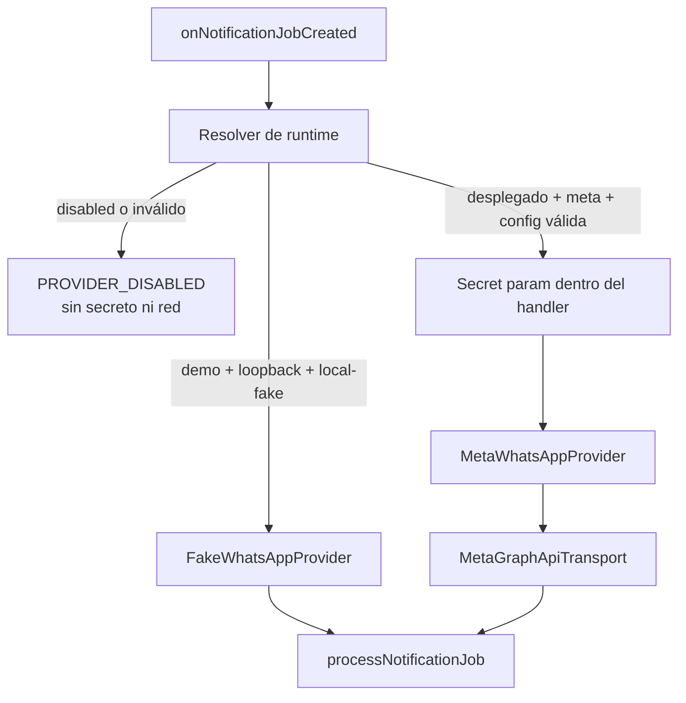

# Spec: E8-PROD-3 — Runtime productivo seguro, apagado por defecto

Estado: **implementada y verificada localmente el 2026-09-11**.
Fecha de propuesta: 2026-09-10, America/Mexico_City.
Autorización: el usuario confirmó `sí autorizo` el 2026-09-11.
Módulo: `athletes-payments`; verificación transversal: `experience-quality`.
Capability map: `../../specs/CAPABILITY-MAP.md`.
Spec matriz: `../../specs/SPEC-payment-notifications-whatsapp.md`.
Precedentes: `SPEC-whatsapp-production-configuration.md` y
`SPEC-whatsapp-meta-transport.md`.

## Objetivo

Crear el ensamble backend que seleccione de forma explícita entre runtime apagado,
fake local y proveedor Meta, y conectar esa selección al worker que procesa nuevos
jobs. La credencial se declarará como secreto de Firebase Functions y sólo se leerá
dentro de una invocación productiva autorizada.

Al terminar, el código podrá construir `MetaWhatsAppProvider` con
`MetaGraphApiTransport`, pero el modo inicial y cualquier configuración incompleta
seguirán produciendo `PROVIDER_DISABLED` sin red. Esta fase no configura un secreto,
no despliega y no envía mensajes.

## Alcance propuesto

### Incluye

- Un resolver puro y testeable que normalice los modos cerrados `disabled`,
  `local-fake` y `meta`; la bandera vigente `fake` se normaliza a `local-fake`.
- Preservar `local-fake` únicamente para proyecto `demo-kronos-training`, RTDB Emulator
  en loopback y la bandera local existente.
- Permitir `meta` únicamente con opt-in explícito, proyecto desplegado no demo, sin
  emulator y configuración completa validada por E8-PROD-2.
- Declarar `WHATSAPP_ACCESS_TOKEN` mediante `defineSecret`; versión Graph
  (`KRONOS_WHATSAPP_GRAPH_API_VERSION`), phone-number ID
  (`KRONOS_WHATSAPP_PHONE_NUMBER_ID`) y modo (`KRONOS_NOTIFICATION_WORKER_MODE`)
  se mantienen como parámetros no secretos.
- Leer el secreto dentro del handler, nunca al importar módulos, y no incluirlo en
  errores, resultados, delivery audit o logs.
- Reutilizar el export `onNotificationJobCreated` y el worker/idempotencia actuales,
  sin crear una segunda Function que compita por el mismo job.
- Pruebas con fábricas y `fetch` fake para apagado, local, Meta aceptado, rechazo
  temporal e incertidumbre, sin Firebase ni red real.

### Excluye

- Crear o asignar el secreto real, seleccionar una versión Graph real, WABA, número
  remitente, plantilla o destinatario QA.
- Ejecutar Meta, mensajes, writes reales, deploy, CI/hosting o una prueba autenticada.
- Modificar scheduler, catch-up, barrido de retries, webhooks, app secret, verify token,
  inbox, BAJA o retención.
- Cambiar Realtime Database, reglas, índices, esquema, Auth o permisos.
- Cambiar Vue; Chrome y Playwright no aplican a esta rebanada local.

## Contrato de selección

| Modo | Entorno permitido | Resultado |
| --- | --- | --- |
| ausente o `disabled` | cualquiera | proveedor apagado; cero lectura de secreto y cero red |
| `fake` → `local-fake` | proyecto demo + RTDB Emulator loopback | fake local vigente |
| `meta` | proyecto desplegado no demo + sin emulator + config completa | proveedor Meta habilitable |
| valor/entorno/config inválidos | cualquiera | falla cerrado y sanitizado; cero red |

El resolver recibirá un objeto explícito para pruebas. La capa Firebase será la única
que podrá leer parámetros y `secret.value()`. Ni el transporte ni la lógica de
negocio leerán `process.env` directamente.

## Diseño propuesto



La Function conservará el marcador durable previo al dispatch y las reglas vigentes:
`RATE_LIMITED`/`SERVICE_UNAVAILABLE` pueden entrar al backoff acotado; timeout, red o
resultado 2xx ambiguo terminan `unknown` y no se reenvían automáticamente.

## Incrementos propuestos

1. T1 — Resolver puro de modos/configuración con RED/GREEN; ningún cambio al export.
2. T2 — Factory de proveedores y prueba de integración con worker/fetch fake.
3. T3 — Declaración de parámetros/secreto y reemplazo controlado del handler exportado,
   manteniendo el fake local y `disabled` por defecto.
4. T4 — Regresión, inspección de exports/bundle, revisión de seguridad y reporte.

Cada incremento tendrá como máximo cinco archivos. No se instalarán dependencias; se
usarán las APIs ya disponibles en `firebase-functions` 7.3.2.

## Archivos probables

Rutas relativas a `app/functions/`:

```text
SPEC-whatsapp-production-runtime.md
src/whatsapp/provider-runtime.ts
src/notifications/local-worker.ts
src/notifications/notification-worker.ts     si separar el handler reduce acoplamiento
src/index.ts
tests/provider-runtime.test.ts
tests/local-worker.test.ts                    sólo para regresión/ajuste del guard
```

Seguimiento:

```text
../../tasks/plan.md
../../tasks/todo.md
../../Docs/implementation-reports/2026-09-10-whatsapp-production-runtime.md
```

## Criterios de aceptación

- [x] El estado predeterminado es `disabled` y no lee el secreto, abre Firebase ni
  ejecuta `fetch`.
- [x] `local-fake` conserva exactamente los tres guards: modo fake, proyecto demo y
  emulator de RTDB en loopback.
- [x] `meta` rechaza proyecto demo, emulator, modo implícito y configuración incompleta
  antes de obtener datos o realizar red.
- [x] El access token sólo existe como `defineSecret`, se lee dentro del handler y no
  aparece en argumentos versionados, errores, resultados, audit o logs.
- [x] Se reutiliza una sola `onNotificationJobCreated`; no hay doble consumidor del
  mismo trigger.
- [x] La integración fake demuestra accepted, rate limit e incertidumbre conservando
  idempotencia, backoff y no reintento de `unknown`.
- [x] El proveedor local sigue utilizable en emuladores y el proveedor Meta sólo puede
  construirse en el modo productivo explícito.
- [x] No hay red real, recursos Meta, mensajes, datos reales, cambios de reglas/esquema
  ni despliegue.
- [x] Suite de Functions, typecheck, build, lint, whitespace, inspección de exports y
  revisión de cinco ejes pasan.

## Resultado local

- El resolver fail-closed selecciona `disabled`, `local-fake` o `meta` sólo con la
  combinación de modo, proyecto, emulator y configuración descrita en esta spec.
- La factory crea el fake local sin leer secretos y construye el proveedor Meta sólo
  después de validar el runtime y obtener un token válido dentro de la invocación.
- `onNotificationJobCreated` conserva un único trigger `created` sobre
  `v1/notificationJobs/{jobId}` y enlaza exclusivamente `WHATSAPP_ACCESS_TOKEN`.
- El worker crea los adaptadores de Realtime Database después de validar runtime y
  proveedor; el estado apagado o inválido termina antes de cualquier lectura de datos.
- RED quedó demostrado por los módulos/exports ausentes de T1 y T3. GREEN quedó
  demostrado por 37 pruebas focalizadas y 184/184 pruebas de Functions.
- `typecheck`, build, ESLint focalizado, `git diff --check`, inspección de exports y
  revisión de corrección, seguridad, arquitectura, rendimiento y mantenibilidad pasan.
- Chrome y Playwright no aplican porque no se modificó la aplicación web ni se activó
  un servicio remoto.

## Riesgos y mitigaciones

| Riesgo | Mitigación |
| --- | --- |
| Activación accidental | `disabled` por defecto y combinación cerrada de modo/entorno/config |
| Secreto leído o expuesto al importar | `defineSecret` y `.value()` sólo dentro del handler autorizado |
| Fake aceptando en producción | guard estricto de demo + loopback, cubierto por regresión |
| Dos workers envían el mismo job | conservar un solo export y el lock/dispatch marker existente |
| Timeout causa duplicado | incertidumbre `unknown` sin reintento ciego |
| Config productiva incompleta | rechazo previo a Firebase y red, con error fijo |

## Verificación propuesta

Desde `app/`:

```powershell
node --require ./scripts/node-userinfo-preload.cjs --import tsx --test functions/tests/provider-runtime.test.ts functions/tests/local-worker.test.ts functions/tests/meta-provider.test.ts functions/tests/meta-graph-api-transport.test.ts
npm --prefix functions test
npm --prefix functions run typecheck
npm --prefix functions run build
.\node_modules\.bin\eslint.cmd functions/src/whatsapp/provider-runtime.ts functions/src/notifications/local-worker.ts functions/src/notifications/notification-worker.ts functions/tests/provider-runtime.test.ts -c .eslintrc.cjs --rule "import/extensions: off"
git diff --check
```

La inspección confirmará que no existe credencial productiva literal, `VITE_*`, log de
configuración, segundo trigger o import del transporte en Vue. Chrome y Playwright no aplican porque
la fase no cambia la aplicación web y no activa un servicio remoto.

## Gate de autorización

Autorización recibida el 2026-09-11 para modificar el resolver, el worker y declarar
el secreto en código. Cubre sólo implementación local y fakes. No cubre crear/asignar
secretos, elegir recursos Meta, configurar Firebase, usar red, enviar mensajes,
escribir datos productivos ni desplegar.
