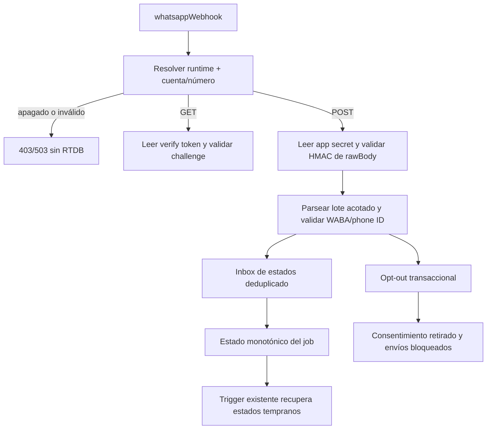

# Spec: E8-PROD-4 — Webhook productivo seguro y opt-out

Estado: **implementada y verificada localmente el 2026-09-21**.
Fecha de propuesta: 2026-09-11, America/Mexico_City.
Autorización: el usuario confirmó `sí autorizo` el 2026-09-11.
Módulo: `athletes-payments`; verificación transversal: `experience-quality`.
Capability map: `../../specs/CAPABILITY-MAP.md`.
Spec matriz: `../../specs/SPEC-payment-notifications-whatsapp.md`.
Precedentes: `SPEC-whatsapp-production-runtime.md` y
`SPEC-whatsapp-production-configuration.md`.

## Objetivo

Convertir el endpoint webhook existente en una frontera productiva fail-closed que
lea el verify token y el app secret desde Firebase Secret Manager, autentique los
bytes originales del request y procese estados de entrega y solicitudes de BAJA sólo
para la cuenta WABA y el número remitente configurados.

Al terminar, el código quedará verificable con handlers y stores inyectados, pero no
se crearán secretos, no se registrará el webhook en Meta, no se ejecutará red real y
no se desplegará.

## Alcance propuesto

### Incluye

- Declarar `WHATSAPP_WEBHOOK_VERIFY_TOKEN` y `WHATSAPP_APP_SECRET` con
  `defineSecret`; leer sólo el secreto requerido dentro de cada rama GET/POST.
- Añadir el parámetro no secreto `KRONOS_WHATSAPP_BUSINESS_ACCOUNT_ID` y reutilizar
  `KRONOS_WHATSAPP_PHONE_NUMBER_ID` y el modo productivo explícito de E8-PROD-3.
- Mantener el webhook deshabilitado por defecto y rechazar entorno demo, emulator,
  cuenta/número inválidos o configuración incompleta antes de parsear o abrir RTDB.
- Para GET, responder el challenge únicamente cuando modo, cuenta, número, verify
  token y parámetros `hub.*` sean válidos.
- Para POST, exigir cuerpo JSON no vacío de máximo 64 KiB y validar
  `X-Hub-Signature-256` contra los bytes originales antes de decodificar el payload.
- Validar que cada entry pertenece a la WABA configurada y que cada metadata usa el
  phone-number ID configurado; lotes mezclados o ambiguos fallan completos.
- Generalizar los stores locales existentes para recibir un scope validado e
  inyectado, conservando deduplicación, estados monotónicos, retención y transacciones.
- Reutilizar `onNotificationProviderStatusWritten` para recuperar estados que llegaron
  antes de que el job obtuviera su `providerMessageId`, con un máximo de cuatro páginas
  de 25 eventos por invocación y sin añadir otro trigger ni enlazar secretos.
- Procesar estados `sent`/`delivered`/`read`/`failed` y palabras de BAJA ya aprobadas;
  una BAJA válida mantiene precedencia sobre jobs pendientes y reintentos.
- Conservar un solo export `whatsappWebhook` y pruebas directas con secretos
  sintéticos, stores fake y RTDB Emulator; ninguna prueba usa Meta.

### Excluye

- Crear, asignar, consultar o rotar secretos reales.
- Crear/modificar WABA, app, número, plantilla, suscripción o URL webhook en Meta.
- Exponer una Function, hacer deploy, usar red real, enviar mensajes o escribir datos
  productivos/QA publicados.
- Cambiar reglas, índices, esquema, Auth, permisos, región, CI, hosting o dependencias.
- Implementar el barrido productivo de queued/retryable jobs, alertas, limpieza TTL o
  retención definitiva; tendrán fases operativas independientes.
- Cambiar Vue; Chrome y Playwright no aplican a esta rebanada backend local.

## Contrato HTTP propuesto

| Entrada | Precondición | Respuesta |
| --- | --- | --- |
| GET | runtime Meta y challenge válidos | `200` con challenge acotado |
| GET | runtime/secreto/challenge inválido | `403`, sin RTDB |
| POST | runtime Meta, cuerpo y firma válidos | `200` tras persistencia/deduplicación |
| POST | firma inválida | `401`, sin parseo ni RTDB |
| POST | payload/configuración de cuenta inválidos | `400`, sin mutación parcial |
| POST | runtime apagado/incompleto | `503`, sin secretos innecesarios ni RTDB |
| POST | fallo transitorio de persistencia | `500` para permitir reentrega |
| otro método | cualquiera | `405` |

Los mensajes HTTP serán fijos y no incluirán secretos, teléfonos, payloads, respuestas
de Meta ni detalles de almacenamiento.

## Diseño propuesto



## Incrementos propuestos

1. T1 — Resolver puro de configuración webhook y secretos sintéticos con RED/GREEN.
2. T2 — Frontera HTTP inyectable: métodos, tamaño, raw body, challenge y HMAC.
3. T3 — Generalizar scope de inbox/status, conectar estados productivos y recuperar
   estados tempranos sin perder el modo local.
4. T4 — Generalizar opt-out y probar lote mixto, duplicados, fallo total y precedencia
   de BAJA en RTDB Emulator.
5. T5 — Metadata de secretos/exports, regresión completa, revisión y reporte.

Cada incremento se mantendrá pequeño y verificable. No se instalarán dependencias.

## Archivos probables

Rutas relativas a `app/functions/`:

```text
SPEC-whatsapp-production-webhook.md
src/whatsapp/http.ts
src/whatsapp/webhook-runtime.ts
src/whatsapp/inbound-opt-out.ts
src/whatsapp/realtime-opt-out.ts
src/whatsapp/local-status-inbox-config.ts
src/whatsapp/realtime-status-inbox.ts
src/whatsapp/local-status-inbox.ts
tests/whatsapp-production-webhook.test.ts
tests/opt-out-http.integration.ts
tests/status-inbox-http.integration.ts
tests/local-status-inbox.test.ts
src/index.ts                                  sólo si cambia el ensamble del export
```

Seguimiento:

```text
../../tasks/plan.md
../../tasks/todo.md
../../Docs/implementation-reports/2026-09-21-whatsapp-production-webhook.md
```

## Criterios de aceptación

- [x] El webhook está deshabilitado por defecto y una configuración inválida termina
  antes de secretos innecesarios, JSON, stores o RTDB.
- [x] Los dos secretos sólo se declaran con `defineSecret`, se leen dentro del handler
  y nunca aparecen en errores, respuestas, logs, fixtures o datos persistidos.
- [x] GET valida el challenge contra el verify token; POST autentica exactamente
  `rawBody` con HMAC-SHA256 antes de decodificarlo.
- [x] POST rechaza cuerpos vacíos, no JSON o mayores de 64 KiB y mantiene respuestas
  sanitizadas y deterministas.
- [x] Todo entry/cambio pertenece a la WABA y phone-number ID configurados; un elemento
  inválido impide mutaciones parciales del lote.
- [x] Los estados se deduplican, no retroceden y pueden reconciliar un job `unknown`
  cuando llega evidencia válida del proveedor.
- [x] Una BAJA válida y reciente retira ambos propósitos, bloquea pendientes/reintentos
  y un duplicado no repite la mutación.
- [x] El fake local actual sigue funcionando sólo en demo+loopback; producción exige
  modo Meta explícito y no acepta identificadores QA.
- [x] Existe un solo `whatsappWebhook` con bindings exclusivos para verify token y app
  secret; no se introduce otro endpoint competidor.
- [x] No hay secretos reales, red Meta, mensajes, datos publicados, cambios de
  reglas/esquema/dependencias ni deploy.
- [x] Suite de Functions, integraciones de emulator relevantes, typecheck, build, lint,
  whitespace, inspección de metadata y revisión de cinco ejes pasan.

## Riesgos y mitigaciones

| Riesgo | Mitigación |
| --- | --- |
| Endpoint público acepta payload de otra cuenta | Firma más match exacto de WABA y phone-number ID |
| Secreto expuesto o leído de más | `defineSecret`, lectura por rama y errores fijos |
| Parseo o lote consume recursos sin límite | raw body de 64 KiB y conteos acotados |
| Mutación parcial de lote inválido | validar el lote completo antes de abrir stores |
| Webhook duplicado/regresivo | event key determinista, transacción y estados monotónicos |
| BAJA compite con un envío | precedencia de consentimiento, doble lectura antes del dispatch y cancelación vigente |
| Refactor rompe QA local | conservar resolver demo+loopback y ejecutar integraciones actuales |
| Fallo temporal se confirma como éxito | responder `500` hasta persistencia/deduplicación durable |

## Verificación propuesta

Desde `app/`:

```powershell
node --require ./scripts/node-userinfo-preload.cjs --import tsx --test functions/tests/whatsapp-production-webhook.test.ts functions/tests/whatsapp-webhook.test.ts functions/tests/local-status-inbox.test.ts
npm --prefix functions test
npm --prefix functions run typecheck
npm --prefix functions run build
.\node_modules\.bin\eslint.cmd functions/src/whatsapp/http.ts functions/src/whatsapp/webhook-runtime.ts functions/src/whatsapp/inbound-opt-out.ts functions/src/whatsapp/realtime-opt-out.ts functions/src/whatsapp/realtime-status-inbox.ts functions/tests/whatsapp-production-webhook.test.ts -c .eslintrc.cjs --rule "import/extensions: off"
git diff --check
```

Las integraciones con RTDB Emulator se ejecutarán sólo con proyecto demo y loopback.
La inspección confirmará dos secret bindings, un solo endpoint, cero secretos literales
y ningún import del webhook en Vue. Chrome y Playwright no aplican porque esta fase no
cambia la aplicación web ni activa el endpoint remoto.

## Resultado

- El resolver mantiene `disabled` como predeterminado, limita el fake a demo+loopback
  y sólo habilita Meta con proyecto desplegado, Graph version y IDs numéricos válidos.
- `whatsappWebhook` conserva un único endpoint con dos secret bindings. GET sólo lee el
  verify token; POST sólo lee el app secret y autentica el raw body antes del JSON.
- Los stores de estados y BAJA aceptan un scope ya validado para Meta y conservan el
  guard local anterior. Los lotes mixtos se validan completos antes de mutar RTDB.
- El trigger existente `onNotificationProviderStatusWritten`, sin secret bindings,
  reintenta los estados tempranos cuando se correlaciona el `providerMessageId`.
- RED documentado: la suite productiva falló inicialmente por no existir el módulo de
  runtime webhook; el recuperador falló inicialmente por no existir
  `syncNotificationStatusInbox`. Ambos incrementos pasaron a GREEN.
- Pasan 28 pruebas focalizadas del inbox/recuperador, 202/202 pruebas de Functions,
  typecheck, build, lint focalizado, whitespace e inspección de metadata.
- Pasan 23/23 integraciones RTDB relevantes y el recorrido real de Functions+RTDB del
  estado temprano. La integración final usó proyecto demo, loopback y secretos QA
  sintéticos temporales, borrados al finalizar.
- Chrome y Playwright no aplican: no hubo cambios en Vue ni activación remota.
- Revisión de corrección, seguridad, arquitectura, rendimiento y mantenibilidad sin
  hallazgos bloqueantes. Se mantiene fuera de alcance el barrido productivo de jobs,
  alertas, TTL definitivo, configuración de recursos remotos y despliegue.

## Gate de autorización

Autorización recibida el 2026-09-11 para cambiar localmente el webhook, generalizar
los stores y declarar los dos secretos. Cubre sólo implementación local, secretos
sintéticos y emuladores. No cubre crear/asignar secretos, cambiar configuración remota
de Firebase/Meta, usar red, enviar mensajes, escribir datos publicados ni desplegar.
El 2026-09-21 el usuario autorizó continuar explícitamente con la implementación,
incluida la recuperación productiva de estados tempranos mediante el consumidor
existente `onNotificationProviderStatusWritten`; no se añade otro trigger.
